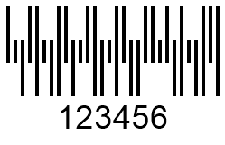
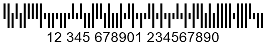

{}[Generate USPS Planet and](https://products.aspose.app/barcode/generate/planet) [USPS Postnet Barcodes online](https://products.aspose.app/barcode/generate/postnet). You can check the quality of ***Aspose.BarCode*** generation for postal barcodes and view results.{}

## **Overview**
Postal barcodes have been introduced to address some problems of 1D barcode types to facilitate postal operations. Such barcode types suggest encoding input information through alterating the height of bars and not the width of bars and spaces as in 1D standards. Postal barcode standards usually ignore horizontal parameters to mitigate the risk of false-positive barcode detection.  
  
Many countries use their own symbologies in postal services. Generally, such barcode types are similar to each other in terms of design with some minor distinctions. Postal barcode standards can be classified in two main groups: two-state symbologies that can encode only numerical characters and four-state ones that allow encoding both numerical digits and uppercase English characters.  
  
***Aspose.BarCode for Node.js via Java*** can be used to create and read various two- and four-state postal standards, i.e. *RM4SCC*, *Postnet*, *Planet*, *Dutch KIX*, *Australia Post*, *OneCode*, and *Mailmark*. Further, this article describes how to work with postal symbologies using the *Aspose.BarCode* library functional.
  
{}*If you need any clarifications, feel free to reach out [Aspose Technical Support](/barcode/nodejsjava/technical-support/): ask your questions at [Aspose.Barcode Forum](https://forum.aspose.com/c/barcode/13) or contact Aspose [Paid Support Helpdesk](https://helpdesk.aspose.com/).*{}

## **Bar Height Settings**
By default, ***Aspose.BarCode for Node.js via Java*** enables automatic calculation of bar height and width for postal barcode standards depending on the *XDimension* value. It also enables manually customizing bar height regardless of barcode width through the *setBarHeight* method of class [*BarcodeParameters*]().  
  
Following *Planet* and *RM4SCC* barcode images have been created varying bar height settings.  
  
|Bar Height Settings for **Planet**| | |
|---| :-: | :-: |
|
**Bar Height**
|
**Is Set to None**
|
**Is Set to 100 Pixels**
|
| |||
  
|Bar Height Settings for **RM4SCC**| | |
|---| :-: | :-: |
|
**Bar Height**
|
**Is Set to None**
|
**Is Set to 100 Pixels**
|
| |||
  

## **Bar Filling Options**
The barcode library enables adjusting the appearance of postal barcode images in terms of setting full or empty filling for bars. Developers can generate postal barcodes with empty bars using the *setFilledBars* method of class [*BarcodeParameters*](). The default value of this parameter is *True*, meaning that the generated postal barcode image will have fully colored bars.  
  
Following *Planet* and *RM4SCC* barcode images have been generated using different bar filling settings.
  
|Bar Filling for **Planet** Barcodes| | |
|---| :-: | :-: |
|**Bar Filling Settings**|
**Filled Bars**
|
**Empty Bars**
|
| |||
  
|Bar Filling for **RM4SCC** Barcodes| | |
|---| :-: | :-: |
|**Bar Filling Settings**|
**Filled Bars**
|
**Empty Bars**
|
| |||
  
  
## **Two-State Postal Barcodes**
Using ***Aspose.BarCode for Node.js via Java***, developers can create barcodes of two-state postal types, such as *Postnet* and *Planet*. These barcode standards allow encoding only numerical characters and require obligatory checksum controls. Code snippets and sample barcode images provided further demonstrate how to create postal barcodes of *Planet* and *Postnet* types.  

### **Planet Standard**
*Planet* barcodes encode each character in five bars. Among them, three bars are full-length, and two bars are half-length.  
  

 
  
### **Postnet Standard**
*Postnet* encodes each digit in five bars so that three bars are full-length and two bars are half-length.  
  

## **Specific Properties of Two-State Barcode Generation**
The ***Aspose.BarCode*** library has several specificities in the way of working with two-state postal symbologies. They are associated with handling invalid barcode text and changing bar length. These special cases are outlined further.

### **Handling Invalid Barcode Text Exception**
When invalid barcode text in passed to to the *setCodeText* method (in case of *Postnet* and *Planet* symbologies, this means entering any characters besides numerical digits), the default approach implemented in class [*BarcodeGenerator*]() implies the necessity to filter out erroneous symbols that do not comply with the specification and then to generate a barcode image encoding suitable characters only. If developers need to establish special controls for such situations, they can request throwing an exception upon entering invalid characters through the *setCodeText* method. In this case, it is necessary to call the *setThrowExceptionWhenCodeTextIncorrect* method of class [*BarcodeParameters*]() passing *True*.

### **Customizing Bar Height**
By design, two-state postal barcodes contain long and short bars in such a way that the shorter bars are half-length with respect to the longer bars. ***Aspose.BarCode for Node.js via Java*** allows modifying bar height for short bars manually. To do this, the *setPostalShortBarHeight* method of class [*PostalParameters*]() needs to be used.  
  
Following barcode images have been created variyng short bar height.
  
|Short Bar Height|Is Set to 10 Pixels|Is Set to 30 Pixels|
| :-: | :-: | :-: |  
| |||
     
## **Four-State Postal Types**
The barcode library enables generating and reading several four-state postal barcode standards, including *RM4SCC*, *Dutch KIX*, *OneCode*, *Australia Post*, and *Mailmark*. By design, four-state barcode types use four different bar types to encode data: tracker (T), descender (D), ascender (A), and full (F). Therefore, each symbol is encoded in four bars meaning that two bits are encoded in one character. In general, four-state symbologies are designed as variations of the *RM4SCC* standard and support encoding numerical characters and uppercase English letters. All aforementioned four-state barcode types except *Dutch KIX* contain checksum controls. In addition, *Mailmark* and *Australia Post* support Reed-Solomon error correction to enable data recovery. 

### **RM4SCC Standard**
The *RM4SCC* symbology can be used to encode numerical characters and uppercase English letters. In this barcode standard, each symbol in a barcode is encoded in four bars among which two bars are enlarged upwards and the other two bars - downwards. Using supported combinations of bars with different length, it is possible to encode up to 36 characters, i.e. 10 digits and 26 letters. *RM4SCC* contains obligatory checksum controls using the modulo 6 algorithm.
   

  
### **Dutch KIX Standard**
The Royal Dutch TPG Post of Netherlands uses the *Dutch KIX* barcode standard to facilitate automatic sorting of mails and process postal codes. It is similar to RM4SCC and allows encoding numericals and uppercase English letters. By design, it does not require checksum controls and do not contain start and stop symbols.
  

    
### **OneCode Standard**
*OneCode* allows encoding fixed-length sets of numerical characters, i.e. 20, 25, 29, or 31 digits. It supports eleven-bit cyclic redundancy verification to detect errors but does not include an error correction mechanism.  
  
|Number of Digits|20 Digits|25 Digits|29 Digits|31 Digits|
| :-: | :-: | :-: | :-: | :-: |  
| |||||
  

### **Australia Post Standard**
The *Australia Post* postal standard uses special two-digit format control code (FCC) fields and eight-digit sorting code (SC) fields to generate barcodes. FCC fields are intended to determine one of three supported subtypes that have various fixed lengths, i.e. 37, 52, or 67 bars. Moreover, barcodes may include a customer information (CI) field to specify one of available encoding types (numerical or alphanumeric characters). These settings can be customized through the *setAustralianPostEncodingTable* method of class [*AustralianPostPatrameters*](). Customer data can take 31 bars in barcodes with 67 bars or 16 bars in barcodes with 52 bars. *Australia Post* has checksum controls and supports Reed-Solomon error correction.  
  
Barcode data can be prepared using one of the supported formats as explained below.  
  
|FCC Field|Sorting Code Field|Customer Information Field|  
| :-: | :-: | :-: |
|11|8 digits|None|
|59|8 digits|16 bars|
|62|8 digits|31 bars|
  
The FCC field can be determined through the *setAustralianPostEncodingTable* method that has to be called passing one of the values from the [*CustomerInformationInterpretingType*]() enum listed in the table below.
  
|Australia Post Encoding Table|Supported Symbols|
| :-: |---|
|CTable|0-9, A-Z, a-z, space symbol, and #|
|NTable|0-9|
|Other|0, 1, 2, and 3 that correspond to H, A, D, and T states, respectively|
  
Following barcode images have been created varying FCC field settings.
  
|Australia Post Subtypes|FCC 11|FCC 59 Table|FCC 62N Table|FCC 62C Table|FCC 62C Other Table|
| :-: | :-: | :-: | :-: | :-: | :-: |  
| ||||||
  

### **Mailmark Standard**
The *Mailmark* postal standard has been introduced by Royal Mail of the United Kingdom. In general, its design is similar to *RM4SCC*; however, it has requires entering barcode information in the strict format and does not support adding customer data. This barcode type can be used to encode numericals, uppercase English letters, and space. It has checksum controls and supports Reed-Solomon error correction.  
*Mailmark* has two main subtypes: 
- **Type L** - allows encoding 26 characters 
- **Type C** - allows encoding 22 characters
  
|Mailmark Subtype|Type C|Type L|
| :-: | :-: | :-: |  
| |||
  
