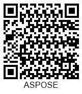
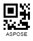
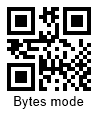
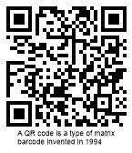

{}[Generate QR Code Online](https://products.aspose.app/barcode/generate/qr): You can test the quality of ***Aspose.BarCode*** generation for QR Codes and get results.{}

## **Overview**
*QR Code* corresponds to a group of 2D square types that benefits from high data density and allows encoding streams of bytes and textual data composed of using Unicode symbols. ***Aspose.BarCode for Node.js via Java*** supports Extended Channel Interpretation (ECI) to encode Unicode data and provides various encoding modes; UTF8 is one of the most widely used encoding mode.  
  
Reserving the minimum possible amount of data for error correction, the *QR Code* standard can be used to encode at most 7,089 numerical digits or 4,296 alphanumeric characters or 2,953 bytes. The other standard, *Micro QR Code*, allows encoding up to 35 numerical digits or 21 alphanumeric characters or 15 bytes. *Micro QR Code* serves to create considerably small *QR Code* images. However, it does not enable Extended Channel Interpretation (ECI) and does not allow encoding Unicode characters. *Micro Qr Code* barcodes corresponding to the *M1* version can encode at most five numerical digits; the *M2* version allows encoding up to ten numericals or six alphanumeric characters. This encoding capacity is usually suitable to work with industrial markers.  

Main advantages of *QR Code* can be outlined as follows:
- Large data density
- Scanning and reading even for severely damaged barcode images 
- Encoding streams of bytes
- High scanning and decoding speed 
- Encoding Unicode characters using ECI (not applicable to *Micro QR Code*)
- Error correction mechanism; the maximal error correction level H allows restoring up to 30% of encoded information 
  
Large damage of target patterns in *QR Code* images can results in deteriorating barcode scanning and reading efficiency.

{}*If you need any clarifications, feel free to reach out Aspose [Technical Support](/barcode/nodejsjava/technical-support/): ask your questions at [Aspose.Barcode Forum](https://forum.aspose.com/c/barcode/13) or contact [Aspose Paid Support Helpdesk](https://helpdesk.aspose.com/).*{}

## **Generation Modes**
***Aspose.BarCode for Node.js via Java*** allows generating *QR Code* or *Micro QR Code* images corresponding to different versions. This can done through two methods of class [*QrParameters*](https://reference.aspose.com/barcode/nodejs/QrParameters), i.e. *setQrEncodeType* using values from the [*QREncodeType*](https://reference.aspose.com/barcode/nodejs/global#QREncodeType) global property and *setQrVersion* with values from the [*QRVersion*](https://reference.aspose.com/barcode/nodejs/global#QRVersion) global property. By default, the *AUTO* setting is enabled.  
  
The first way to set the required version of *QR Code* or *Micro QR Code* is to use the *setQrVersion* method. If data inputted for encoding does not occupy the entire capacity of the target version, padding characters are used to fill the leftover space. If barcode information exceeds the available capacity, barcode images cannot be generated, and the corresponding exception is thrown.  
  
The second way to determine the desired *QR Code* generation mode is applicable when [*QRVersion*](https://reference.aspose.com/barcode/nodejs/global#QRVersion) remains set to *AUTO*. In this case, the *setQrEncodeType* method can be used to select the barcode type according to the input data size. The [*QREncodeType*](https://reference.aspose.com/barcode/nodejs/global#QREncodeType) global property can take the following values:

- *AUTO*: firstly, the library aims to identify the most appropriate *Micro QR Code* version from M1 to M4. If no suitable version is found, the library iterates over supported *QR Code* versions from *Version 01* to *Version 40*. If the data to be encoded does not fit to the data capacity of *Version 40*, an exception is thrown.
- *FORCE_QR*: the most appropriate *QR Code* version is automatically selected among options from *Version 01* to *Version 40*.
- *FORCE_MICRO_QR*: the library aims at selecting the most applicable *Micro QR Code* version from M1 to M4. If the input data exceeds the data capacity of the M4 verion, an exception is thrown. 
  
 
### **Manual Version Selection**
It is possible to manually select the desired *QR Code* version for barcode generation. In this case, it is required to call the *setQRVersion* method of class [*QrParameters*](https://reference.aspose.com/barcode/nodejs/QrParameters) passing a value from the [*QRVersion*](https://reference.aspose.com/barcode/nodejs/global#QRVersion) global property, i.e. from *VERSION_01* to *VERSION_40* for *QR Code* or from *VERSION_M1* to *VERSION_M4* for *Micro QR Code*. The following barcode images are intended to explain how to create *QR Code* barcodes using manual settings to define the requested version.
  
|Version|QR Code VERSION_05|Micro QR VERSION_M4|
| :-: | :-: | :-: |
| |||
  
### **Automatic Version Setting**
The following sample barcodes images are given to explain how to create different types of *QR Code* using varios automatic version setting modes.
  
|Generation Mode|*AUTO*|*FORCE_QR*|*FORCE_MICRO_QR*|
| :-: | :-: | :-: | :-: |
| ||||
  

## **Encoding Modes**
***Aspose.BarCode for Node.js via Java*** enables the variety of widely used data encoding specifications, including Unicode. Developers can select the desired encoding mode through the *setQrEncodeMode* method of class [*QrParameters*](https://reference.aspose.com/barcode/nodejs/QrParameters) passing a value from the [*QrEncodeMode*](https://reference.aspose.com/barcode/nodejs/global#QREncodeMode) global property that includes the following options:
-	*AUTO*: information inputted through the *setCodeText* method gets encoded using the value set through the *setCodeTextEncoding* method (UTF8 is applied by default).
-	*BYTES*: is intended to encode byte streams and allows encoding digits from 0 to 255. In cases when a byte stream includes digits larger than 255, the library applies the *UTF16LE*. 
-	*UTF_8_BOM* and *UTF_16_BEBOM*: allow encoding barcode data in UTF8 and UTF16BE encodings. The first character is encoded as a byte order mark (BOM) character to denote the enabled encoding. However, the *ECI_ENCODING* mode is recommended for use because it is more suitable to set the encodings suitable for the *QR Code* standard.  
-	*ECI_ENCODING*: applies encodings from the list defined in the [*ECIEncodings*](https://reference.aspose.com/barcode/nodejs/global#ECIEncodings) global property.
-	*EXTENDED_CODETEXT*: in addition to main information, barcode data must include special control words that are required to establish improved controls over the data encoding process; in this mode, textual parts with various encodings can be stored in one *QR Code* barcode.
  
### ***AUTO* Mode**
To encode input data when the *AUTO* encoding mode is enabled, the library applies the encoding defined through the *setCodeTextEncoding* method. If the required encoding is not specified explicitly, UTF8 is applied. 
  
<p align="center"></p>

### ***BYTES* Mode**
When the *BYTES* encoding mode is used, input information presented in a form of a plain byte stream is trasnformed to an array of symbols and then to a string. Digits from 0 to 255 can be encoded. If a byte stream contains digits larger than 255, this symbol gets encoded as two bytes in the UTF16LE encoding (the lower byte is put first). 
  
<p align="center"></p>

### ***ECI_ENCODING* Mode**

The *ECI_ENCODING* encoding mode suggests applying one of the encodings listed in the [*ECIEncodings*](https://reference.aspose.com/barcode/nodejs/global#ECIEncodings) global property. ***Aspose.BarCode for Node.js via Java*** supports the variety of widely used encodings. In this mode, the extended channel interpretation (ECI) identifier is added to denote the enabled encoding to transfer the information about it to decoders. It is recommended to use the UTF8 value. 
  
<p align="center"></p>

``` java
//Example how to use ECI encoding
    let generator = new BarcodeGenerator(EncodeTypes.QR);
    generator.setCodeText("12345TEXT");
    generator.getParameters().getBarcode().getQR().setQrEncodeMode(QREncodeMode.ECI_ENCODING);
    generator.getParameters().getBarcode().getQR().setQrEncodeType(QREncodeType.FORCE_QR);
    generator.getParameters().getBarcode().getQR().setQrECIEncoding(ECIEncodings.UTF8);
    generator.save("test.png", BarcodeImageFormat.PNG);
```

### ***UTF_8_BOM* and *UTF_16_BEBOM* Modes**
The library provides two special encoding modes called *UTF_8_BOM* and *UTF_16_BEBOM* that serve to encode information according to *UTF8* and *UTF16BE* specifications. A byte order mark (BOM) symbol is added as the first digit. 
  
<p align="center"></p>
    
### ***EXTENDED_CODETEXT* Mode**
***Aspose.BarCode for Node.js via Java*** supports the *EXTENDED_CODETEXT* mode that allows customizing settings for the *QR Code* generation process manually. This mode enables activating the multi-ECI mode and adding FNC characters (special symbols to differentiate between fields in variable-length identifiers) to work with extended textual information. The library provides a special class called [*QrExtCodetextBuilder*](https://reference.aspose.com/barcode/nodejs/QrExtCodetextBuilder) that facilitate using with this encoding mode. When the multi-ECI mode is enabled, barcode information gets processed for all predefined encodings automatically. In all other cases, the encoding defined through the *setCodeTextEncoding* method is applied.    
  
<p align="center"></p>
  
## **Error Correction Level**
The *QR Code* group of barcode standards provides four types of Reed-Solomon error correction (EC). The error correction mechanism prescribes storing redundant data to facilitate automatic error detectiion and correctiion in the case of barcode image distortions or damages. Basically, to recover 1% of corrupted data, 2% redundancy is required.  
  
Following error correction levels are supported for *QR Code*.
  
|Error Correction Level|Data Recovery Capacity|
| :-: | :-: |
|Level L| 7% |
|Level M| 15% |
|Level Q| 25% |
|Level H| 30% |
  
For all *QR Code* subtypes with the exception of *Micro QR*, developers can use any error correction level. For *Micro QR*, different subtypes are compatible with specific EC levels only, i.e. *M1* enables EC level L; *M2* - levels L and M; *M3* and *M4* - levels L, M, and Q. 
  
|Error Correction Level|Level L|Level M|Level Q|Level H|
| :-: | :-: | :-: | :-: | :-: |
| |||||
  
## **Aspect Ratio Settings**
*Aspect Ratio* is the ratio between the height and the width of a barcode. To adjust barcode proportions using the X and Y coordinates, it is required to use the *setAspectRatio* method of class [*QrParameters*](https://reference.aspose.com/barcode/nodejs/QrParameters). This property is defined as a relative coefficient to the value of *XDimension* parameter. Generally, the value of *AspectRatio* should be set to 1. When it is necessary to adjust the proportions of generated *QR Code* barcodes, the *setAspectRatio* method can be used. Sample barcode labels shown below have been generated using different aspect ratio settings.  
  
|Aspect Ratio|Is Set to 1|Is Set to 2|
| :-: | :-: | :-: |
| |||
  

## **Structured Append Mechanism**
*QR Code* types (except *Micro QR*) support the possibility to generate composite barcodes using the structured append mechanism. In this mode, the input data can be divided among different *QR Code* barcodes and then composed into a single image. ***Aspose.BarCode for Node.js via Java*** does not enable distributing input barcode data across several *QR Code* barcodes; however, it allows creating a composite *QR Code* label manually. This can be done through the *setStructuredAppend* method passing an object of lass [*QrStructuredAppendParameters*](https://reference.aspose.com/barcode/nodejs/QrStructuredAppendParameters) class. This class provides the following methods: 
- *setTotalCount* - the number of barcodes in a composite *QR Code* image (can take values from 2 to 16)
- *setSequenceIndicator* - the sequence number of the current barcode (starting from 0)
- *setParityByte* - a byte that serves as a checksum identifier. In the general case, it is calculated as *XOR* of all bytes in which UTF16BE symbols are encoded using two bytes   
  
Sample barcode images provided below have been created using the structured append mechanism.
  
|Structured Append Type|First Type|Second Type|
| :-: | :-: | :-: |
| |||
  

