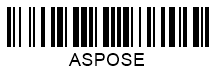

## **Overview**
***Aspose.BarCode for Node.js via Java*** enables customizing various parameters that are specific for 1D barcode generation. Particularly for 1D barcode standards, developers can adjust the following display properties: the height of bars, the mode of bar filling, the wide-to-narrow ratio, and the automatic correction of invalid barcode text.  
This article describes how to manage these properties using specified classes and properties of the library.  

{}*If you need any clarifications, feel free to reach out [Aspose Technical Support](/barcode/nodejsjava/technical-support/): ask your questions at [Aspose.Barcode Forum](https://forum.aspose.com/c/barcode/13) or contact [Aspose Paid Support Helpdesk](https://helpdesk.aspose.com/).*{}

## **Set Bar Height**
It is possible to modify the height of bars for 1D single-row barcodes by setting [*AutoSizeMode*](https://reference.aspose.com/barcode/nodejs/global#AutoSizeMode) to *AutoSizeMode.NONE*. In this case, regardless of the value specified through the *setXDimension* method, the bar height can be regulated using the *setBarHeight* method of class [*BarcodeParameters*](https://reference.aspose.com/barcode/nodejs/BarcodeParameters). This method does not apply to multiple-row barcodes and 2D barcodes.
  
|Bar Height|Is Set to 40 Pixels|Is Set to 80 Pixels|
| :-: | :-: | :-: |
| |||
  
``` java
//This sample shows how to create and save a barcode image
 let generator = new BarcodeGenerator(EncodeTypes.CODE_128);
 generator.setAutoSizeMode(AutoSizeMode.NEAREST);
 generator.getBarCodeWidth().setMillimeters(50);
 generator.getBarCodeHeight().setInches(1.3f);
 generator.save("test.png", BarcodeImageFormat.PNG);
```  

## **Set Wide-to-Narrow Ratio**
Two-width 1D barcodes are based on the binary code principle, meaning that information is encoded using bars and spaces with two options of width: wide and narrow. Two-width barcode symbologies include the following: *Codabar*, *Code 11*, *Code 32*, *Code 39*, *DataLogic 2-of-5*, *IATA 2-of-5*, *Interleaved 2-of-5*, *ITF 6*, *ITF 14*, *Matrix 2-of-5*, *MSI*, *OPC*, *PZN*, *Standard 2-of-5*, and *VIN*.  
  
In ***Aspose.BarCode for Node.js via Java***, the **wide-to-narrow ratio** defines the relation between the width of wide and narrow elements. It can be set using the *setWideNarrowRatio* method of class [*BarcodeParameters*](https://reference.aspose.com/barcode/nodejs/BarcodeParameters). The larger if the value of the wide-to-narrow ratio, the larger is the width of the generated barcode. However, the readability also improves with an increase in this parameter. By default, *WideNarrowRatio* is set to 3.  
  
|Wide-to-Narrow Ratio|Is Set to 2|Is Set to 5|
| :-: | :-: | :-: |
| |||
  
  
## **Handle Exception on Incorrect Barcode Text**
When a barcode has not been created correctly due to invalid barcode text, by default, the library can generate additional dummy data to bring the barcode in line with the standard or delete conflicting characters. In this case, barcode generation is considered successfully completed.  
  
Developers can change this behaviour by using the *setThrowExceptionWhenCodeTextIncorrect* method of [*BarcodeParameters*](https://reference.aspose.com/barcode/nodejs/BarcodeParameters). When this method is called, an exception is thrown if the barcode text has been found incorrect or incomplete.
  
|Barcode Text Correctness|Correct with Valid Barcode Text|Adjusted with Invalid Barcode Text|
| :-: | :-: | :-: |
| |||
  

## **Bar Filling Modes**
For 1D barcodes, ***Aspose.BarCode for Node.js via Java*** provides a specific mode to generate barcodes with empty bars instead of filled ones. Such a modification can be done using the *setFilledBars* method of class [*BarcodeParameters*](https://reference.aspose.com/barcode/nodejs/BarcodeParameters). This property is set to *True* by default and is valid only for 1D barcodes. 
  
|Bar Filling|Filled|Empty|
| :-: | :-: | :-: |
| |||
  
