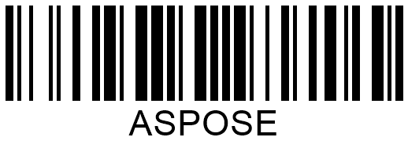

In the present article, you can find details about customizing various parameters of barcodes to be generated, such as barcode label size, rotation angle, barcode paddings, and barcode image borders.

{}*If you need any clarifications, feel free to reach out [Aspose Technical Support](/barcode/phpjava/technical-support/): ask your questions at [Aspose.Barcode Forum](https://forum.aspose.com/c/barcode/13) or contact [Aspose Paid Support Helpdesk](https://helpdesk.aspose.com/).*{}

## **Overview**
***Aspose.BarCode for PHP via Java*** provides class [*BarcodeGenerator*](https://reference.aspose.com/barcode/php/classBarcodeGenerator) to generate barcodes in line with the predefined settings so that each element of a barcode image gets its fixed position relatively to other elements, as shown in the scheme below. A barcode label comprises the following parts: barcode text, bars, top and bottom captions, image borders, and paddings. All elements besides barcode bars are optional.
  

 
## **Barcode Image Sizing Modes**

In general, ***Aspose.BarCode for PHP via Java*** defines barcode image size in terms of height and width automatically. The library enables developers to manage image size settings manually by determining the height and width of barcode labels using *setImageHeight (Unit $value)* and *setImageWidth (Unit $value)* functions of class [*BaseGenerationParameters*](https://reference.aspose.com/barcode/php/classBaseGenerationParameters).  
  
Barcode image size can be varied by using varios sizing modes that can be enabled using the [*AutoSizeMode*](https://reference.aspose.com/barcode/php/classAutoSizeMode) class . *AutoSizeMode* provides the following options: *NONE*, *NEAREST*, and *INTERPOLATION*. In *Interpolation* and *Nearest* modes, barcode image size is managed based on the values of width and height, and other parameters are ignored. In turn, when the *None* mode is enabled, barcode image size is defined ignoring width and height; instead, other parameters, such as *XDimension*, are used. *AutoSizeMode* takes the *NONE* value by default.  
   
Further in the article, different barcode sizing modes are discussed.

### **AutoSizeMode.None** 
As outlined above, setting the *None* mode implies that barcode image size is managed based on different parameters ignoring width and height. To specify barcode size, class [*BarcodeParameters*](https://reference.aspose.com/barcode/php/classBarcodeParameters) provides a special function called *setXDimension (Unit $value)*. It is used to define the minimum size of bars in 1D barcodes or cells in 2D barcodes. Other barcode sizing parameters are calculated based on the *XDimension* value.  
  
Various barcode standards often determine *XDimension* to provide compatibility between printing and scanning equipment units so that barcode images could be captured by scanners used in various companies. *XDimension* is related to the data density of a barcode type, meaning that it determines the amount of data that can be encoded in one barcode. Setting a small value of *XDimension* results in covering less space to place each encoded character in a barcode image. In contrast, setting a bigger value of *XDimension* leads to enlarging the area required to encode each character and decreasing the number of characters per inch.  
    
The barcode label shown below has been generated using the *None* mode.

   
### **AutoSizeMode.Interpolation**
Setting *AutoSizeMode.INTERPOLATION* means that only the values specified using *setImageHeight (Unit $value)* and *setImageWidth (Unit $value)* functions are used to set the barcode size. In this case, barcode image size is determined using the manually specified values of height and width even when it results in producing distorted barcode proportions and the deterioration of barcode readability. The *Interpolation* mode is appropriate to create barcode images with the resolution of 300 dpi or higher. Using such resolution will allow keeping barcode distortions negligible and avoiding the descrease of barcode readability.  
  
The barcode label generated through the *Interpolation* mode is demonstrated below.  

 

  
### **AutoSizeMode.Nearest** 
To set barcode image size, the *Nearest* mode uses only the values specified using *setImageHeight (Unit $value)* and *setImageWidth (Unit $value)* functions of class [*BaseGenerationParameters*](https://reference.aspose.com/barcode/php/classBaseGenerationParameters) similarly to the *Interpolation* mode. In this mode, [*BarcodeGenerator*](https://reference.aspose.com/barcode/php/classBarcodeGenerator) aims at finding the most suitable image size to avoid barcode proportion distortion and readability deterioration.  
  
The barcode label created through the *Nearest* mode is provided below.
  

  
  
## **Barcode Rotation**
In ***Aspose.BarCode for PHP via Java***, barcode image rotation can be set through the *setRotationAngle (float $value)* function of class [*BaseGenerationParameters*](https://reference.aspose.com/barcode/php/classBaseGenerationParameters). Passing a value in degrees to this function allows generating a barcode image rotated at the desired angle clockwise or counterclockwise.  
  
The sample barcode labels rotated by various angles are shown below.
  
|Rotation Angle|Is Set to +90°|Is Set to -90°|Is Set to +45°|Is Set to -45°|Is Set to 180°| 
| :-: | :-: | :-: | :-: | :-: | :-: | 
| ||||||
  
  
## **Customizing Barcode Borders and Padding**
***Aspose.BarCode for PHP via Java*** allows customizing barcode image borders and paddings. Corresponding functions are described further.
  
### **Border Settings**
Applying default border settings results in generating barcode images without borders. Alternatively, they can be defined manually using five styles: solid, dotted, dashed, dash-dot, and dash dot dot. The border style can be modified using special class [*BorderParameters*](https://reference.aspose.com/barcode/php/classBorderParameters). In addition, this class allows setting border thickness in any available units and colors using *setWidth (Unit $value)* and *setColor (string $hexValue)* functions. Border styles can be changed using the *setDashStyle (int $value)* function of the same class. 
  
Barcode labels demonstrated below have been generated using different border styles. 
  
|Border Style|Solid|Dashed|Dotted|Dash Dot|Dash Dot Dot| 
| :-: | :-: | :-: | :-: | :-: | :-: | 
| ||||||
  
### **Paddings**
Paddings from the edges of a barcode image or its borders can be set in four directions using a special class called [*Padding*](https://reference.aspose.com/barcode/php/classPadding) and its functions: *setLeft (Unit $value)*, *setRight (Unit $value)*, *setTop (Unit $value)*, and *setBottom (Unit $value)*. By default, the padding value is set to 5 points in all directions.
  
|Padding|Millimeters|Pixels|  
| :-: | :-: | :-: |  
| ||| 

  
## **Bar Width Reduction**
The other important property that needs to be determined accurately is bar width. Setting an approriate value of this parameter is critical to assure successful barcode scanning. Due to the so-called ink floating phenomenon, some barcode printing techniques may result in increasing actual bar width after printing out barcode images. This happens often in commercial printing in cases when conventional printing presses are used. To ensure that printed barcode images will be printed out with appropriate bar width, setting a bar width reduction value may be required.  
  
Bar width reduction is a way to mitigate the effecet of ink floating in a graphic design file of a barcode. ***Aspose.BarCode for PHP via Java*** allows modifying bar width through the *setBarWidthReduction (Unit $value)* function of class [*BarcodeParameters*](https://reference.aspose.com/barcode/php/classBarcodeParameters). Passing the required value while calling this function allows decreasing bar width in 1D barcodes or cell size in 2D barcodes. To find out the suitable BWR value for a printer, it is necessary to check special tables provided by printer manufacturers. Modifying this parameter is not applicable to laser printers.  
  
The sample barcodes shown below have been generated with and without applying bar width reduction.
  
|Barcode Type|Bar Width Reduction 0|Bar Width Reduction 3|  
| :-: | :-: | :-: |  
|**Code 128**||| 
|**Data Matrix**|||
  
  