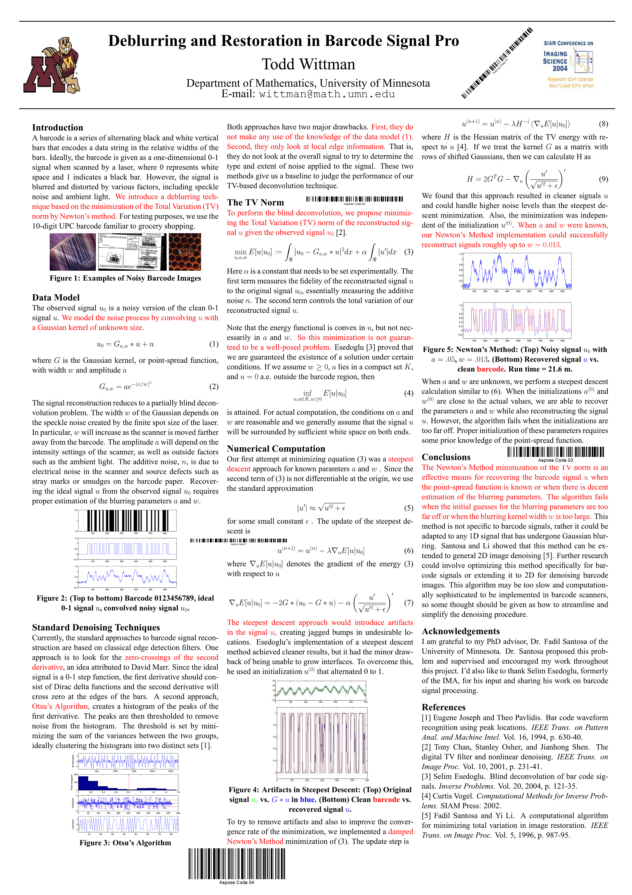

{}[Read Barcodes Online](https://products.aspose.app/barcode/recognize): You can check the quality of Aspose.BarCode reading and view the results online.{}

## **Overview**
Barcode reading relies on machine vision mechanisms and uses various mathematical algorithms for object detection. Same as in other computer vision tasks, source image quality is necessary to convert an arbitrary image to machine-readable code. Low-quality barcode images may result in being unreadable depending on specific recognition standards. There are different approaches to read barcodes of unacceptable quality. However, they require extra CPU computation time and may lead to a considerable increase in reading time.

***Aspose.BarCode for PHP via Java*** suggests optimizing the barcode reading process in terms of quality and speed in line with specific business needs. A special class called [*QualitySettings*](https://reference.aspose.com/barcode/php/classQualitySettings) provides flexible recognition settings to achieve the acceptable trade-off between reading accuracy and speed depending on the quality of a source barcode image.
  
{}*If you need any clarifications, feel free to reach out [Aspose Technical Support](/barcode/phpjava/technical-support/): ask your questions at [Aspose.Barcode Forum](https://forum.aspose.com/c/barcode/13) or contact [Aspose Paid Support Helpdesk](https://helpdesk.aspose.com/).*{}

## **Reading Speed and Quality Options and Presets**
As stated above, ***Aspose.BarCode for PHP via Java*** contains class [*QualitySettings*](https://reference.aspose.com/barcode/php/classQualitySettings) that is used to enable and disable various algorithms to read barcodes with damages or artifacts. Class [*QualitySettings*](https://reference.aspose.com/barcode/php/classQualitySettings) allows customizing the trade-off between recognition quality and speed in common cases. Corresponding functions are grouped into dedicated presets that allow improving image recovery and barcode reading for various scenarios.

## **Reading Presets**
The barcode library provides various barcode reading presets, such as *HighPerformance*, *NormalQuality*, *HighQuality*, *MaxBarCodes*, and others. By default, the *NormalQuality* preset is enabled. 

|Recognition Preset|Description|
|---|---|
|*NormalQuality*|Suitable for regular-quality barcode images|
|*HighQuality*|Intended for low-quality barcode images. It allows scanning diagonal and severely damaged barcode images|
|*HighPerformance*|Used for high-quality barcode images|
|*HighQualityDetection*|Same as *NormalQuality* but with the *setDetectorSettings()* function called passing the *HighQuality* value|
|*MaxQualityDetection*|Same as *NormalQuality* but with the *setDetectorSettings()* function called using the *MaxQuality* value. It allows detecting diagonal and damaged barcode images|
|*MaxBarcodes*|Allows scanning all barcodes possibly presented in an image, including invalid ones. It is recommended for debugging tasks only|
  
``` php
$reader = new BarCodeReader("test.png", DecodeType::CODE_39_STANDARD, DecodeType::CODE_128);
//set high performance mode
$reader->setQualitySettings(QualitySettings::getHighPerformance());
foreach($reader->readBarCodes() as $result)
   print("BarCode CodeText: ".$result->getCodeText());
$reader = new BarCodeReader("test.png", DecodeType::CODE_39_STANDARD, DecodeType::CODE_128);
//normal quality mode is set by default
foreach($reader->readBarCodes() as $result)
  print("BarCode CodeText: ".$result->getCodeText());
$reader = new BarCodeReader("test.png", DecodeType::CODE_39_STANDARD, DecodeType::CODE_128);
//set high quality mode with low speed recognition
$reader->setQualitySettings(QualitySettings::getHighQuality());
foreach($reader->readBarCodes() as $result)
  print("BarCode CodeText: ".$result->getCodeText());
$reader = new BarCodeReader("test.png", DecodeType::CODE_39_STANDARD, DecodeType::CODE_128);
//set max barcodes mode, which tries to find all possible barcodes, even incorrect. The slowest recognition mode
$reader->setQualitySettings(QualitySettings::getMaxBarCodes());
foreach($reader->readBarCodes() as $result)
  print("BarCode CodeText: ".$result->getCodeText());
$reader = new BarCodeReader("test.png", DecodeType::CODE_39_STANDARD, DecodeType::CODE_128);
//set high performance mode
$reader->setQualitySettings(QualitySettings::getHighPerformance());
foreach($reader->readBarCodes() as $result)
  print("BarCode CodeText: ".$result->getCodeText());
```


### **Universal Presets for All Barcode Types**
***Aspose.BarCode for PHP via Java*** suggests various universal recognition presets and the corresponding functions to activate them, such as *setHighPerformance*, *setNormalQuality*, and *setHighQuality*. These presets establish linear dependence between reading accuracy and speed for all barcode types. Generally, using the default *NormalQuality* preset is sufficient for most barcodes that have acceptable scanning quality. 
  
<p align="center"></p>

``` php
$reader = new BarCodeReader("test.png", DecodeType::CODE_39_STANDARD, DecodeType::CODE_128);
//normal quality mode is set by default
foreach($reader->readBarCodes() as $result)
  print("BarCode CodeText: ".$result->getCodeText());
$reader = new BarCodeReader("test.png", DecodeType::CODE_39_STANDARD, DecodeType::CODE_128);
//set high quality mode with low speed recognition
$reader->setQualitySettings(QualitySettings::getHighQuality());
foreach($reader->readBarCodes() as $result)
  print("BarCode CodeText: ".$result->getCodeText());
```

### **Presets for 1D Barcode Types**
To scan linear barcodes, the barcode library provides dedicated recognition presets suitable for normal-quality barcodes. These presets enable improved barcode detection and decoding for 1D barcodes and are useful to work with barcodes of small dimensions or complex documents with multiple text blocks and tables. For example, compared with general recognition settings, *HighQualityDetection* and *MaxQualityDetection* presets allow improving recognition results for 1D barcodes in complex documents. It can also be implemented using the *NormalQuality* preset and tuning [*BarcodeSvmDetectorSettings*](https://reference.aspose.com/barcode/php/classBarcodeSvmDetectorSettings) using the *setDetectorSettings* function.  
  
The image shown below is a sample document with multiple barcodes that contains also text parts and figures. 

<p align="center"></p>
 

### ***MaxBarCodes* Preset for Debugging**
To detect all possible barcodes in an image including invalid ones, the *MaxBarCodes* preset can be used. This preset allows restoring up to 1% more barcodes (severely damaged or incorrectly generated) in comparison with the results that can be reached by the *NormalQuality* preset. Similar reading settings can be implemented through the *setAllowIncorrectBarcodes* function.
The *MaxBarCodes* preset may be used to scan even unreadable barcodes; however, it is intended for debugging tasks only as it may result in considerably augmenting the time needed to complete the reading process and providing invalid decoding outputs. This preset is suggested only for advanced users of the ***Aspose.BarCode*** library. 

``` php
$reader = new BarCodeReader("test.png", DecodeType::CODE_39_STANDARD, DecodeType::CODE_128);
//set max barcodes mode that attempts to detect all possible barcodes, even incorrect ones. The slowest recognition mode
$reader->setQualitySettings(QualitySettings::getMaxBarCodes());
foreach($reader->readBarCodes() as $result)
  print("BarCode CodeText: ".$result->getCodeText());

```

## **Barcode Reading Options**

### **Read High-Quality Barcode Images with Fast Detection**
To recognize high-quality 1D barcodes created through web-based applications, it is suggested to use *setAllowOneDFastBarcodesDetector* and *setFastScanOnly* reading functions. These functions enable fast scanning of target image areas through lightweight scanning techniques. The difference between these two options is that the *setFastScanOnly* function does not enable further barcode search after the failure to identify more barcodes through lightweight scanning functions.  
  
<p align="center"></p>

``` php
$reader = new BarCodeReader("test.png", DecodeType::CODE_128);
$reader->getQualitySettings()->setAllowOneDFastBarcodesDetector(true);
$reader->getQualitySettings()->setFastScanOnly(true);
foreach($reader->readBarCodes() as $result)
  print("BarCode CodeText: ".$result->getCodeText());

```

### **Read Regular Barcode Images without Damage**
To decode regular barcode images, the library provides the *setAllowRegularImage* function that is based on standard recognition techniques. This mode is suggested to be enabled in most cases, as its deactivation may lead to decoding failures for regular barcode images.  
    
<p align="center"></p>

``` php
$reader = new BarCodeReader("test.png", DecodeType::CODE_128);
$reader->getQualitySettings()->setAllowRegularImage(true);
foreach($reader->readBarCodes() as $result)
  print("BarCode CodeText: ".$result->getCodeText());

```

## **Detect Areas with Potential Barcodes**
To read barcodes, the barcode library first performs the segmentation of a source image and finds areas with potential barcodes. Two barcode region detectors are available: the one with flexible sensitivity implemented in class [*BarcodeSvmDetectorSettings*](https://reference.aspose.com/barcode/php/classBarcodeSvmDetectorSettings) and the other one that relies on the previous detector version that allows correctly identifying about 97% of barcodes without the need in additional settings. [*BarcodeSvmDetectorSettings*](https://reference.aspose.com/barcode/php/classBarcodeSvmDetectorSettings) is used by default together with calling the *setNormalQuality* function.

### **Barcode Detector with Flexible Sensibility**
[*BarcodeSvmDetectorSettings*](https://reference.aspose.com/barcode/php/classBarcodeSvmDetectorSettings) allows adjusting the sensitivity of the barcode detector in a flexible manner according to specific needs. The better the detector sensitivity, the lower reading speed and the better the results of barcode region detection in complex source images with many text blocks and tables. For 1D barcodes, the following sensitivity settings are supported:
-	*NormalQuality* 
-	*HighQuality* 
-	*HighPerformance*
-	*MaxQuality*  
  
### **Previous Version of Barcode Detector**
The *setUseOldBarcodeDetector* function allows performing barcode region detection for 1D barcodes using the previous detector version that does not support flexible sensitivity settings. This region detection mode is close to *NormalQuality* and *HighQuality* modes of the new detector implemented in [*BarcodeSvmDetectorSettings*](https://reference.aspose.com/barcode/php/classBarcodeSvmDetectorSettings).  
  

## **Manage Scan Gap during 1D and 2D Barcode Scanning**
To conduct preliminary detection of large-sized 1D and some 2D types, such as *QR Code*, *PDF417*, or *Aztec Code*, barcode scanning can be applied with a gap of several lines. This option is intended to avoid excessively long scanning and allows speeding up the decoding process. The barcode library provides the *setAllowDetectScanGap* function to enable the scan gap. However, if large and tiny barcodes are displayed in an image close to each other, applying this recognition option can lead to a failure to read smaller-sized barcode. When this option is not enabled, reading such combinations of barcodes can be executed successfully at the expense of recognition speed.  
  
<p align="center"></p>

``` php
$reader = new BarCodeReader("test.png", DecodeType::CODE_128);
$reader->getQualitySettings()->setAllowDetectScanGap(true);
foreach($reader->readBarCodes() as $result)
  print("BarCode CodeText: ".$result->getCodeText());

```