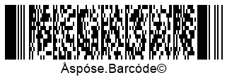

{}[Read Barcodes Online](https://products.aspose.app/barcode/recognize): You can test the quality of ***Aspose.BarCode*** barcode recognition functionality and view the results online.{}
  
## **Overview**
***Aspose.BarCode for PHP via Java*** not only enables reading information encoded in a barcode but also provides the possibility to analyze its technical properties, including symbology, orientation angle, position, and metadata. This data is stored in objects of class [*BarCodeResult*](https://reference.aspose.com/barcode/php/classBarCodeResult) and can be fetched using special functions described further in this article.  


{}*If you need any clarifications, feel free to reach out to [Aspose Technical Support](/barcode/phpjava/technical-support/): ask your questions at [Aspose.Barcode Forum](https://forum.aspose.com/c/barcode/13) or contact [Aspose Paid Support Helpdesk](https://helpdesk.aspose.com/).*{}

## **Barcode Type and Encoded Data**
To obtain input barcode data and its type, *getCodeText* and *getCodeType* functions of class [*BarCodeResult*](https://reference.aspose.com/barcode/php/classBarCodeResult) can be used. The other function called *getCodeTypeName* returns the text name of the barcode type.

``` php
$generator = new BarcodeGenerator(EncodeTypes::Code128, "12345");
$generator->save("test.png");
$reader = new BarCodeReader("test.png", DecodeType::CODE_39_STANDARD, DecodeType::CODE_128);
foreach($reader->readBarCodes() as $result)
{
    print("BarCode Type: ".$result->getCodeTypeName());
    print("BarCode CodeText: ".$result->getCodeText());
}
```  

<p align="center"></p> 
  
## **Read Barcode Data as Byte Stream**
It is possible to load barcode data as a byte stream using the *getCodeBytes* function of class [*BarCodeResult*](https://reference.aspose.com/barcode/php/classBarCodeResult). 

<p align="center"></p>
  
## **Verify Quality of Reading Results**
Developers may need to check whether barcode reading outputs are accurate and complete. For this purpose, ***Aspose.BarCode for PHP via Java*** provides two specific functions of class [*BarCodeResult*](https://reference.aspose.com/barcode/php/classBarCodeResult): *getConfidence* and *getReadingQuality*.  
Depending on the quality of barcode reading results, the *getConfidence* function returns an instance of the [*BarCodeConfidence*](https://reference.aspose.com/barcode/php/classBarCodeConfidence) class that denotes the recognition confidence level. This class contains values *STRONG*, *NONE*, and *MODERATE* that are discussed below. The *getReadingQuality* function returns an estimate of recognition quality corresponding to the confidence level, as explained in the table below.
  
|Confidence Level|Quality Value|Description|
|---|---|---|
|*NONE*|0|If the confidence level is *None*, it indicates that the barcode is invalid and its information has been read with errors. If required, it is possible to get its symbology and position in the image and decode barcode information partially|
|*MODERATE*|80|This confidence level may be returned for linear and postal barcode types with weak or absent checksum controls. Furthermore, it is necessary to analyze the result of the *getReadingQuality* function. The absolute correctness of barcode reading results is not assured|
|*STRONG*|100|This confidence level is returned for all 2D types with Reed-Solomon error correction. It means that barcode text has been recognized accurately|

``` php
$generator = new BarcodeGenerator(EncodeTypes::Code128, "12345");
$generator->save("test.png");
$reader = new BarCodeReader("test.png", DecodeType::CODE_39_STANDARD, DecodeType::CODE_128);
foreach($reader->readBarCodes() as $result)
{
    print("BarCode Confidence: ".$result->getConfidence());
    print("BarCode ReadingQuality: ".$result->getReadingQuality());
} 
```

## **Barcode Position and Orientation Angle**
To obtain the position of a source barcode and its orientation angle, functions of class [*BarCodeRegionParameters*](https://reference.aspose.com/barcode/php/classBarCodeRegionParameters) can be used. This class allows getting information about the barcode region in the following forms:
-	Quadrangle – a quadrangle object that bounds a barcode
-	Rectangle - a rectangle object that bounds a barcode
-	Points – an array of points constituting a barcode
-	Angle – an orientation angle in degrees
    
<p align="center"></p>

``` php
$generator = new BarcodeGenerator(EncodeTypes::Code128, "12345");
$generator->save("test.png");
$reader = new BarCodeReader("test.png", DecodeType::CODE_39_STANDARD, DecodeType::CODE_128);
foreach($reader->readBarCodes() as $result)
{
    print("BarCode Angle: ".$result->getRegion()->getAngle());
}
```

## **Barcode Metadata**

### **Read Macro PDF417 and Macro PDF417 Metadata**
Metadata from *PDF417* barcodes can be obtained using special functions of class [*Pdf417ExtendedParameters*](https://reference.aspose.com/barcode/php/classPdf417ExtendedParameters) listed below.
  
|PDF417 Metadata Function|Description|
|---|---|
|*getPdf417MacroFileID*|Gets the unique identifier of a barcode series or a PDF417 file|
|*getPdf417MacroSegmentID*|Gets the current identifier of a segment|
|*getPdf417MacroSegmentsCount*|Returns the number of barcodes in a series|
|*getPdf417MacroFileName*|Returns the name of a file|
|*getPdf417MacroChecksum*|Gets the checksum value computed using CCITT-16 polynomial|
|*getPdf417MacroFileSize*|Returs the total size of bytes in a series|
|*getPdf417MacroTimeStamp*|Returns the time spent to generate/send the file|
|*getPdf417MacroAddressee*|Gets the address of the file sender|
|*getPdf417MacroSender*|Returns the name of the file sender|
  
    
<p align="center"></p>  

```php
$generator = new BarcodeGenerator(EncodeTypes::MacroPdf417, "12345");
$generator->getParameters()->getBarcode()->getPdf417()->setPdf417MacroFileID(10);
$generator->getParameters()->getBarcode()->getPdf417()->setPdf417MacroSegmentsCount(2);
$generator->getParameters()->getBarcode()->getPdf417()->setPdf417MacroSegmentID(1);
$generator->save("test.png");
$reader = new BarCodeReader("test.png", DecodeType::MACRO_PDF_417);
foreach($reader->readBarCodes() as $result)
{
    print("BarCode Type: ".$result->getCodeTypeName());
    print("BarCode CodeText: ".$result->getCodeText());
    print("Macro Pdf417 FileID: ".$result->getExtended()->getPdf417()->getMacroPdf417FileID());
    print("Macro Pdf417 Segments: ".$result->getExtended()->getPdf417()->getMacroPdf417SegmentsCount());
    print("Macro Pdf417 SegmentID: ".$result->getExtended()->getPdf417()->getMacroPdf417SegmentID());
}
```

### **Read Barcode Metadata from QR Codes with Structured Append**
To fetch metadata from *QR Code* barcodes with structured append, the barcode library provides the [*QRExtendedParameters*](https://reference.aspose.com/barcode/php/classQRExtendedParameters) class. It enables reading the information from structured append that is used to combine several QR codes into one. This data can be obtained using the following functions:

- *getQRStructuredAppendModeBarCodeIndex* - returns the sequence number of the current barcode (starting from 0)
- *getQRStructuredAppendModeBarCodesQuantity* - returns the number of barcodes in a composite *QR Code*, which can take values from 2 to 16
- *getQRStructuredAppendModeParityData* - returns the checksum identifier byte that is usually computed as *XOR* of all bytes in which UTF16BE characters are encoded in two bytes  
  

<p align="center"></p>

```php
$reader = new BarCodeReader("test.png", DecodeType::QR);
foreach($reader->readBarCodes() as $result)
{
   print("BarCode Type: ".$result->getCodeTypeName());
   print("BarCode CodeText: ".$result->getCodeText());
   print("QR Structured Append Quantity: ".$result->getExtended()->getQR()->getQRStructuredAppendModeBarCodesQuantity());
   print("QR Structured Append Index: ".$result->getExtended()->getQR()->getQRStructuredAppendModeBarCodeIndex());
   print("QR Structured Append ParityData: ".$result->getExtended()->getQR()->getQRStructuredAppendModeParityData());
}
```

### **Read Barcode Metadata from DataBar with 2D Components**
Metadata from *DataBar* barcodes with 2D components can be obtained using class  [*DataBarExtendedParameters*](https://reference.aspose.com/barcode/php/classDataBarExtendedParameters) that provides the *is2DCompositeComponent* function. It allows enabling or disabling a 2D component in *DataBar* barcodes.  
  
<p align="center"></p>

``` php
$reader = new BarCodeReader("test.png", DecodeType::DATABAR_OMNI_DIRECTIONAL);
 
foreach($reader->readBarCodes() as $result)
{
   print("BarCode Type: ".result->getCodeTypeName());
   print("BarCode CodeText: ".result->getCodeText());
   print("QR Structured Append Quantity: ".result->getExtended()->getQR()->getQRStructuredAppendModeBarCodesQuantity());
}
```

### **Read Metadata from 1D Barcodes**
Some 1D barcode types, i.e. *EAN-13*, allow separating barcode input information itself from the checksum value. To do this, class [*OneDExtendedParameters*](https://reference.aspose.com/barcode/php/classOneDExtendedParameters) provides the *getValue* function, which allows getting 1D barcode text and the *getCheckSum* function that returns the result of checksum computation.
 
<p align="center"></p>

``` php
$generator = new BarcodeGenerator(EncodeTypes::EAN_13, "1234567890128");
$generator->save("test.png");
$reader = new BarCodeReader("test.png", DecodeType::EAN_13);
foreach($reader->readBarCodes() as $result)
{
   print("BarCode Type: ".$result->getCodeTypeName());
   print("BarCode CodeText: ".$result->getCodeText());
   print("BarCode Value: ".$result->getExtended()->getOneD()->getValue());
   print("BarCode Checksum: ".$result->getExtended()->getOneD()->getCheckSum());
}
```
  
### **Get Raw Data from Code 128 Barcodes**
Input data stored in *Code 128* barcodes can be encoded in three ways: A, B, or C. Class [*Code128ExtendedParameters*](https://reference.aspose.com/barcode/php/classCode128ExtendedParameters) provides the *getCode128DataPortions* function that returns decoded parts of barcode input information and the encoding mode.

<p align="center"></p>

``` php
$generator = new BarcodeGenerator(EncodeTypes::CODE_128, "12345");
$generator->save("test.png");
$reader = new BarCodeReader("test.png", DecodeType::CODE_128);
foreach($reader->readBarCodes() as $result)
{
   print("BarCode Type: ".$result->getCodeTypeName());
   print("BarCode CodeText: ".$result->getCodeText());
   print("Code128 Data Portions: ".$result->getExtended()->getCode128());
}
```