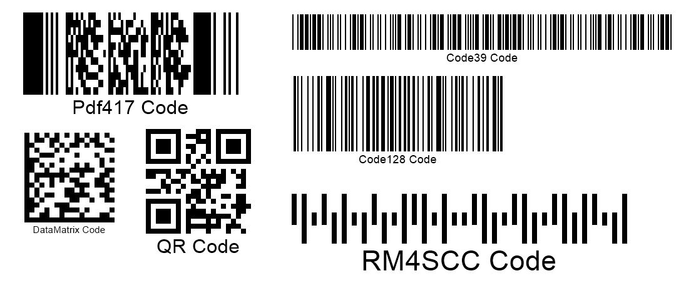

{}[Read Barcodes Online](https://products.aspose.app/barcode/recognize): You can test the quality of ***Aspose.BarCode*** recognition functionality and view the results online.{}

## **Overview**
Class [*BarCodeReader*](https://reference.aspose.com/barcode/php/classBarCodeReader) in ***Aspose.BarCode for PHP via Java*** is the most important to implement barcode recognition for more than 60 barcode types. First, it is necessary to identify a barcode source that can be represented as a file or a bitmap object. After that, target barcode types need to be specified using values from the [*DecodeType*](https://reference.aspose.com/barcode/php/classDecodeType) class. By default, the library uses the *ALL_SUPPORTED_TYPES* setting that implies iterating over all supported barcode types to check for their presence in the source image. In this case, barcode scanning takes much more time. Developers can set explicitly not only the desired barcode types but also a target region or regions in the source image. This allows optimizing the scanning process by avoiding areas without barcodes. Target regions can be determined using class [*Rectangle*](https://reference.aspose.com/barcode/php/classRectangle/).

{}*If you need any clarifications, feel free to reach out to [Aspose Technical Support](/barcode/phpjava/technical-support/): ask your questions at [Aspose.Barcode Forum](https://forum.aspose.com/c/barcode/13) or contact [Aspose Paid Support Helpdesk](https://helpdesk.aspose.com/).*{}

## **Main Barcode Reading Parameters**
In ***Aspose.BarCode for PHP via Java***, barcode reading is performed according to the following steps:
-	Determine the barcode source (image file, or bitmap), e.g. set the path to a source image
-	Select target barcode types. [*DecodeType*](https://reference.aspose.com/barcode/php/classDecodeType) is set to *ALL_SUPPORTED_TYPES* by default meaning that the sources image will be scanned to search for all supported barcode types; in this case, the time required to finish the barcode detection process will increase.  
  
The barcode library contains the *readBarCodes* function of class [*BarCodeReader*](https://reference.aspose.com/barcode/php/classBarCodeReader) that returns the result of barcode reading in an array of the [*BarCodeResult*](https://reference.aspose.com/barcode/php/classBarCodeResult) type.  
  
<p align="center"></p>  

``` php
This sample shows how to read barcodes with BarCodeReader
   $reader = new BarCodeReader("test.png", DecodeType::CODE_39_STANDARD, DecodeType::CODE_128);
   foreach($reader->readBarCodes() as $result)
      print("BarCode CodeText: ".$result->getCodeText());
   $reader = new BarCodeReader("test.png", DecodeType::CODE_39_STANDARD, DecodeType::CODE_128);
   $reader->readBarCodes();
   for($i = 0; $reader->getFoundCount() > $i; ++$i)
      print("BarCode CodeText: ".$reader->getFoundBarCodes()[i]->getCodeText());
  
   @return array of recognized {@code BarCodeResult}s on the image. If nothing is recognized, zero array is returned.
   @throws BarcodeException
   @throws RecognitionAbortedException
  /
public function readBarCodes(): array
{
    try
    {
        $this->recognizedResults = array();
        $javaReadBarcodes = java_values($this->getJavaClass()->readBarCodes());
        for ($i = 0; $i < sizeof($javaReadBarcodes); $i++)
        {
            $this->recognizedResults[$i] = new BarCodeResult($javaReadBarcodes[$i]);
        }
        return $this->recognizedResults;
    }
    catch (Exception $e)
    {
        if (strpos($e->getMessage(), "RecognitionAbortedException"))
        {
            throw new RecognitionAbortedException($e->getMessage(), null);
        }
        throw $e;
    }
}
```
  
## **Get Recognition Results**
To load barcode reading outputs, it is needed to call the *ReadBarCodes* function that provides a [*BarCodeResult*](https://reference.aspose.com/barcode/php/classBarCodeResult) array. The current reading result can be accessed using the *getFoundBarCodes* function that obtains decoding results or the *getFoundCount* function that returns the number of detected barcodes.  

``` php
$reader = new BarCodeReader("test.png", DecodeType::CODE_39_STANDARD, DecodeType::CODE_128);
$reader->readBarCodes();
for($i = 0; $reader->getFoundCount() > $i; ++$i)
{
   print("BarCode CodeText: ". $reader->getFoundBarCodes()[$i]->getCodeText());
}
```

``` php
$reader = new BarCodeReader("test.png", DecodeType::CODE_39_STANDARD, DecodeType::CODE_128);
$reader->readBarCodes();
for($i = 0; $reader->getFoundCount() > $i; ++$i)
   print("BarCode CodeText: ".$reader->getFoundBarCodes()[i]->getCodeText());
```

## **Set Barcode Recognition Source**
In ***Aspose.BarCode for PHP via Java***, there are three ways to set the barcode recognition source: from an image file or from a bitmap. The following five raster image formats are supported: PNG, JPEG, BMP, TIFF, or GIF. Three options to set the source for barcodes reading are explained further. 

### **Read Barcodes from Files**
First of all, barcodes can be scanned and recognized from image files. The full or relative path to the source needs to be specified in the *BarCodeReader* constructor. Alternatively, the *setBarCodeImage* function can be used to pass the path to the existing object of class [*BarCodeReader*](https://reference.aspose.com/barcode/php/classBarCodeReader).  

``` php
$reader = new BarCodeReader();
$reader->setBarCodeReadType(DecodeType::CODE_39_STANDARD, DecodeType::CODE_128);
$reader->setBarCodeImage("test.png");
foreach($reader->readBarCodes() as $result)
{
    print("BarCode Type: ".$result->getCodeTypeName());
    print("BarCode CodeText: ".$result->getCodeText());
}
```

### **Read Barcodes from Bitmap Objects**
In ***Aspose.BarCode for PHP via Java***, it is possible to use a graphical object or a bitmap as a source for barcode reading. Bitmap objects allow working with images consisting of pixel data. To read barcodes from a bitmap, the created bitmap object needs to be passed to the *BarCodeReader()* constructor or the *setBarCodeImage* function.  

``` php
$bmp = "test.png";
$reader = new BarCodeReader();
$reader->setBarCodeReadType(DecodeType::CODE_39_STANDARD, DecodeType::CODE_128);
$width, $height;
list($width, $height) = getimagesize('path_to_image')
$reader->setBarCodeImage($bmp, new Rectangle[] { new Rectangle(0, 0, $width, $height) });
foreach($reader->readBarCodes() as $result)
{
   print("BarCode Type: ".$result->getCodeTypeName());
   print("BarCode CodeText: ".$result->getCodeText());
}
```

## **Set Target Barcode Types**
***Aspose.BarCode for PHP via Java*** supports barcode recognition for 60+ various barcode types. To improve the efficiency of the recognition process and optimize its timing, it is recommended to set target symbologies in advance. Otheriwise, the *ALL_SUPPORTED_TYPES* setting of the [*DecodeType*](https://reference.aspose.com/barcode/php/classDecodeType) class will be used by default meaning that the library will look over all supported barcode types to check for their presence in the source image. Using this setting will increase the time needed to complete barcode recognition. 

### **List Target Barcode Types in DecodeType**
Target barcode types can be specified by grouping them in a list and passing it to the *BarCodeReader()* constructor or the *setBarCodeReadType* function.  

``` php
$reader = new BarCodeReader();
$reader->setBarCodeReadType(DecodeType::CODE_39_STANDARD, DecodeType::CODE_128);
$reader->setBarCodeImage("test.png");
foreach($reader->readBarCodes() as $result)
{
    print("BarCode Type: ".$result->getCodeTypeName());
    print("BarCode CodeText: ".$result->getCodeText());
}
```

### **Using Predefined Sets for Barcode Types**
Class [*DecodeType*](https://reference.aspose.com/barcode/php/classDecodeType) provides the following barcode type presets for barcode reading:
-	*ALL_SUPPORTED_TYPES* - all available barcode types
-	*TYPES_1D* - all supported 1D types
-	*TYPES_2D* - all supported 2D types
-	*POSTAL_TYPES* - all available postal types
-	*MOST_COMMON_TYPES* - a set of the most widespread barcode types defined according to Aspose recommendations

The required preset can be specified in the *BarCodeReader* constructor or passed to the *setBarCodeReadType* function.

```php
$reader = new BarCodeReader("test.png", DecodeType::TYPES_1D);
foreach($reader->readBarCodes() as $result)
{
   print("BarCode Type: ".$result->getCodeTypeName());
   print("BarCode CodeText: ".$result->getCodeText());
}
```

## **Setting Target Barcode Regions**
Target areas for barcode detection can be determined by creating one or several objects of [*Rectangle*](https://reference.aspose.com/barcode/php/classRectangle/). Setting target regions allows improving recognition efficiency and avoiding the regions without any barcodes. Target areas have to be determined accurately as the Aspose library applies heuristic approaches to identify target barcode detection areas. Focusing on too many image regions can lead to recognition efficiency deterioration.

### **Unique Target Region**
To set one target area for barcode recognition, it is necessary to create an object of the [*Rectangle*](https://reference.aspose.com/barcode/php/classRectangle/) type and then pass it to the *BarCodeReader* constructor or the *setBarCodeImage* function.  

```php
$bmp = "test.png";
$reader = new BarCodeReader();
$reader->setBarCodeReadType(DecodeType::CODE_39_STANDARD, DecodeType::CODE_128);
$width, $height;
list($width, $height) = getimagesize('path_to_image')
$reader->setBarCodeImage($bmp, new Rectangle[] { new Rectangle(0, 0, $width, $height) });
foreach($reader->readBarCodes() as $result)
{
   print("BarCode Type: ".$result->getCodeTypeName());
   print("BarCode CodeText: ".$result->getCodeText());
}
```

### **Several Target Regions**
It is also possible to set several target areas for barcode detection within one source image. This can be done in the same way as described above for one target region, i.e., using the *BarCodeReader* constructor or the *setBarCodeImage* function.  
  

## **Interrupt Barcode Reading Using Manual and Timeout Methods**
Class [*BarCodeReader*](https://reference.aspose.com/barcode/php/classBarCodeReader) has two special functions to interrupt the barcode reading process if it becomes unfeasible to complete. The first one is the *setTimeOut* function that can be called to interrupt the barcode reading process immediately after the timeout value gets exceeded. By default, the *TimeOut* value is set to 0.  
  
``` php
$reader = new BarCodeReader("test.png");
$reader->setTimeout(5000);
foreach($reader->readBarCodes() as $result)
   print("BarCode CodeText: ".$result->getCodeText());
```   

The second way is to use the *abort()* function. This option is used if the recognition process has been launched in the other thread. This function does not stop the entire process and returns controls immediately.  
  
Both aforementioned functions throw an exception called [*RecognitionAbortedException*](https://reference.aspose.com/barcode/php/classRecognitionAbortedException) if the recognition process could not be finished successfully.

``` php
   This sample shows how to read barcodes with BarCodeReader
   $reader = new BarCodeReader("test.png", DecodeType::CODE_39_STANDARD, DecodeType::CODE_128);
   foreach($reader->readBarCodes() as $result)
      print("BarCode CodeText: ".$result->getCodeText());
   $reader = new BarCodeReader("test.png", DecodeType::CODE_39_STANDARD, DecodeType::CODE_128);
   $reader->readBarCodes();
   for($i = 0; $reader->getFoundCount() > $i; ++$i)
      print("BarCode CodeText: ".$reader->getFoundBarCodes()[i]->getCodeText());
  
   @return array of recognized {@code BarCodeResult}s on the image. If nothing is recognized, zero array is returned.
   @throws BarcodeException
   @throws RecognitionAbortedException
  /
public function readBarCodes(): array
{
    try
    {
        $this->recognizedResults = array();
        $javaReadBarcodes = java_values($this->getJavaClass()->readBarCodes());
        for ($i = 0; $i < sizeof($javaReadBarcodes); $i++)
        {
            $this->recognizedResults[$i] = new BarCodeResult($javaReadBarcodes[$i]);
        }
        return $this->recognizedResults;
    }
    catch (Exception $e)
    {
        if (strpos($e->getMessage(), "RecognitionAbortedException"))
        {
            throw new RecognitionAbortedException($e->getMessage(), null);
        }
        throw $e;
    }
}
```

  