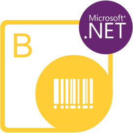

{} 

**Welcome to Aspose.BarCode for Python via .NET**
***Aspose.Barcode for Python via .NET*** is an API that allows developers to quickly and easily embed barcode reading and generation functionality to their Python applications. It supports the most widespread barcode standards and specifications. 

{} 

**Aspose.BarCode for Python via .NET Resources**
The following are the links to some useful resources you may need to accomplish your tasks.

- [Aspose.BarCode for Python via .NET Features](/barcode/python-net/features/)
- [Aspose.BarCode for Python via .NET Release Notes](/barcode/python-net/release-notes/)
- [Aspose.BarCode for Python via .NET Product Page](https://products.aspose.com/barcode/python-net)
- [Download Aspose.BarCode for Python via .NET](https://downloads.aspose.com/barcode/python-net)
- [Free Support Forum](https://forum.aspose.com/c/barcode)
- [Paid Support Helpdesk](https://helpdesk.aspose.com/)