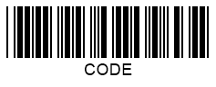

## **Overview**
The concept of **checksum** (also called *check digit*) as an error detection mechanism has been introduced to verify the correctness and integrity of information encoded in 1D barcodes. Checksums are aimed to ensure that barcode data have not been corrupted or lost and that barcode reading has been performed properly. Usually, a checksum corresponds to the last symbol in a barcode sequence that is encoded as a typical character supported by the corresponding barcode type. 1D barcodes may contain a checksum as an optional property or include it as an obligatory part that is calculated according to the specific algorithm. Then, barcode scanner decoders calculate checksums by executing required mathematical operations using the barcode digits that precede the checksum and then verify the calculation result against the checksum value.  
  
Some symbologies without compulsory checksum are composed of self-checking characters. Self-checking barcodes are inherently error resistant as any character modification is considered to be erroneous and makes a barcode unreadable. Two contradictory changes made in a character and a scan line at the same time may result in reading a barcode incorrectly. Such a discrepancy is called substitution error and can be avoided by adding checksum controls.

{}*If you need any clarifications, feel free to reach out [Aspose Technical Support](/barcode/python-net/technical-support/): ask your questions at [Aspose.Barcode Forum](https://forum.aspose.com/c/barcode/13) or contact [Aspose Paid Support Helpdesk](https://helpdesk.aspose.com/).*{}
 
## **Definition of Checksum**
The majority of 1D barcode standards have been introduced in the 70s; for most of them, the checksum is defined in a rather simple way, as a sum of all preceding barcode characters modulo the index of the maximal encoded character. In contrast, the *DataBar* group of barcode standards introduced at the beginning of the 2000s relies on the much more sophisticated checksum verification algorithm that is similar to those of modern data transmission protocols.  
In general, enabling checksum in ***Aspose.BarCode for Python via .NET*** for 1D barcodes allows verifying barcodes with minor damages. However, in the case of significantly corrupted barcode labels, the probability of incorrect barcode reading increases.  
  
To provide some examples, checksum calculations and settings for the *Code 39* and *Code 128* symbologies are discussed below.  
  
**Code 39 Checksum**
  
In *Code 39*, setting a checksum is optional. Given that the maximal number of characters to be encoded equals 43, the checksum is calculated as the sum of encoded digits modulo 43. 

  
**Code 128 Checksum**  
  
Compared to *Code 39*, the *Code 128* standard provides an improved algorithm for checksum calculation. In this case, each barcode digit is weighted by the index of its position. 
  
## **Checksum Settings**
Various barcode types have different checksum requirements, meaning that the checksum can be set optionally or requested obligatory. Moreover, a barcode standard may use different checksum types. When setting a checksum is requested, the library applies the most widely used checksum type for the corresponding barcode type. When requested, the checksum digit is generated as the last barcode character. The *is_checksum_enabled* property of class [*BarcodeParameters*](/barcode/python-net/api-reference/aspose.barcode.generation/barcodeparameters/) is used to manage checksum calculation for 1D barcodes. By default, this property is set to *Yes* for barcode types with obligatory checksum computation and *No* for those with an optional check digit.  
  
Below, the lists of barcode standards with optional and obligatory checksum settings are provided.
  
|Checksum Requirements|1D Symbologies|
|---|---|
|**Optional**|Codabar, Code 39, Italian Post 25, Interleaved 2 of 5, Matrix 2 of 5, MSI, Pharmacode, PatchCode, PZN, Standard 2 of 5|
|**Obligatory**|Codablock-F, Code 11, Code 128, Code16K, Code 32, Code93, Databar Expanded Stacked, Databar Expanded, Databar Omnidirectional, Databar Stacked OmniDirectional, Databar Stacked, Databar Limited, Databar Truncated, EAN-13, EAN-14, EAN-2, EAN-5, EAN-8, GS1 Codablock-F, GS1 Code 128, IATA 2-of-5, ISBN, ISMN, ISSN, ITF14, ITF6, OPC, SSCC14, SSCC18, UPC-A, UPC-E, UpcaGs1DatabarCoupon, VIN|

### **Optional Checksum Settings**
By default, 1D barcodes with optional checksum do not impose the necessity of check digit calculation. For such barcodes, the *is_checksum_enabled* property of class [*BarcodeParameters*](/barcode/python-net/api-reference/aspose.barcode.generation/barcodeparameters/) can be set in the following ways:
- *EnableChecksum.Default* and *EnableChecksum.No*. Checksum calculation is not enabled.
- *EnableChecksum.Yes*. The library generates the checksum of the most appropriate type for the given barcode symbology.
  
|Checksum Settings|Checksum Enabled|Checksum Disabled|
| :-: | :-: | :-: |
| |||
  
  
### **Obligatory Checksum Settings**
For such barcodes, the *is_checksum_enabled* property of class [*BarcodeParameters*](/barcode/python-net/api-reference/aspose.barcode.generation/barcodeparameters/) can be initiated as follows:
- *EnableChecksum.Default* and *EnableChecksum.Yes*. Checksum calculation is performed according to the specific algorithm.
- *EnableChecksum.No*. Depending on the given symbology, the library throws an exception or ignores this setting.

The following sample image illustrates the barcode label generated with obligatory checksum settings.     

  
## **Displaying Checksum for Code 128**
For the *Code 128* and *GS1 Code 128* types, the library provides the *checksum_always_show* property of class [*BarcodeParameters*](/barcode/python-net/api-reference/aspose.barcode.generation/barcodeparameters/). When enabled, this setting allows adding the checksum digit in the *CodeText* field and thus displaying it as human-readable barcode text. 
  
|Checksum Visibility|Displayed|Hidden|
| :-: | :-: | :-: |
| |||
  
