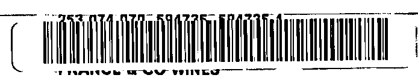

## **Barcode Images with Gaussian Noise**
Gaussian noise is one of the most common damages that may deteriorate the quality of a source barcode. Most of difficulties correspond to the cases when barcode images have the monochrome color scheme or the distortion grain is considerably bigger than the minimal element of a barcode. To cope with these effects, median filtering mechanisms suitable for both 1D and 2D symbologies can be applied. Median filtering mechanisms also affect image quality due to the possible removal of some barcode elements together with noise; however, they still may be helpful in improving readability of key barcode modules. ***Aspose.BarCode for Python via .NET*** contains class [*QualitySettings*](/barcode/python-net/api-reference/aspose.barcode.barcoderecognition/qualitysettings/) that is used to enable and disable various algorithms to read barcodes with damages or artifacts. 

{}*If you need any clarifications, feel free to reach out to [Aspose Technical Support](/barcode/python-net/technical-support/): ask your questions at [Aspose.Barcode Forum](https://forum.aspose.com/c/barcode/13) or contact [Aspose Paid Support Helpdesk](https://helpdesk.aspose.com/).*{}

### **Median Filtering for 1D Barcodes**
One-dimensional filtering for linear barcodes can be set using the *allow_salt_and_paper_filtering* property of class [*QualitySettings*](/barcode/python-net/api-reference/aspose.barcode.barcoderecognition/qualitysettings/). In this case, the filtering window size is selected automatically.  

### **Median Filtering for 2D Barcodes**
In ***Aspose.BarCode for Python via .NET***, median filtering can be implemented using the *allow_median_smoothing* property and setting the median filtering window using the *median_smoothing_window_size* property. Unlike 1D barcodes, automated selection of a suitable median filtering window is not supported for 2D types.  

### **Median Filtering for Postal Barcodes**
One-dimensional median filtering for postal barcode types can be performed using the *allow_micro_white_spots_removing* property. The size of the filtering window is set automatically.  

### **Filtering Out White Spots**
The presence of white spots in barcode images is a frequent problem that appears while sending documents with barcodes through fax transmission. To mitigate this issue, it is possible to use the *allow_white_spots_removing* property that allows filtering out not all Gaussian noise but only white spots.  
  

## **Reducing Barcode Image Size to Eliminate Visual Artifacts**
In some cases, distortions caused by excessive scaling of a barcode image can be mitigated by reducing the scale space. It can be done using the *allow_decreased_image*. Its purpose is to reduce the size of an image and in this way, to facilitate barcode reading by eliminating visual artifacts.   
  

## **Reading Barcodes with Erased or Displaced Bars**
While scanning or sending barcode images using fax transmission, the problem of displaced or erased bars in 1D barcode labels often appears, especially, in those printed out using ink-jet printers. To resolve this issue, the barcode library provides two properties: *allow_one_d_wiped_bars_restoration* and *setCheckMore1DVariants* that allow selecting the most suitable recognition option according to the checksum value and other barcode elements. However, it should be noted that enabling these settings may result in incorrect recognition of 1D barcodes.  
  

## **Reading Inverted Barcode Images**
The library enables reading barcode images with inverted colors. To do this, it is required to use the *allow_invert_image* property. 

## **Detecting Colored Barcodes on Colored Background**
To read colored barcodes on a colored background, the barcode library provides the *allow_complex_background* property that attempts to distinguish the colored background from barcode labels through color quantization and then subtract it. It should be noted that enabling this parameter results in considerable deceleration of recognition speed and thus should be used in special cases only. 
  

## **Reading Evidently Incorrect Barcodes**
In cases when it is necessary just to detect the presence of barcodes regardless of their validity and corresponding recognition correctness, it is possible to enable two special settings called *setAllowIncorrectBarcodes* and *setReadTinyBarcodes*. The first one is used to attempt performing partial barcode recognition even if the reading process has provided incorrect results; in this case, the barcode data is decoded with [*BarCodeConfidence*](/barcode/python-net/api-reference/aspose.barcode.barcoderecognition/barcodeconfidence/) being set to *None*, which means that the correctness of recognition is not guaranteed.  
  
The *read_tiny_barcodes* property facilitates reading small barcode labels in large images. It is ignored if the *allow_incorrect_barcodes* property is called passing the *True* value. However, enabling this parameter may result in recognizing false barcodes in place of actual text or tables.  
  

## **Reading Industrial Data Matrix Barcodes**
Industrial *Data Matrix* barcodes often have dotted patterns or other decoration elements and are placed onto metallic surfaces, in this way, creating embossed indelible barcode labels. To facilitate the recognition of such barcodes, it is possible to enable the *allow_datamatrix_industrial_barcodes* property that allows reading dashed labels in a slow mode. 

## **Reading Severely Distorted QR Codes and Micro QR Codes**
The barcode library allows reading severely corrupted *QR Code* and *Micro QR Code* images. It can be enabled by setting the *allow_qr_micro_qr_restoration* parameter.

