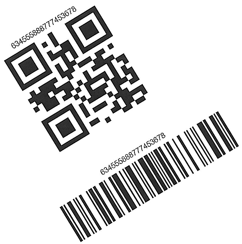

---
title: Get Barcode Placement Region and Orientation Angle
linktitle: Get Placement Region and Orientation
type: docs
description: "This article describes how to read barcode parameters"
keywords: "Read Barcode, Read Barcode from Stream, Scan Barcode from Image, Many Barcodes in One Image, Read PDF417 Barcode, Read PDF417 Metadata, Read Qr Code, Read QR Code Metadata, QR Code Structured Append, Aspose.BarCode, Read Barcode C#"
weight: 20
url: /python-net/get-placement-and-orientation/
---  
  
## **Barcode Position and Orientation Angle**
To obtain the position of a source barcode and its orientation angle, class [*BarCodeRegionParameters*](/barcode/python-net/api-reference/aspose.barcode.barcoderecognition/barcoderegionparameters/) can be used. This class allows getting the information about the barcode region in the following forms:
-	quadrangle – a quadrangle object that bounds a barcode
-	rectangle - a rectangle object that bounds a barcode
-	points – an array of points constituting a barcode
-	angle – an orientation angle in degrees

  

