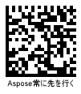

  
## **Get Barcode Type and Encoded Data**
To obtain input barcode data and its type, *code_text* and *code_type* properties of class [*BarCodeResult*](/barcode/python-net/api-reference/aspose.barcode.barcoderecognition/barcoderesult/) can be used. The other property called *code_type_name* returns the text name of the barcode type.

 
  
## **Get Barcode Data as Byte Stream**
It is possible to load barcode data as a byte stream using a property of class [*BarCodeResult*](/barcode/python-net/api-reference/aspose.barcode.barcoderecognition/barcoderesult/) that is called *code_bytes*. 

## **Decode Barcode Text in Unicode**
For barcodes in which the barcode data is encoded in a Unicode encoding, the barcode library provides the *get_code_text(encoding)* method that can be used to enable the required encoding.  

