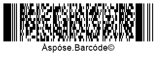

## **Read Macro PDF417 and Macro PDF417 Metadata**
Metadata from *PDF417* barcodes can be obtained using the properties of class [*Pdf417ExtendedParameters*](/barcode/python-net/api-reference/aspose.barcode.barcoderecognition/pdf417extendedparameters/) listed below.
  
|PDF417 Metadata Property|Description|
|---|---|
|*pdf_417_macro_file_id*|Gets the unique identifier of a barcode series or a PDF417 file|
|*pdf_417_macro_segment_id*|Gets the current identifier of a segment|
|*pdf_417_macro_segments_count*|Returns the number of barcodes in a series|
|*pdf_417_macro_file_name*|Returns the name of a file|
|*pdf_417_macro_checksum*|Gets the checksum value computed using CCITT-16 polynomial|
|*pdf_417_macro_file_size*|Returs the total size of bytes in a series|
|*pdf_417_macro_time_stamp*|Returns the time spent to generate/send the file|
|*pdf_417_macro_addressee*|Gets the address of the file sender|
|*pdf_417_macro_sender*|Returns the name of the file sender|
  
  

  

## **Read Metadata from QR Codes with Structured Append**
To fetch metadata from *QR Code* barcodes with structured append, the barcode library provides a class called [*QRExtendedParameters*](/barcode/python-net/api-reference/aspose.barcode.barcoderecognition/qrextendedparameters/) that enables reading the information from structured append used to combine several *QR Code* barcodes into one. This data can be obtained using the following properties:

- *qr_structured_append_mode_bar_code_index* - returns the sequence number of the current barcode (starting from 0)
- *qr_structured_append_mode_bar_codes_quantity* - returns the number of barcodes in a composite *QR Code* barcode taht can take values from 2 to 16
- *qr_sructured_append_mode_parity_data* - returns the checksum identifier byte that is usually computed as *XOR* of all bytes in which UTF16BE characters are encoded in two bytes  

  
## **Read Metadata from DataBar Barcodes with 2D Components**
Metadata from *DataBar* barcodes with 2D components can be obtained using class called [*DataBarExtendedParameters*](/barcode/python-net/api-reference/aspose.barcode.barcoderecognition/databarextendedparameters/) that provides a property called *is_2d_composite_component*. This property allows enabling or disabling a 2D component in *DataBar* barcodes. 

## **Read Metadata from 1D Barcodes**
Some 1D barcode types, i.e. *EAN 13*, allow separating barcode input information itself from the checksum value. To do this, class [*OneDExtendedParameters*](/barcode/python-net/api-reference/aspose.barcode.barcoderecognition/onedextendedparameters/) provides the *value* property that allows getting 1D barcode text and the *check_sum* property that returns the result of checksum computation.

 

  
## **Get Raw Data from Code 128 Barcodes**
Input data stored in *Code 128* barcodes can be encoded in three ways: A, B, or C. Class [*Code128ExtendedParameters*](/barcode/python-net/api-reference/aspose.barcode.barcoderecognition/code128extendedparameters/) provides a property called *code_128_data_portions* that returns decoded parts of barcode input information and the encoding mode.

