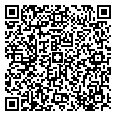

## **Overview**
*Swiss QR Code* has been created to automate payment digital operations in Switzerland. Currently, payment bills and receipts issued there need to be marked with a *Swiss QR Code* that stores the details about transactions. Unlike usual *QR Codes*, *Swiss QR Codes* have the Swiss cross sign in the center.  
  
The *Swiss QR Code* standard has been introduced to work with QR bills in electronic payments. A *Swiss QR Code* contains all necessary payment information required to execute payments or process a QR invoice. ***Aspose.BarCode for Python via .NET*** includes [*SwissQRBill*](/barcode/python-net/api-reference/aspose.barcode.complexbarcode/swissqrbill/) and [*SwissQRCodetext*](/barcode/python-net/api-reference/aspose.barcode.complexbarcode/swissqrcodetext) classes to work with *Swiss QR* codes.  
  
General rules for creating *Swiss QR Codes* and payment documents are described in the ["Swiss Implementation Guidelines for the QR-bill"](https://www.paymentstandards.ch/dam/downloads/ig-qr-bill-en.pdf) standard that relies on the ISO 20022 standard.

## **Generate Swiss QR Codes**
To generate a *Swiss QR Code*, it is necessary to create an instance of [*ComplexBarcodeGenerator*](/barcode/python-net/api-reference/aspose.barcode.complexbarcode/complexbarcodegenerator/) and enter input data into [*SwissQRCodetext*](/barcode/python-net/api-reference/aspose.barcode.complexbarcode/swissqrcodetext).  

 

## **Read Swiss QR Codes**
Class [*ComplexCodetextReader*](/barcode/python-net/api-reference/aspose.barcode.complexbarcode/complexcodetextreader) is used to extract input data from different complex barcode types, in this case, *Swiss QR Code*. To decode *Swiss QR Codes*, first, it is necessary to create an instance of class [*BarCodeReader*](/barcode/python-net/api-reference/aspose.barcode.barcoderecognition/barcodereader) and set it to the value *DecodeType.QR*. then, the decoded data needs to be parsed using class [*ComplexCodetextReader*](/barcode/python-net/api-reference/aspose.barcode.complexbarcode/complexcodetextreader) by calling the *try_decode_swiss_qr(encoded_codetext)* method that returns an instance of [*SwissQRCodetext*](/barcode/python-net/api-reference/aspose.barcode.complexbarcode/swissqrcodetext) with the decoded information.