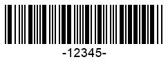

{}[Generate Codabar Barcodes Online](https://products.aspose.app/barcode/generate/codabar): You can test the quality of ***Aspose.BarCode*** generation for Codabar barcodes and get results online.{}

## **Overview**
***Aspose.BarCode for Python via .NET*** supports the *Codabar* type that allows encoding numerical characters and a set of six punctuation signs. *Codabar* barcodes may include four optional alphabet symbols (generally, A, B, C, or D) serving as start and stop characters. As such, this barcode type supports four sets of start digits and four sets of stop ones. In this way, using the same input data, it is possible to create 16 barcodes with service sets of start and stop symbols.  
  
Input text in *Codabar* barcodes has the following format:  
<p align="center"><mark>[Start Character "A/B/C/D"] [Data Digits from the charset: "0-9" and "–$./:+"] [Stop Character "A/B/C/D"]</mark></p>
  
{}*If you need any clarifications, feel free to reach out [Aspose Technical Support](/barcode/python-net/technical-support/): ask your questions at [Aspose.Barcode Forum](https://forum.aspose.com/c/barcode/13) or contact [Aspose Paid Support Helpdesk](https://helpdesk.aspose.com/).*{}
  
## **Start and Stop Symbols**
Start and stop digits can be encoded separately using any of four formats (A, B, C, or D). To specify the preferred format, it is possible to use *codabar_start_symbol* and *codabar_stop_symbol* properties from class [*CodabarParameters*](/barcode/python-net/api-reference/aspose.barcode.generation/codabarparameters/). The default set of start and stop digits is "A".  
  
Following barcode images have been created using various sets of start and stop characters.
  
|Start and Stop Characters|A+A|B+B|C+C|D+D|
| :-: | :-: | :-: | :-: | :-: |
| |||||
  

  
## **Checksum Settings**
In general, the *Codabar* standard does not require obligatory checksum controls. If checksum controls are needed, *Codabar* provides two checksum algorithms: Mod10 and Mod16. The pseudocode given below shows how these two checksum algorithms can be used.  

``` csharp
//Mod10
foreach (var value in encodedCodetext)
    checkSum = (checkSum + value) % 10;
//Mod16
foreach (var value in encodedCodetext)
    checkSum = (checkSum + value) % 16;
```
  
Checksum controls for *Codabar* can be enabled using the [*EnableChecksum*](/barcode/python-net/api-reference/aspose.barcode.generation/enablechecksum/) enum. The required checksum algorithm can be allocated through the [*CodabarChecksumMode*](/barcode/python-net/api-reference/aspose.barcode.generation/codabarchecksummode/) enum. By default, the *Mod16* checksum is applied.  
  
*Codabar* barcode images below have been generated using different checksum control settings.

|Checksum Calculation|Is Set to *None*|Is Set to *Mod10*|Is Set to *Mod16*|
| :-: | :-: | :-: | :-: |
| ||||
  
