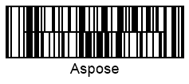
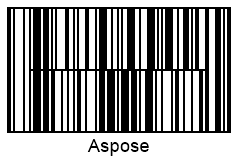
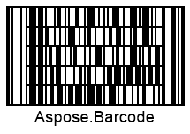

{}[Generate Codablock-F Barcodes Online](https://products.aspose.app/barcode/generate/codablock?type=codablockf): You can check the quality of ***Aspose.BarCode*** generation for Codablock-F barcodes and view results online.{}

## **Overview**
*Codablock-F* is a stacked multiple-row barcode type that enables creating barcodes that include many *Code 128* barcodes. This symbology allows encoding at most 2,725 digits and contains from 2 to 44 rows with from 4 to 62 characters. *Codablock-F* benefits from two principle differences compared with the basic *Code 128* symbology. It provides flexible settings of barcode layout in terms of the number of rows and columns and thus allows organizing vertical and horizontal space more efficiently. Moreover, it contains two additional check digits (calculated using the modulo 86 algorithm) for a *Codablock-F* barcode besides obligatory checksum controls that are included in each row of *Code 128* barcodes. Finally, *Codablock-F* can be detected using laser scanners.
  
{}*If you need any clarifications, feel free to reach out [Aspose Technical Support](/barcode/python-net/technical-support/): ask your questions at [Aspose.Barcode Forum](https://forum.aspose.com/c/barcode/13) or contact [Aspose Paid Support Helpdesk](https://helpdesk.aspose.com/).*{}
  
## **Height Settings**

***Aspose.BarCode for Python via .NET*** allows developers to modify the height of each row in a stacked barcode using the *aspect_ratio* properties of class [*CodablockParameters*](/barcode/python-net/api-reference/aspose.barcode.generation/codablockparameters/). *AspectRatio* is determined as a relative coefficient to *XDimension*. For *Codablock-F* barcodes, the value of *AspectRatio* should be set greater than 10.  
  
Following barcode images have been created using various aspect ratio settings. 
  
|Aspect Ratio|Is Set to 15|Is Set to 30|
| :-: | :-: | :-: |
| |||
  

## **Layout Settings**
To adjust the layout of a *Codablock-F* barcode in terms of the number of columns and rows, *columns* and *rows* properties of class [*CodablockParameters*](/barcode/python-net/api-reference/aspose.barcode.generation/codablockparameters/) can be used. The maximum values of columns and rows can be 62 and 44, respectively.  
  
Barcode images provided below have been generated using different layout settings.
  
|Layout Settings|4 Columns|4 Rows|6 Rows and 4 Columns|
| :-: | :-: | :-: | :-: | :-: |
| ||||
  
