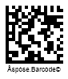
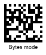
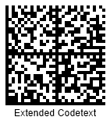
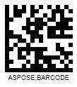
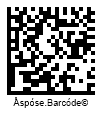
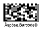

{}[Generate Data Matrix Barcodes Online](https://products.aspose.app/barcode/generate/datamatrix): You can test the quality of ***Aspose.BarCode*** generation for Data Matrix barcodes and get results online.{}

## **Overview**
*Data Matrix* is a 2D matrix symbology used to generate barcodes of rectangular and square shapes. It is a widespread industry standard that can be used to encode characters and streams of bytes. The maximal configuration of *Data Matrix* contains up to 144 rows and columns and allows encoding at most 3,116 numerical digits or 2,335 ASCII symbols or 1,555 bytes. The *Data Matrix* barcode data includes special information for integrity verification and error correction. The error correction mechanism allows reading barcodes with severe damage. *Data Matrix* includes two standards described in the table below.  
   
|Data Matrix Standard|Description|
|---|---|
|*ECC 000-140*|Several obsolete standards that enable square barcode configuration only, use outdated encoding algorithms, and support convolutional error correction. It is recommended not to apply these standards to business-as-usual goals as they currently serve only to execute industrial tasks that are compatible with outdated instructions|
|*ECC 200*|Modern standard that enables both square and rectangular barcode configurations, utilizes up-to-date encoding methods, and supports Reed-Solomon error correction. It is applicable to any up-to-date application|
  
{}*If you need any clarifications, feel free to reach out [Aspose Technical Support](/barcode/python-net/technical-support/): ask your questions at [Aspose.Barcode Forum](https://forum.aspose.com/c/barcode/13) or contact [Aspose Paid Support Helpdesk](https://helpdesk.aspose.com/).*{}

## **Data Matrix ECC Standards**
To enable the required *Data Matrix* standard, developers can use the *data_matrix_ecc* property of class [*DataMatrixParameters*](https://reference.aspose.com/barcode/python-net/aspose.barcode.generation/datamatrixparameters/). This property allows setting one of the supported standards: *ECC 000-140* (outdated standards) or *ECC 200* (recent universal standard) using the values available in the [*DataMatrixEccType*](https://reference.aspose.com/barcode/python-net/aspose.barcode.generation/datamatrixecctype/) enum. The value of *DataMatrixEccType.ECC_200* is set by default.
  
### ***ECC 200***
***Aspose.BarCode for Python via .NET*** allows explicitly setting the *ECC 200* standard initializing the *data_matrix_ecc* property with values *ECC_AUTO* or *ECC_200*. *ECC_200* is compatible with all encoding modes specified in the [*DataMatrixEncodeMode*](https://reference.aspose.com/barcode/python-net/aspose.barcode.generation/datamatrixencodemode/) enum. Moreover, it allows encoding Unicode characters using the *code_text_encoding* property. The capacity of additional recovery information required for error correction is precisely limited for barcodes according to their size.  
    

  
  
### ***ECC 000-140***  
*ECC 000-140* standards can be applied only to a few encoding modes included in the [*DataMatrixEncodeMode*](https://reference.aspose.com/barcode/python-net/aspose.barcode.generation/datamatrixencodemode/) enum, i.e. *AUTO*, *FULL*, and *ASCII*. All other encoding modes are processed as *FULL* by default. The *code_text_encoding* property does not apply to these standards and therefore, encoding Unicode characters is not supported. Barcode layout configurations of *ECC 000-140* differ significantly from *ECC 200*. At the same time, different standards corresponding to *ECC 000-140* are quite similar to each other and only have different data recovery capacities, as explained below. 
  
|ECC Standard|Data Recovery Capacity|
| :-: | :-: |
|**ECC_000**|Only error detection|
|**ECC_050**|2.8%|
|**ECC_080**|5.5%|
|**ECC_100**|12.6%|
|**ECC_140**|25%| 
    

  
## **Encoding Modes**
***Aspose.BarCode for Python via .NET*** supports various encoding modes that are defined in the [*DataMatrixEncodeMode*](https://reference.aspose.com/barcode/python-net/aspose.barcode.generation/datamatrixencodemode/) enum of class [*DataMatrixParameters*](https://reference.aspose.com/barcode/python-net/aspose.barcode.generation/datamatrixparameters/). This enum provides nine encoding modes, as described below. The *AUTO* encoding mode is used by default.
  
|Encoding Mode|Description|
|---|---|
|*AUTO*|Similar to *ASCII*|
|*ASCII*|Encodes both ASCII characters and streams of bytes; characters from 128 to 255 are encoded with two bytes. The *FULL* mode is recommended to encode streams of bytes|
|*FULL*|Encodes any symbol in 8 bits. This mode is recommended to encode byte streams|
|*CUSTOM*|Uses the encoding determined in *BarCodeBuilder.CodeTextEncoding*; thereafter, the generated stream of bytes is further processed through the *FULL* mode|
|*C40*, *TEXT*, *EDIFACT*, and *ANSIX12*|Encode predefined sets of symbols through special industrial encodings, i.e. C40, Text, EDIFACT, and ANSI X12|
|*EXTENDED_CODETEXT*|Gives flexible control over encodings and allows setting the required encoding for a part of the input message manually|
  
For all encoding modes except *CUSTOM*, the encoding determined in *BarCodeBuilder.CodeTextEncoding* is used to process input information that includes a Unicode symbol (any character with a value over 255). The *CUSTOM* mode is enabled in the *ECC 200* standard only. Further in the article, it is explained how to manage different encoding modes.
  
### ***AUTO* and *ASCII* Encoding Modes**
*AUTO* and *ASCII* encoding modes allow encoding ASCII symbols and byte streams. However, encoding characters from 128 to 255 takes two bytes for each character. In cases when input text includes Unicode symbols, information needs to be re-encoded with the use of the encoding determined in *BarCodeBuilder.CodeTextEncoding*.  
  

 

### **Encoding Streams of Bytes in *FULL* Mode**
The *FULL* mode is used to encode streams of bytes. In this mode, each byte is encoded with 8 bits. If input barcode data contains Unicode characters, information gets re-encoded with the encoding set in *BarCodeBuilder.CodeTextEncoding*. It is possible to represent text lines using the *two_d_display_text* property. 
  

 

### **Encoding Unicode Text in *CUSTOM* Mode**
In all cases, the *CUSTOM* encoding mode implies first re-encoding barcode information into a stream of bytes. Thereafter, the generated stream gets processed in the *FULL* mode; here, each byte is encoded using 8 bits.  
  

 

### **Extended Encoding Controls in *EXTENDED_CODETEXT* Mode**
The *EXTENDED_CODETEXT* mode allows encoding input data by applying various encodings to different parts of barcode text if requested by specific industrial standards. It is possible to combine different supported encodings, i.e. *AUTO*, *ASCII*, *C40*, *TEXT*, *ANSIX12*, and *EDIFACT*.  
  
It is necessary to formulate a barcode text message using the following form: <mark>"\Encoding_mode_name:text\Encoding_mode_name:text"</mark>. It is necessary to double all backslashes in text. To display the text message under a barcode, the *two_d_display_text* property needs to be used.  
    

 
  
### **Special Industrial Encoding Modes: *C40*, *TEXT*, *EDIFACT*, and *ANSIX12***
Various special encoding modes, such as *TEXT*, *C40*, *EDIFACT*, and *ANSIX12*, can be used to encode barcode information in forms compatible with specific industrial requirements. These modes are applicable to industrial tasks only.  
  
  

 
  
## **Layout Settings**
The layout for *Data Matrix* barcode generation can be determined using *rows* and *columns* properties of class [*DataMatrixParameters*](https://reference.aspose.com/barcode/python-net/aspose.barcode.generation/datamatrixparameters/). If these properties have not been initialized, the barcode library identifies a layout that is optimal for the size of input data. Barcode layout configurations are different in *ECC 000-140* and *ECC 200* standards. Only *ECC 200* allows modifying the number of rows and columns. In *ECC 000-140* standards, the suitable barcode layout configuration is determined automatically. The *ECC 200* standard prescribes setting even numbers of rows and columns. In other words, it supports the following layout configurations: 8 x 18; 16 x 48; 10 x 10; 144 x 144.

|Layout Settings|22 Rows and 22 Columns|12 Rows and 36 Columns|
| :-: | :-: | :-: |
| |||
  

## **Working with Macro Characters**
***Aspose.BarCode for Python via .NET*** supports the use of macro characters in *Data Matrix* barcodes. The *Data Matrix* standard allows encoding industry-specific headers and trailers in a single character. This feature leads to the reduction of the number of symbols for data encoding owing to the use of dedicated structured formats. Macro characters can be useful to implement particular industrial needs. It is necessary to put a macro character in the first digit position.
  

 
  
## **Aspect Ratio Settings**
*Aspect Ratio* is one of the most important parameters defined as the ratio between barcode height and width. ***Aspose.BarCode for Python via .NET*** provides the *aspect_ratio* property of class [*DataMatrixParameters*](https://reference.aspose.com/barcode/python-net/aspose.barcode.generation/datamatrixparameters/) that allows managing barcode proportions based on the X and Y coordinates. *Aspect Ratio* is determined as a relative coefficient to *XDimension*. Usually, it is recommended to set the value of *Aspect Ratio* equal to 1.
  
|Aspect Ratio|Is Set to 1|Is Set to 0.5|
| :-: | :-: | :-: |
| |||
  