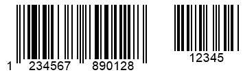

{}[Generate Barcodes Online](https://products.aspose.app/barcode/generate): You can check the quality of ***Aspose.BarCode*** barcode generation and view the results online.{}

## **Overview**
***Aspose.BarCode for Python via .NET*** supports *EAN-2* and *EAN-5* types but only as a supplement for some barcode types, i.e. *EAN-8*, *EAN-13*, *Interleaved 2-of-5*, *Standard 2-of-5*, *ISMN*, *ISBN*, *ISSN*, *UPC-E*, or *UPC-A*. Supplement barcodes are used to encode two or five additional characters with their own checksum controls. Supplement barcodes have applications that are limited to specific industrial tasks. They can also be used in production to store additional information about products or their price. 
  
{}*If you need any clarifications, feel free to reach out [Aspose Technical Support](/barcode/python-net/technical-support/): ask your questions at [Aspose.Barcode Forum](https://forum.aspose.com/c/barcode/13) or contact [Aspose Paid Support Helpdesk](https://helpdesk.aspose.com/).*{}
  
## **Supplement Barcode Settings**
Conventional barcodes serve to encode the most important information about items or products. To store additional (supplement) data besides primary barcodes, developers can use the *supplement_data* property of class [*SupplementParameters*](/barcode/python-net/api-reference/aspose.barcode.generation/supplementparameters/). This property needs to take 2 or 5 additional numerical digits for *EAN-2* or *EAN-5*, respectively. Thereafter, the library identifies the suitable barcode type automatically based on the entered number of digits. Supplement barcode size is computed automatically according to the parameters of the primary barcode.  
  
The following barcodes have been created enabling *EAN-2* and *EAN-5* supplements for *EAN-13* barcodes.

|Supplement Barcode|EAN-2|EAN-5|
| :-: | :-: | :-: |
| |||
  
## **Adjusting Supplement Spacing**
To define the size of a gap between the main and supplement barcodes, the library provides the *supplement_space* property of class [*SupplementParameters*](/barcode/python-net/api-reference/aspose.barcode.generation/supplementparameters/).  
  
The barcode samples demonstrated below have been generated with different gap settings.  
  
|Supplement Spacing|Is Set to 20 Pixels|Is Set to 40 Pixels|
| :-: | :-: | :-: |
| |||
  
