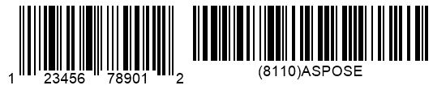

{}[Generate GS1 Code 128 and](https://products.aspose.app/barcode/generate/code128?type=gs1code128) [GS1 Data Matrix Barcodes Online](https://products.aspose.app/barcode/generate/datamatrix?type=gs1datamatrix): You can test the quality of ***Aspose.BarCode*** generation for GS1 barcodes and view the results online.{}

## **Overview**
GS1 is one of the main developers of data processing and encoding standards for barcodes. It is an international non-profit organization that introduces standardized machine data reading methods for item tracking based on the mechanism of automatic identification and data capture (AIDC). GS1 has proposed using application identifiers (AIs) that are defined as identification codes to encode information about items or goods. Such codes serve as prefixes that may be added to barcodes or RFID tags to store some extra information. Moreover, GS1 has introduced special encoding standards for various types.  
  
The barcode types compatible with all GS1 Application Identifiers or the GS1AI_01 type only are listed in the table below.  
  
|Compatibility with GS1 AIs|Supported Barcode Types|
|---|---|
|Supports All GS1 AIs|DataBar Expanded, DataBar Expanded Stacked, GS1 Codablock-F, GS1 Code 128, GS1 Data Matrix, GS1 QR Code, UPC-A GS1 DataBar Coupon, UPC-A GS1 Code 128 Coupon|
|Supports Only GS1AI_01|DataBar Omnidirectional, DataBar Stacked Omnidirectional, Databar Limited, DataBar Truncated, DataBar Stacked, EAN 14, ITF 14|
  
{}*If you need any clarifications, feel free to reach out [Aspose Technical Support](/barcode/python-net/technical-support/): ask your questions at [Aspose.Barcode Forum](https://forum.aspose.com/c/barcode/13) or contact [Aspose Paid Support Helpdesk](https://helpdesk.aspose.com/).*{}

## **GS1 Barcode Generation Standards**
***Aspose.BarCode for Python via .NET*** supports creating barcodes of various symbologies using formats based on GS1 standards. To generate barcodes in this way, developers first need to pass barcode text using the *code_text* property of class [*BarcodeGenerator*](https://reference.aspose.com/barcode/python-net/aspose.barcode.generation/barcodegenerator/) using the following format:  

<mark>"(Application_Identifier_1)Application_Data(Application_Identifier_2)Application_Data"</mark>
 

As an example, it is possible to set the string "(01)12345678901231(21)ASPOSE(30)9876" as barcode text using the *code_text* property.  
      
**GS1 Code 128**  
    

    
**GS1 DataMatrix**  
  

  
## **GS1 UPC-A Coupon Barcodes**
It is possible to generate *UPC-A* barcodes with coupon add-ons in the form of *DataBar Expanded* or *GS1 Code128* barcodes displayed nearby the primary barcode label. This can be done also by creating two barcode images separately and then merging them into the same image using special graphic libraries. ***Aspose.BarCode for Python via .NET*** allows generating barcodes with coupons in a faster and easier manner.  
  
Specifically, the barcode library enables creating barcodes with coupons using two formats:
- *UPC-A GS1 DataBar Coupon*: *UPC-A* + *DataBar Expanded* coupon
- *UPC-A GS1 Code 128 Coupon*: *UPC-A* + *GS1 Code128* coupon
  
Developers can generated aforementioned barcodes with coupons using the [*EncodeTypes*](https://reference.aspose.com/barcode/python-net/aspose.barcode.generation/encodetypes/) class and fields *UPCA_GS_1_CODE_128_COUPON* and *UPCA_GS_1_DATABAR_COUPON* of class [*SymbologyEncodeType*](https://reference.aspose.com/barcode/python-net/aspose.barcode.generation/symbologyencodetype/). First, it is needed to initiate the *code_text* property of class [*BarcodeGenerator*](https://reference.aspose.com/barcode/python-net/aspose.barcode.generation/barcodegenerator/) passing barcode text as a string in the special format:  

<mark>"UPC-A Input Data(Application Identifier)GS1 Barcode Text"</mark>
  
  
As an example, it is possible to pass the string "123456789012(8110)ASPOSE" to the *code_text* property. 
    
### **UPC-A + DataBar Expanded**

  
### **UPC-A + GS1 Code 128**

## **Spacing Settings for Barcodes with Coupons**
***Aspose.BarCode for Python via .NET*** provides a possibility to modify the size of spacings between primary barcodes and their coupons using the *supplement_space* property of class [*CouponParameters*](https://reference.aspose.com/barcode/python-net/aspose.barcode.generation/couponparameters/).  
  
Following *UPC-A GS1 DataBar Coupon* barcodes have been created with different spacing settings.
     
|Spacing Size|Is Set to 30 Pixels|Is Set to 50 Pixels|
| :-: | :-: | :-: |
| |||
  
