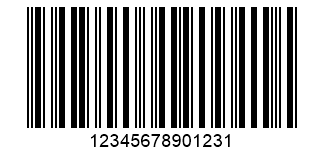
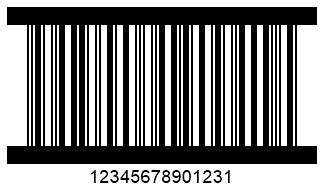
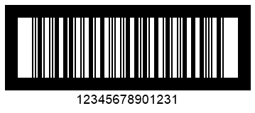

{}[Generate ITF Barcodes Online](https://products.aspose.app/barcode/generate/itf): You can check the quality of ***Aspose.BarCode*** generation for ITF barcodes and view the results online.{}

## **Overview**
The GS1 organization has proposed the *ITF 14* barcode standard as an extension of *Interleaved 2-of-5*. *ITF 14* is intended to work with trade identifiers in the form of Global Trade Item Numbers (GTIN). This symbology can be used to encode sets of 14 characters with the last one being the check digit. The *ITF 6* standard serves as a special extension of *ITF 14* that is used to encode such properties of trade items as weight. Generally, *ITF* barcodes are designed with frames of various styles with a quiet zone. Frame settings may require customization according to specific industrial requirements. ***Aspose.BarCode for Python via .NET*** allows developers to modify such appearance-related properties of *ITF* barcodes through class [*ITFParameters*](/barcode/python-net/api-reference/aspose.barcode.generation/itfparameters/). In this article, it is explained how to manage these properties.
  
{}*If you need any clarifications, feel free to reach out [Aspose Technical Support](/barcode/python-net/technical-support/): ask your questions at [Aspose.Barcode Forum](https://forum.aspose.com/c/barcode/13) or contact [Aspose Paid Support Helpdesk](https://helpdesk.aspose.com/).*{}

## **Frame Settings**
*ITF* barcodes usually are generated with frames with various styles depending on industrial specificities. ***Aspose.BarCode for Python via .NET*** enables adjusting appearance-related parameters of *ITF* barcodes, i.e. frame styles and thickness.
 
### **Frame Style Settings**
***Aspose.BarCode for Python via .NET*** supports five styles for *ITF* barcode frames. The required frame style including the one with no frames can be enabled using the [*ITF14BorderType*](/barcode/python-net/api-reference/aspose.barcode.generation/itf14bordertype/) enum. The following styles are available: *NONE*, *FRAME*, *BAR*, *BAR_OUT*, and *FRAME_OUT*. *FRAME_OUT* and *BAR_OUT* imply displaying frames outside the barcode image itself so that the original height is not modified. 
  
Following barcodes have been generated with different frame settings. 
  
|Frame Style|No Borders (*NONE*)|Normal Frame (*FRAME*)|Horizontal Lines (*BAR*)|Outside Frame (*FRAME_OUT*)|Outside Lines (*BAR_OUT*)|
| :-: | :-: | :-: | :-: | :-: | :-: |
| ||||||
  
  
### **Frame Thickness Settings**
Developers can customize thickness settings for *ITF* barcodes according to particular industrial needs through the *itf_border_Thickness* property of class [*ITFParameters*](/barcode/python-net/api-reference/aspose.barcode.generation/itfparameters/). The default settings for border thickness is equal to 12 pt.
  
Following *ITF 14* barcodes have been created setting different border thickness values.
  
|Border Thickness|Is Set to 5 Pixels|Is Set to 15 Pixels|
| :-: | :-: | :-: |
| |||
  
  
## **Quiet Zone Settings**
***Aspose.BarCode for Python via .NET*** allows developers to modify the quiet zone size for *ITF* barcodes using the *quiet_zone_coef* property of class [*ITFParameters*](/barcode/python-net/api-reference/aspose.barcode.generation/itfparameters/). The quiet zone is determined as a relative coefficient to the value of *XDimension*.  
  
Following *ITF 14* barcodes have been created with different quiet zone settings. 
  
|Quiet Zone Coefficient|Is Set to 10|Is Set to 30|
| :-: | :-: | :-: |
| |||
  
