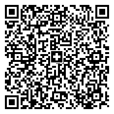

## **Overview**
The *Swiss QR Code* symbology has been developed in Switzerland to automate digital payments. At present, all payment receipts and bills in Switzerland are intended to have a *Swiss QR Code* barcode that encrypts payment details. To distinguish from basic *QR Code*, *Swiss QR Code* labels have the Swiss cross sign in the center.  
  
Specifically, the *Swiss QR Code* standard is used to work with QR bills in electronic payments. A *Swiss QR Code* barcode contains all necessary payment information required to launch payments or to process a QR invoice. ***Aspose.BarCode for Python via .NET*** includes [*SwissQRBill*]() and [*SwissQRCodetext*]() classes that provide various properties to work with *Swiss QR* codes.  
  
The general rules for creating *Swiss QR Code* barcodes and corresponding payment documents are defined in a specific standard called ["Swiss Implementation Guidelines for the QR-bill"](https://www.paymentstandards.ch/dam/downloads/ig-qr-bill-en.pdf) that relies on the ISO 20022 standard.

## **How to Generate Swiss QR Code**
To generate a *Swiss QR Code* barcode using  ***Aspose.BarCode for Python via .NET***, it is necessary to create an instance of [*ComplexBarcodeGenerator*]() and specify the information to be encoded into [*SwissQRCodetext*](https://reference.aspose.com/barcode/net/aspose.barcode.complexbarcode/swissqrcodetext).  

  

## **How to Read Swiss QR Code**
TBD