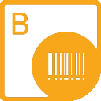

## **Welcome to the Aspose.BarCode for Reporting Services**

{} 

Aspose.BarCode for Reporting Services is a unique and robust solution for making your reports unique and more professional. It allows developers to display more than 60 types of high-quality barcode labels in high resolution mode on SQL reports. These barcode labels can be rendered in various formats: BMP, JPEG, GIF, TIFF and PNG.
{} 

## **Aspose.BarCode for Reporting Services Resources**

The following are the links to some useful resources you may need to accomplish your tasks:
- [Aspose.BarCode for Reporting Services Product Page](https://products.aspose.com/barcode/reporting-services)
- [Download Aspose.BarCode for Reporting Services](https://downloads.aspose.com/barcode/reportingservices)
- [Aspose.BarCode for Reporting Services Release Notes](/barcode/reportingservices/release-notes/)
- [Aspose.BarCode for Reporting Services Free Support Forum](https://forum.aspose.com/c/barcode)
- [Aspose.BarCode for Reporting Services Paid Support Helpdesk](https://helpdesk.aspose.com/)
- [Aspose.BarCode Product Family Blog](https://blog.aspose.com/category/barcode/)
- [Reporting Services Tutorials (SSRS)](https://docs.microsoft.com/sql/reporting-services/reporting-services-tutorials-ssrs)
- [Microsoft Reporting Services Projects](https://marketplace.visualstudio.com/items?itemName=ProBITools.MicrosoftReportProjectsforVisualStudio)