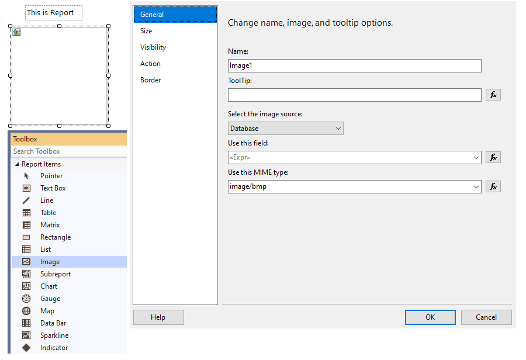
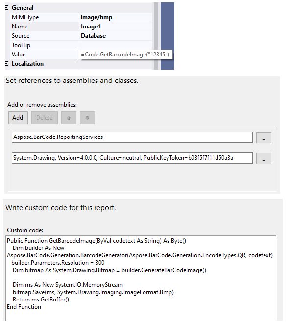

## **BarcodeGenerator Class Usage in Custom Code**

***Aspose.BarCode for Reporting Services*** provides ***BarcodeGenerator class***, which can be used in [Custom Code](https://docs.microsoft.com/sql/reporting-services/report-design/custom-code-and-assembly-references-in-expressions-in-report-designer-ssrs) solutions and provides the same features as BarcodeGenerator class from ***Aspose.BarCode for .Net***.

Barcode label can be rendered as ***Image*** with standard Report Item Image components. Image Value can be generated in ***Custom Code*** as byte array.

Main disadvantage of this method that barcode value can be visible only in runtime: preview or server deploying.

