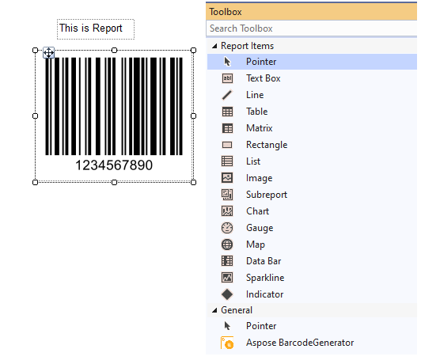
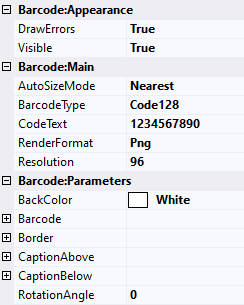
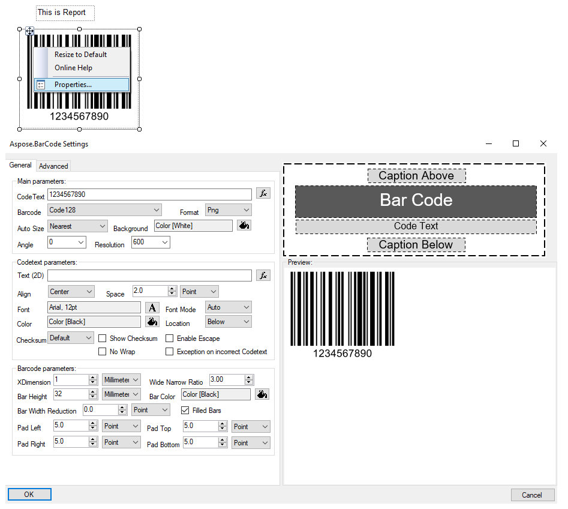

## **Component Description**

***Aspose.BarCode for Reporting Services*** provides ***BarcodeGenerator visual componen***t, built by [Custom Report Items](https://docs.microsoft.com/sql/reporting-services/custom-report-items/custom-report-items) technology, allows editing most of features of barcode label visually by embedded editor or component properties. ***BarcodeGenerator visual component*** can be used as any other Reporting Services Report Item by dragging it to any places of report (except report footer or report header) and placing in required report area.

The component requires Visual Studio with [SQL Server Data Tools](https://docs.microsoft.com/sql/ssdt/download-sql-server-data-tools-ssdt) or [Microsoft Reporting Services Projects Extension](https://marketplace.visualstudio.com/items?itemName=ProBITools.MicrosoftReportProjectsforVisualStudio) installed.

Main component features:
- Visual managing multiple barcode and caption areas with previewing in design time.
- Visual managing special barcode options, like error correction mode, ECI or embedded metadata.
- Variable resolution mode from 96 to 600 dpi.
- Embedded editor which helps to edit barcode options visually.

## **Component Properties**

***BarcodeGenerator visual component*** allows to edit barcode label parameters in design time by changing properties, like any other Report Item. It contains two group of properties:
- ***Barcode:Appearance*** – contains parameters which affect component appearance and visibility.
- ***Barcode:Main*** – contains main barcode label parameters like codetext, barcode type or resolution.
- ***Barcode:Parameters*** – contains all other barcode parameters, like barcode area edition or special barcode parameters.

## **Component Embedded Editor**

***BarcodeGenerator visual component*** contains embedded visual editor which allows to edit barcode parameters visually with grouped parameters sets. It duplicates the same features as component properties but makes it more simple.