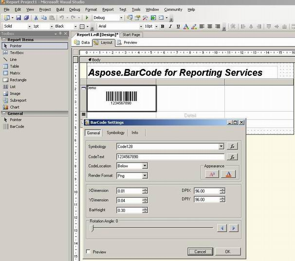

{} 

Aspose.BarCode for Reporting Services is a custom report item control used to display barcode labels on Microsoft SQL Server Reporting Services reports with greater efficiency. The barcode labels' layout can be altered very easily with a fully-integrated visual barcode designer for Visual Studio. Developers can also preview and adjust the barcode images at design-time.

{} 
### **Easy to Design**
Developer can customize various settings to make a barcode's appearance fit better with the report design. These settings can be configured in the **Barcode Settings** dialog, which can be accessed by right clicking on the barcode image (that was dragged from the toolbox). The design time settings supported by Aspose.BarCode for Reporting Services are: 

- 25+ linear and 2D barcode symbologies: select from over 25 barcode symbologies (including linear and 2D) according to need; the barcode labels are generated quickly.
- Image formats: choose to render barcode images on reports in BMP, JPG, PNG or GIF.
- Barcode size and location settings: adjust the location and height of the barcode image by setting the values of the **XDimension**, **YDimension** and **BarHeight** properties.
- Resolution settings: change the quality of the barcode image by changing the **DPIX** and **DPIY** properties.
- CodeText appearance settings: control the appearance of text that appears as part of the barcode image by setting its **Font**, **Size**, **Color** and **Alignment** buttons.
- Rotation angle: a barcode image can be displayed in any direction by setting its rotation angle.
- Design-time preview: after changing hte barcode's settings, preview it. This helps check the effect of changes before applying them.

A screenshot is given below to illustrate the process of developing reports using Aspose.BarCode for Reporting services. 

