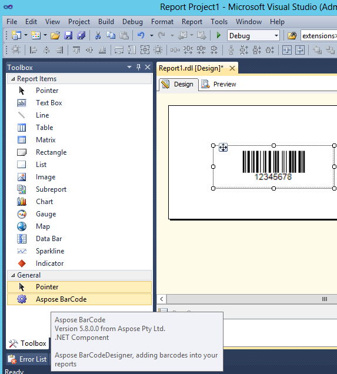

{} 

Aspose.BarCode for Reporting Services is a .NET component, compliant with .NET Frameworks 2.0 (with Microsoft SQL Server 2005), 3.x (with Microsoft SQL Server 2008) and 4.x (with Microsoft SQL Server 2012). It can be very easily integrated into existing and new projects by adding the Aspose.BarCode for Reporting Services component to Visual Studio's Toolbox and then dropping it onto the project wherever desired.

{} 
### **Easy to Integrate with Visual Studio**
The Report Server project does not support adding custom controls in a report's header and footer. But you can add an image control from the toolbox to the header. It contains a public class, BarCodeBuilder, which can be used to render a barcode image as a byte array. This byte array can be used to render the image in the header. For details, please [read this technical article](/barcode/reportingservices/how-to-display-barcodes-in-report-header/).

**Barcode added to the report from Toolbox using drag and drop.** 

