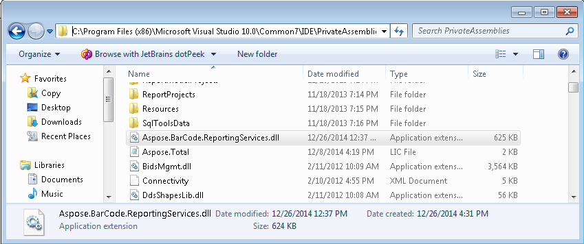
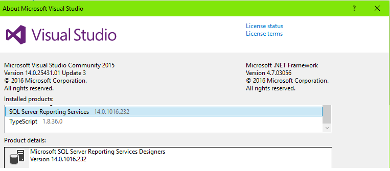
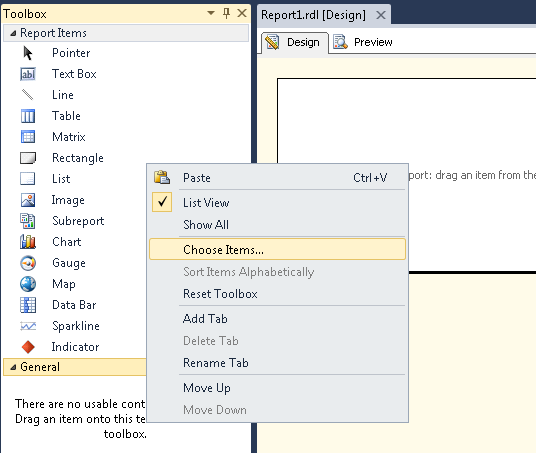
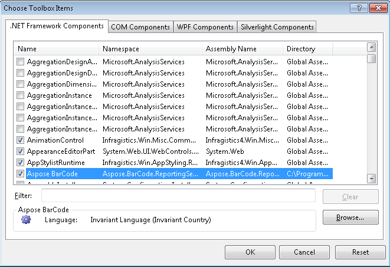
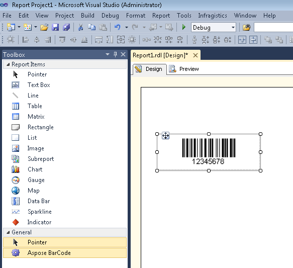

{} 

Aspose.BarCode for Reporting Services allows .NET developers to easily add barcode images to SQL Server reports. Barcode image can be dragged and dropped from the Visual Studio Toolbox onto SQL Reporting Services reports, just like window and web form controls.

{} 
### **Configuring Visual Studio for Aspose.BarCode**
To add Aspose.BarCode for Reporting Services to your Visual Studio 2010 toolbox, follow the steps below.
#### **Step 1: Download Aspose.BarCode**
[Download](https://downloads.aspose.com/barcode/reportingservices) and install the latest version of Aspose.BarCode for Reporting Services.
#### **Step 2: Copy the DLLs**
Copy Aspose.BarCode.ReportingServices.dll to the PrivateAssemblies folder of your IDE.
For Visual Studio 2010, copy Bin\VS2010\ Aspose.BarCode.ReportingServices.dll to the PrivateAssemblies folder of your IDE.
The PrivateAssemblies folder of Visual Studio 2010 can be found at C:\Program Files (x86)\Microsoft Visual Studio 10.0\Common7\IDE\PrivateAssemblies.
The PrivateAssemblies folder of Visual Studio 2017 can be found at C:\Program Files (x86)\Microsoft Visual Studio\2017\Community\Common7\IDE\CommonExtensions\Microsoft\SSRS

The **Aspose.BarCode.ReportingServices.dll** is located in your installation folder's Binsub folder.
#### ****
Aspose.BarCode for Reporting Services dll supports SSRS versions (Bin\ folder):

VS2019 (required VS 15.8.9+ and SSDT 15.8.1+) - SSRS 15.x

VS2017 - SSRS 14.x

VS2015 - SSRS 13.x

VS2013 - SSRS 12.x

SSDT includes SSRS versions:

SSDT for VS2017

SSDT 15.8.1+ - SSRS 15.x

SSDT 15.8.0- - SSRS 14.x

SSDT for VS2015

SSDT 17.3+ - SSRS 14.x

SSDT 16.5- - SSRS 13.x

SSDT for VS2013 - SSRS 12.x
#### **Step 3: Register Aspose.BarCode**
Register Aspose.BarCode to render item in **RSReportDesigner.config**.

Edit the **RSReportDesigner.config** file in the private assembly folder and add the following code:

**XML**



 <Configuration>

<Extensions>

    <!-- Start config for Aspose.BarCode for Reporting Services-->

    <ReportItemDesigner>

            <ReportItem Name="BarCode" Type="Aspose.BarCode.ReportingServices.BarCodeReportItemDesigner, Aspose.BarCode.ReportingServices" />

    </ReportItemDesigner>

    <ReportItems>

            <ReportItem Name="BarCode" Type="Aspose.BarCode.ReportingServices.BarCodeReportItem, Aspose.BarCode.ReportingServices" />

    </ReportItems>

    <!-- End of config -->

 </Extensions>

</Configuration>


#### **Step 4: Give Permission to Preview**
Give permissions to preview:

1. In the PrivateAssemblies folder, edit the RSPreviewPolicy.config file and add the following code:

**XML**



 <configuration>

<mscorlib>

  <security>

   <policy>

    <PolicyLevel version="1">

     <CodeGroup class="FirstMatchCodeGroup" version="1" PermissionSetName="Nothing">

      <CodeGroup class="FirstMatchCodeGroup" version="1" PermissionSetName="Execution" Description="This code group grants MyComputer code Execution permission. ">

       <!-- code to add...... -->

<CodeGroup class="UnionCodeGroup" version="1" PermissionSetName="FullTrust" Name="BarCode" Description="Aspose.BarCode for Reporting Services ">

 <IMembershipCondition class="StrongNameMembershipCondition" version="1" PublicKeyBlob="0x00240000048000009400000006020000002400005253413100040000010001005542E99CECD28842DAD186257B2C7B6AE9B5947E51E0B17B4AC6D8CECD3E01C4D20658C5E4EA1B9A6C8F854B2D796C4FDE740DAC65E834167758CFF283EED1BE5C9A812022B015A902E0B97D4E95569EB8C0971834744E633D9CB4C4A6D8EDA03C12F486E13A1A0CB1AA101AD94943236384CBBF5C679944B994DE9546E493BF" />

</CodeGroup>

       <!-- end ......... -->

      </CodeGroup>

     </CodeGroup>

    </PolicyLevel>

   </policy>

  </security>

 </mscorlib>

</configuration>



{} 

While installing Aspose.BarCode for Reporting Services on MS SQL Server 2012 environment, you need additionally set FullTrust instead of Execution for Report_Expressions_Default_Permissions and ZoneMembershipCondition in the file RSPreviewPolicy.config

{}
#### **Step 5: Add Aspose.BarCode to the Toolbox**
1. Start Visual Studio and create a Report Server Project.
1. When the project is created, right-click **Reports** in the Solution Explorer.
1. Click **New Item** by pointing to **Add**.
1. Click **Report** in **Add New Item**.
   A report, **Report1.rdl** is created.
1. When in design mode creating a report, open the **Toolbox** panel and right-click it.
1. Now select **Choose Items** option from the context menu.

#### **Step 6: Add an Aspose.BarCode icon to the Toolbox**
1. In the **Choose Toolbox Items** dialog, click the **.NET Framework Components** tab.
1. Browse to the PrivateAssemblies folder and select **Aspose.BarCode.ReportingServices.dll**.
   An Aspose.BarCode for Reporting Services icon is added to the toolbox.

#### **Step 7: Drag and Drop**
Now, you can drag and drop barcode report item on to your report and start producing reports with barcodes using Aspose.BarCode for Reporting Services.

