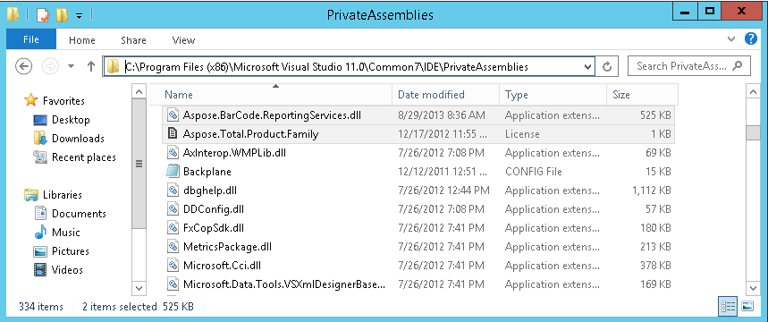
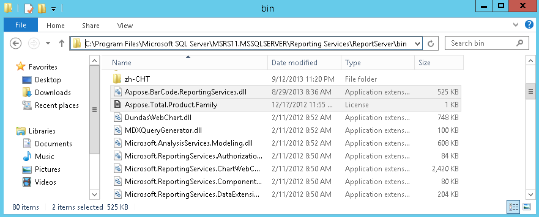

To apply a license:

1. Download the license file (complete with the .lic extension) to your computer.
1. Copy the license file to the C:\Program Files (x86)\Microsoft Visual Studio 11.0\Common7\IDE\PrivateAssemblies. This is for development purpose as it allows Visual Studio developers to use the licensed version of Aspose.BarCode for Reporting Services. 

   **The PrivateAssemblies directory** 

1. Copy the license file to C:\Program Files\Microsoft SQL Server\MSRS11.MSSQLSERVER\Reporting Services\ReportServer\bin (the same folder that Aspose.BarCode.ReportingServices.dll is installed to). 

   **The bin directory** 

