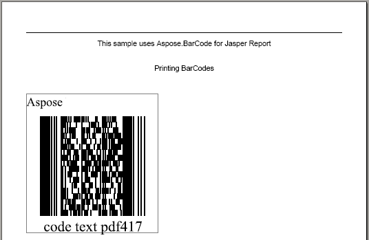
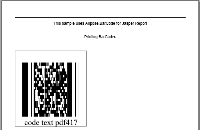

The only limitation to the evaluation version of Aspose.BarCode for Reporting Services is that it puts a label that reads **Aspose** on the generated barcode image. An example is shown below.

**Barcode created with the demo version of Aspose.BarCode** 

Licensed version of Aspose.BarCode for Reporting Services won't inject any such label on barcode images as shown in the below screenshot.

**Barcode created with a licensed version of Aspose.BarCode** 

