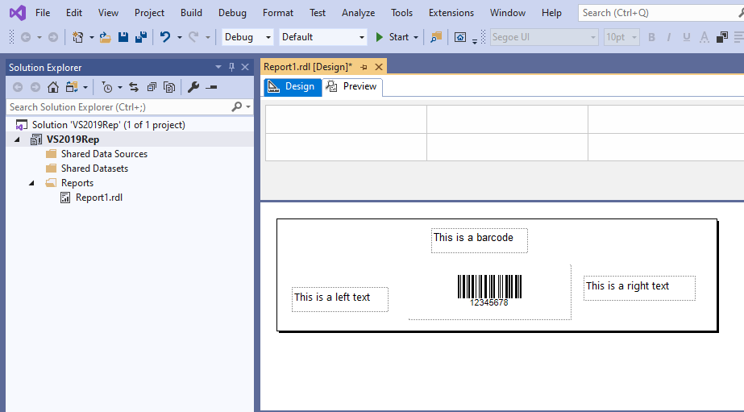
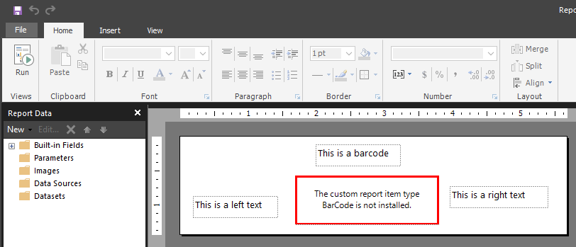
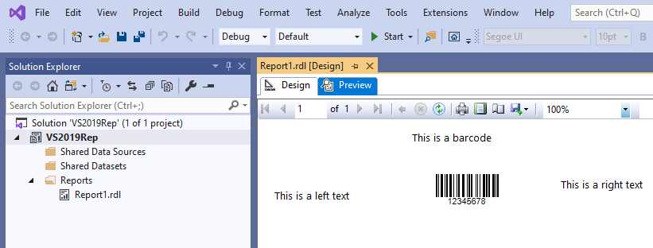
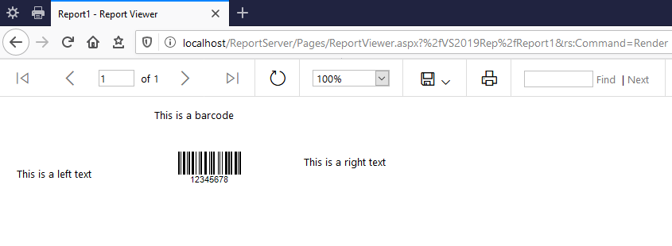

## **Report Builder abilities**

Report Builder from Microsoft is developed to manage and add minor changes to already created report projects. In addition it allows creating simple reports with standard report elements. Report builder cannot correctly manage [custom report code, and custom assemblies](https://docs.microsoft.com/en-us/sql/reporting-services/report-design/custom-code-and-assembly-references-in-expressions-in-report-designer-ssrs) like Aspose.BarCode for Reporting Services (later Aspose.BarCode component).

To use all features of Aspose.BarCode component you should use Visual Studio with [SQL Server Data Tools](https://docs.microsoft.com/en-us/sql/ssdt/download-sql-server-data-tools-ssdt) or [Microsoft Reporting Services Projects](https://marketplace.visualstudio.com/items?itemName=ProBITools.MicrosoftReportProjectsforVisualStudio) extension.

**Report Builder can**: 
- load report with Aspose.BarCode embedded component;
- edit standard report elements in the report project;
- remove Aspose.BarCode component from the report.

**Report Builder cannot**:
- add Aspose.BarCode component to the report;
- edit any Aspose.BarCode component field or property.

## **Example of Report Builder usage with Aspose.BarCode component**

### 1. Create report project in Visual Studio, add Aspose.Barcode component and upload it to the reporting server.

### 2. Open uploaded project in Report Builder from the reporting server.
In Design mode, you can edit standard components, but cannot edit [Custom Report Item](https://docs.microsoft.com/en-us/sql/reporting-services/custom-report-items/custom-report-items) like Aspose.Barcode component.

### 3. In the Preview mode Aspose.Barcode component works correctly.

### 4. In addition it works correctly on the Microsoft SQL Server Reporting Services.

