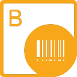

## **Welcome to the Aspose.BarCode for Reporting Services**

{} 

Aspose.BarCode for Reporting Services is a unique and robust solution for making your reports unique and more professional. It allows developers to display high-quality barcode labels in high resolution mode on SQL reports. These barcode labels can be rendered in various formats: BMP, JPEG, GIF, TIFF and PNG.
{} 

## **Product Description**
Aspose.BarCode for Reporting Services is a very light weight component that supports 60+ of the most popular barcode symbologies. It can be used easily by adding it to the Visual Studio toolbox and then dropping it on the SQL report just like any Windows or web controls.

## **Features**

- Generate 60+ barcode symbologies with light weight component or with a few lines of code.
- Wide range of options to manipulate barcode image appearance.
- Generate barcodes with special barcode parameters, like error correction mode, ECI or embedded matadata.
- Create device resolution dependent barcode images.

## **Supported Barcode Symbologies**
The following symbologies are supported for generation by Aspose.BarCode for Reporting Services:

- **1D:** Code 11, Code 128, Code 32, Code 39, Code 93, Codabar, Code 16K, CodablockF, Databar OmniDirectional, Databar Stacked OmniDirectional, DatabarLimited, DatabarTruncated,
Databar Stacked, Databar Expanded, Databar Expanded Stacked, EAN 13, EAN 14, EAN 8, GS1 CodablockF, GS1 Code 128, IATA 2 of 5, Italian Post 25, Interleaved 2 of 5, ISBN
ISMN, ISSN, ITF6, ITF 14, Matrix 2 of 5, MSI, OPC, PatchCode, Pharmacode, PZN, SSCC 14, SSCC 18, Standard 2 of 5, EAN 5, EAN 2, UPC A, UPC E, UpcaGs1DatabarCoupon, VIN.
- **2D:** Aztec, Compact PDF 417, Data Matrix, DotCode, GS1 Data Matrix, GS1 QR, MaxiCode, Macro PDF 417, Micro PDF 417, PDF 417, QR, MicroQR, Swiss QR.
- **Postal:** Australia Post, AustralianPosteParcel, Deutsche Post Identcode, Deutsche Post Leticode, Planet, Postnet, RM4SCC, SingaporePost, SwissPostParcel, USPS OneCode.

## **This section includes the following topics:**
- [Sample Reports Gallery](/barcode/reportingservices/sample-reports-gallery/)
- [Quick Start Tutorial](/barcode/reportingservices/quick-start-tutorial/)
- [Design Time Barcode Report Designer](/barcode/reportingservices/design-time-barcode-report-designer/)
- [Supported File Formats](/barcode/reportingservices/supported-file-formats/)
