{} 

Aspose.BarCode for Reporting Services provides a light-weight yet fully featured report item designer. This designer can be used to customize the style and layout of the barcode image precisely according to the requirements. Barcode Report Designer is a dialog box through which developers can use many features related to the barcode image and can have a preview of the effect of changes just made.

{} 
### **Using the Barcode Report Designer**
A screenshot of the Barcode Report Designer is shown below.

**The Barcode Report Designer** 

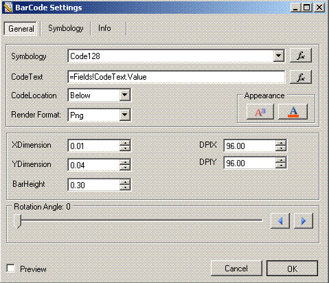

With the Barcode Report Designer, developers can customize different properties of a barcode image. 

**Barcode to which a number of settings have been applied** 

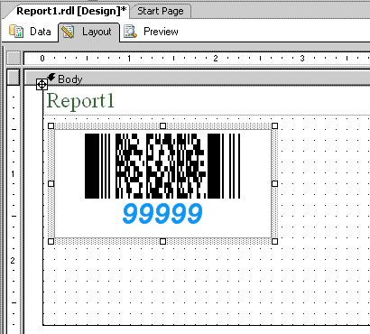
#### **CodeText**
CodeText can be set by:

1. Click the **fx** button.

|**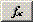**|**Toggle Expression editor** |
| :- | :- |
The Expression Editor opens. This can be used to create an expression that determines the value of CodeText at runtime. 

**The Expression Editor** 

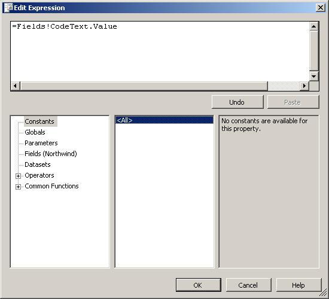
##### **CodeText Appearance**
The CodeText appearance can be set using the **Font** and **Color** buttons to change the font and color of the CodeText. 

|**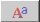**|**CodeText Font** |
| :- | :- |
|****|**CodeText Color**|
##### **CodeText Position**
CodeText can be displayed above or below the barcode image. The location is set using the **CodeLocation** field.

**Setting the CodeText position** 

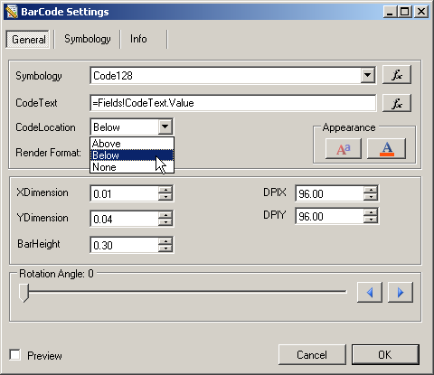
#### **Rotation Angle**
Developers can also rotate the barcode images clockwise or anti-clockwise. To achieve that, configure the barcode image's rotation angle.

|**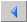**|**Rotate anti clockwise** |
| :- | :- |
|**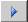**|**Rotate clockwise** |
The default rotation angle is 0 (zero). 
#### **Barcode Symbology**
Aspose.BarCode for Reporting Services supports plenty of barcode symbologies. Select the desired barcode symbologies from the **Symbology** field.

**Selecting the barcode symbology** 

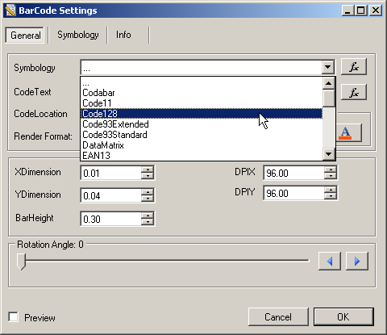

You can also find an **fx** button next to the **Symbology** field. Using this button, Symbology can also accept an Expression as input whose value should be one of the following strings: 

|
- Aztec

- BooklandEAN

- Codabar

- Code11

- Code128

- Code39Standard

- Code39Extended

- Code93Extended

- Code93Standard

- DataMatrix

- EAN8

- EAN128

- EAN13
|
- EAN14

- Interleaved2of5

- ITF14

- MSI

- Pdf417

- Planet

- Postnet

- QR

- SSCC18

- Standard2of5

- UPCA

- UPCE
|
| :- | :- |
{} 

The above strings are case sensitive. In case of incorrect value, the default symbology if used if the barcode image is in a general data region and the last symbology is used if it is in a data row. 

{} 
#### **Barcode Image Size**
The barcode image's size can be adjusted using the **XDimension**, **YDimension** and **BarHeight** fields. All the sizing units are measured in inches and incorrect entries are automatically ignored. 

**Setting the barcode image size** 

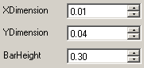
#### **Barcode Image Resolution**
The barcode image's resolution can be customized using the **DPIX** and **DPIY** fields. 

**Setting the barcode image resolution** 

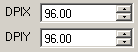
#### **Barcode Image Rendering Format**
The barcode image can be rendered to different image formats. Select them from the **Render Format** field. 

**Selecting the output barcode image format** 

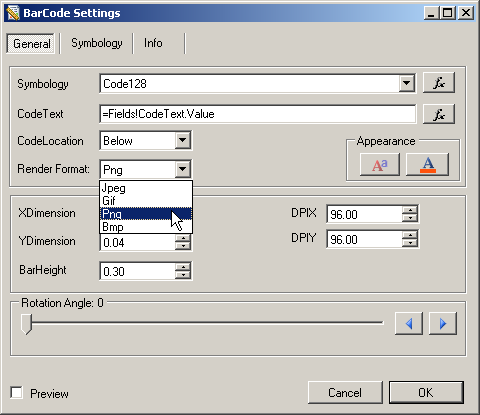

Portable network graphic (PNG) image format is recommended. 
#### **Symbology Specific Settings**
There are a few types of barcodes that also support special settings. To configure symbology-specific settings:

1. Select a symbology from the list.
1. Click the Symbology tab of the Barcode Report Designer dialog.

All sizing units in the symbology-specific settings are measured in inches and incorrect entries are automatically ignored. The screenshot below shows the specific barcode settings for the PDF417 symbology. 

**Symbology-specific settings** 

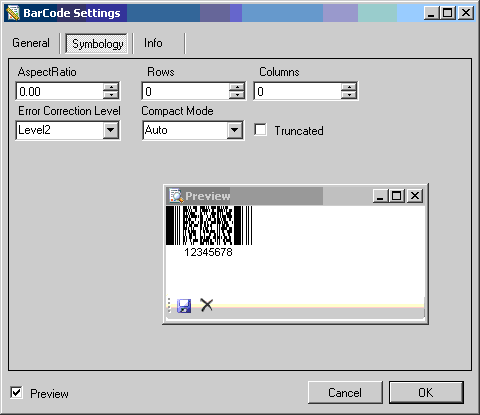
#### **Barcode Image Preview**
The **Preview** window gives a preview of any changes made to the barcode image before the changes are finally applied. 

**Previewing the barcode image** 

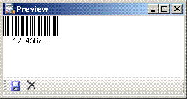
