{} 

This easy tutorial demonstrates how to use Aspose.BarCode for Reporting Services to generate barcodes for reports. Before starting, please read [System Requirements](http://www.aspose.com/documentation/ssrs-rendering-extensions/aspose.barcode-for-reporting-services/system-requirements.html).

The steps to create a demo application are:

- [Create a report project and choose data source](/barcode/reportingservices/quick-start-tutorial-html/).
- [Add a barcode to the report](/barcode/reportingservices/quick-start-tutorial-html/).

{} 

To install Aspose.BarCode for Reporting Services manually, some registration and installation steps have to be performed manually. For manual installation, developers need to copy and modify files in the installation directory of Microsoft SQL Server Reporting Services.

- The SSRS 2000 assembly is located in the Bin\SSRS2000 directory of the ZIP archive,
- The SSRS 2005 assembly is located in the Bin\SSRS2005 directory, and
- The SSRS 2008 assembly is located in the Bin\SSRS2008 directory.
- The SSRS 2008 R2 assembly is located in the Bin\SSRS2008R2 directory.
- For Microsoft SQL Server 2012, we have provided two assemblies.  
  - First "DesignVersion" works only with designers (Visual Studio or BIDS). Its assembly is located in the Bin\SSRS2012\DesignVersion directory.
  - Second "RunTimeVersion" works only with report Server. Its assembly is located in the Bin\SSRS2012\RunTimeVersion directory.
### **Create Report Project and Choose Data Source**
1. Start Visual Studio .NET 2012.
1. Create a new report project by launching the Report Server Project Wizard from Visual Studio's installed templates. 

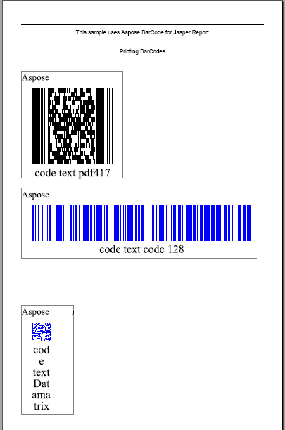

1. Add a new data source to the project. 

   **Adding a data source** 

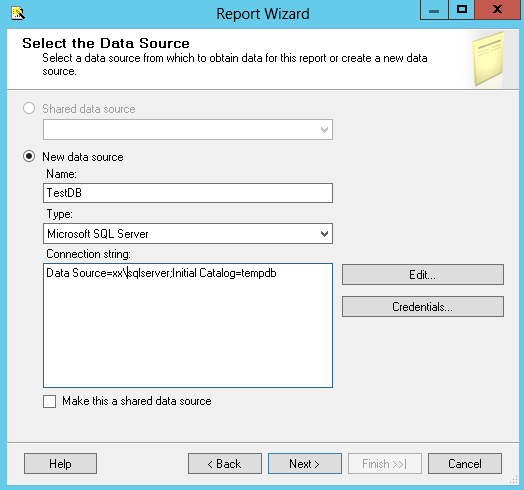

1. Add SQL query to retrieve data from the data source. 

   **Adding a query** 

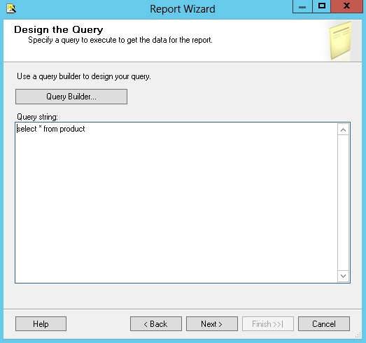

1. Choose a tabular report type. 

   **Selecting a table type** 

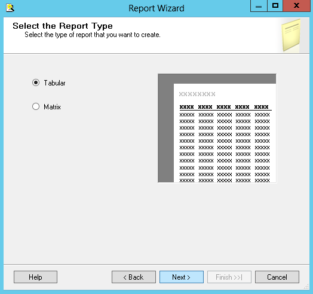

1. Select which data fields returned by the query should appear in the report. 

   **Designing the table** 

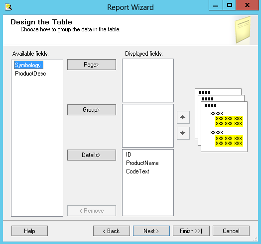

1. Choose a table style for the report. 

   **Styling the table** 

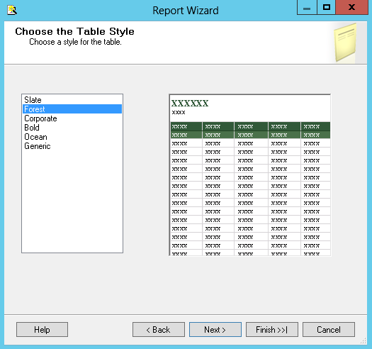

1. Choose a location to deploy the report. 

   **Selecting deployment location** 

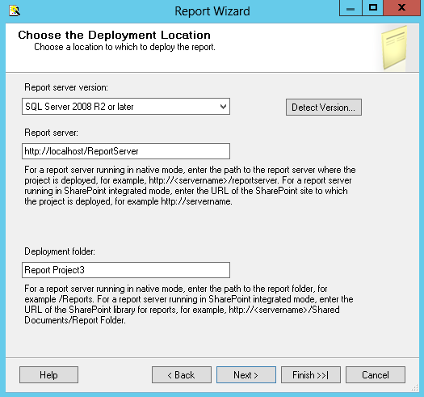

1. Set the name of the report and press finish button to complete the default wizard. 

   **Finishing** 

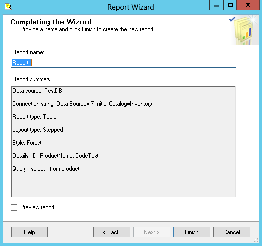
### **Add Barcodes to the Report**
1. Add a new column for barcode images.
1. Select the first column and right-click to insert a column to the left. 
   Barcode images will be displayed in the new column. 

   **Inserting a column** 

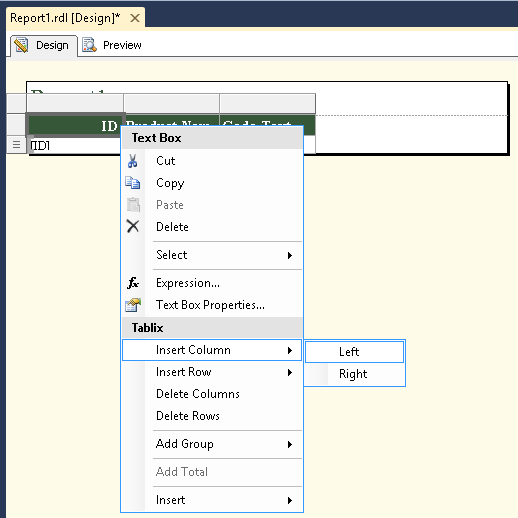

1. Adjust the size of the first column to preserve enough space for barcode images. 

   **Adjusting the column width** 

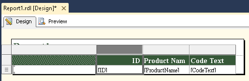

1. Drag and drop Aspose.BarCode for Reporting Services from Visual Studio Toolbox to the first column. 

   **Adding a barcode** 

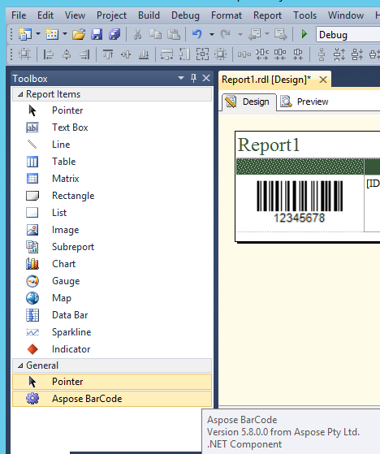

1. Right-click on the barcode image to open context menu. Select Properties to open Barcode Settings dialog box. 

   **Opening the Properties dialog** 

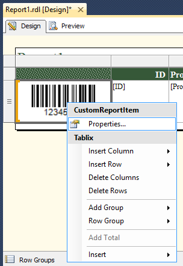

1. Set the **CodeText** property to an expression by clicking **fx**.
1. Type the following expression: Fields!* [CodeText](http://www.aspose.com/Wiki/wikiedit.aspx?topic=Aspose.BarCode.Reporting.Services.CodeText&return=Aspose.BarCode.Reporting.Services.SSRSTutorial)*.Value, which indicates to use the value of [CodeText](http://www.aspose.com/Wiki/wikiedit.aspx?topic=Aspose.BarCode.Reporting.Services.CodeText&return=Aspose.BarCode.Reporting.Services.SSRSTutorial) field as the [CodeText](http://www.aspose.com/Wiki/wikiedit.aspx?topic=Aspose.BarCode.Reporting.Services.CodeText&return=Aspose.BarCode.Reporting.Services.SSRSTutorial) of the barcode image. 

   **Setting the code text** 

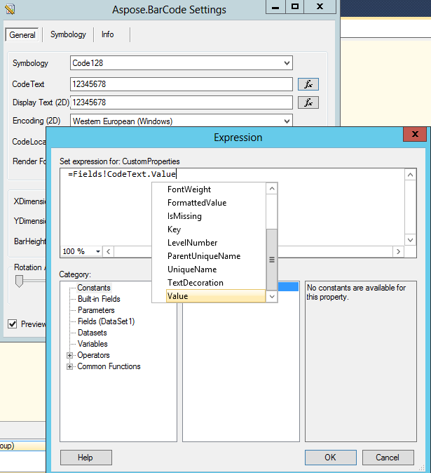

1. Click **OK** in the **Edit Expression** dialog.
1. Click **OK** in the **BarCode Settings** dialog.
   The [barcode](http://www.aspose.com/Wiki/wikiedit.aspx?topic=Aspose.BarCode.Reporting.Services.BarCode&return=Aspose.BarCode.Reporting.Services.SSRSTutorial) settings are applied. 

   **Applying the settings** 

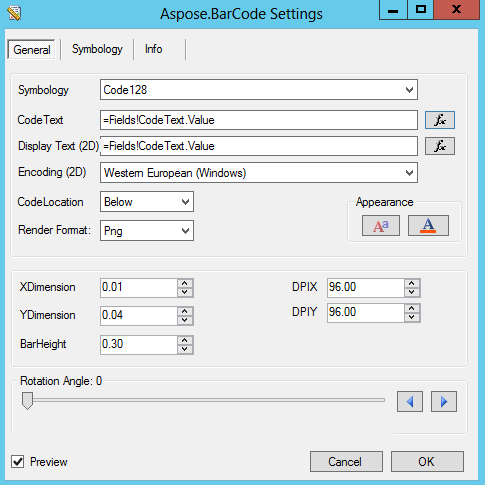

1. Preview and deploy the report. 

   **Deploying the report** 

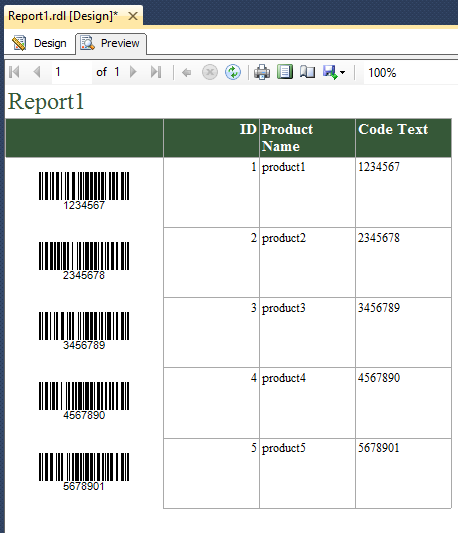
