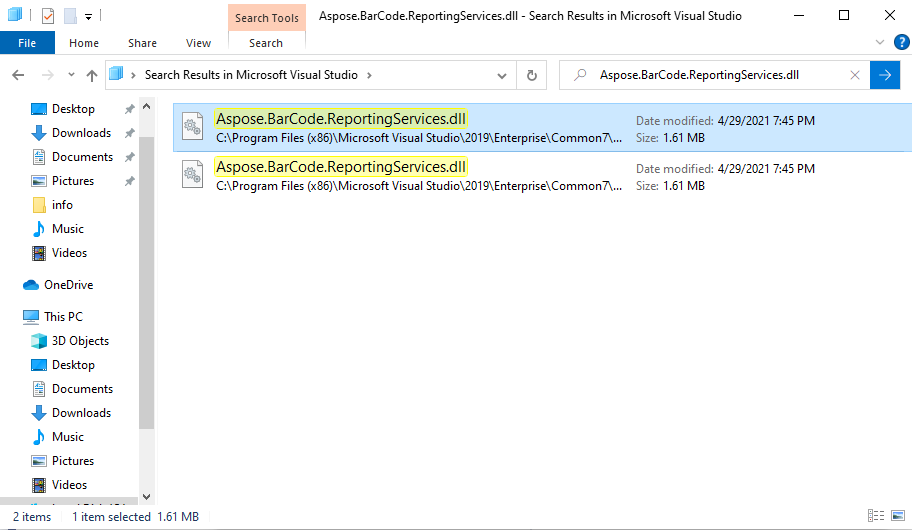
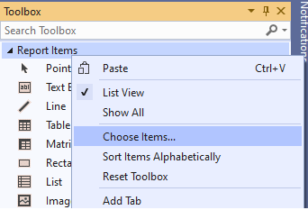
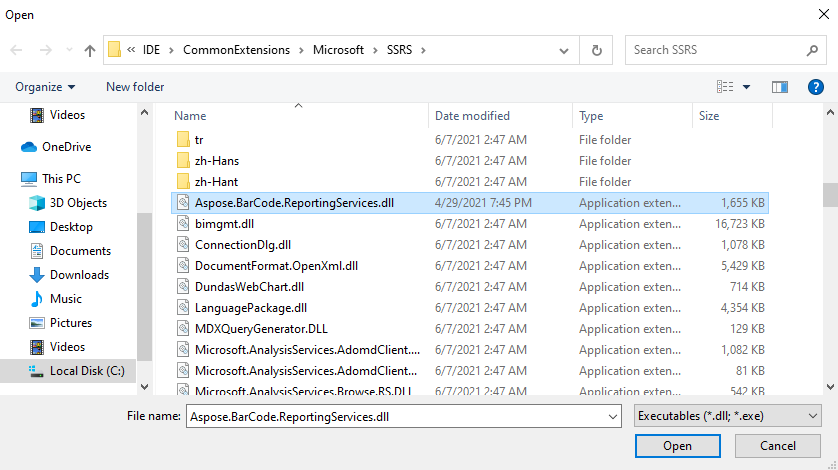
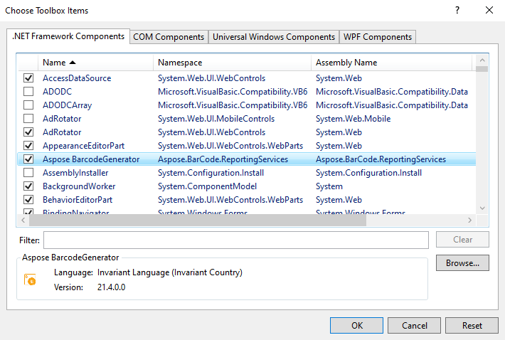
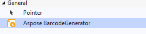

## **Overview**
After installing ***Aspose.BarCode for Reporting Services*** visual component to Visual Studio you need to add the component to Visual Studio Toolbox. After this it can be used as other Report items just by drag-dropping to report area.

## **Locate Aspose.BarCode for Reporting Services library in Visual Studio folder**
You can locate Aspose.BarCode for Reporting Services library with system tools. You just need to search ***Aspose.BarCode.ReportingServices.dll*** file in Visual Studio folder.

Other way you can locate the library in predefined folder:
 - **VS2019** folder: ***C:\Program Files (x86)\Microsoft Visual Studio\2019\{Edition}\Common7\IDE\CommonExtensions\Microsoft\SSRS***
- **VS2017** folder: ***C:\Program Files (x86)\Microsoft Visual Studio\2017\{Edition}\Common7\IDE\CommonExtensions\Microsoft\SSRS***
- **VS2015** folder: ***C:\Program Files\Microsoft Visual Studio 14.0\Common7\IDE\PrivateAssemblies***
- **VS2013** folder: ***C:\Program Files (x86)\Microsoft Visual Studio 12.0\Common7\IDE\PrivateAssemblies***
- **VS2012** folder: ***C:\Program Files (x86)\Microsoft Visual Studio 11.0\Common7\IDE\PrivateAssemblies***
- **VS2010** folder: ***C:\Program Files (x86)\Microsoft Visual Studio 10.0\Common7\IDE\PrivateAssemblies***

## **Add Visual Component to Toolbox by Copy and Paste**

1. At first you need to create Report Server Project and open ***Toolbox*** panel.
2. You need to locate ***Aspose.BarCode.ReportingServices.dll*** as described in previous steps.
3. Then you just need to copy and paste the library to toolbox or you can just ***drag-and-drop*** file to ***Toolbox***. Because Visual Studio is run with administrative rights, the folder with the library sometimes should be open with the same rights.

{} 
Use ***Copy*** from the dll file location and ***Paste*** on Visual Studio ***Toolbox*** to add the Visual Component to Toolbox.
{} 

## **Add Visual Component to Toolbox by Choose items**

1. Create Report Server Project and open ***Toolbox*** panel.

2. Select ***Choose Items*** by right click on ***Toolbox*** panel.

3. Select Folder ***.Net Framework Components***, click ***Browse*** button and locate and select ***Aspose.BarCode.ReportingServices.dll*** from Visual studio folder.

4. Select ***Aspose BarcodeGenerator*** form the list.

5. As a result you should see installed visual component.

