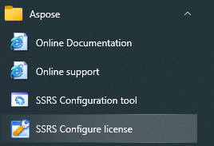
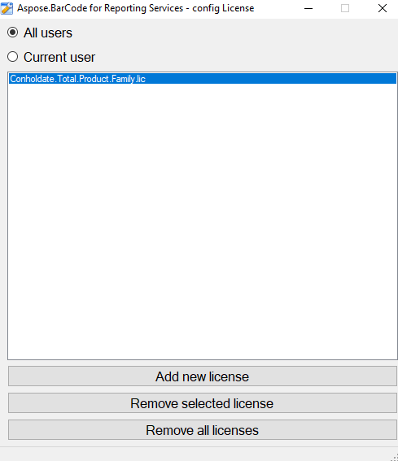
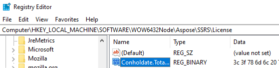

## **Overview**
***Aspose.BarCode for Reporting Services*** library can create barcode label in evaluation mode without any restrictions except of watermark. To remove watermark, you need installed license which is checked and applied automatically when library is run.

The simplest way is using ***ConfigLicense*** utility, however there are other methods to install license.

## **Obtain license**
In any time, you can obtain Free [Temporary License](https://purchase.aspose.com/temporary-license) for one month and apply it with ConfigLicense tool which is provided with ***Aspose.BarCode for Reporting Services*** package.

Also you can buy [Commercial License]( https://purchase.aspose.com/admin/pricing/barcode/reporting-services) which suits your requirements and apply it in the same way.

## **Install license with ConfigLicense utility**

1. To install license with ***ConfigLicense*** utility you need to run it and this is possible by two ways. First way is running from Start Menu ***Aspose\SSRS Configure License***. Other way is running from ***{Package Folder}\ Tools\ConfigLicense.exe***.

2. Then you just need to click ***Add new license button*** and select proper license file. License is written to system registry and can be written to only current user registry branch or to all users (local machine). SQL Server Reporting Services requires installing license to all users or local machine, Visual Studio can work with current user registry branch. But better choice is installing license to all users.

License removing is possible with ***Remove selected license*** or ***Remove all licenses*** buttons.

## **Install license to registry manually**
You can manually install license to registry. You need manually add data from license file to any named value in registry branch ***HKEY_LOCAL_MACHINE\SOFTWARE\WOW6432Node\Aspose\SSRS\License*** as registry binary value.


[HKEY_LOCAL_MACHINE\SOFTWARE\WOW6432Node\Aspose\SSRS\License]
"Conholdate.Total.Product.Family.lic"=hex:00


## **Source code of ConfigLicense utility**
At any time you can freely [download source code](https://github.com/aspose-barcode/Aspose.BarCode-for-.NET/tree/master/ReportingServices/ConfigLicense) of ConfigLicense utility and use it in the own scripts or utilities.