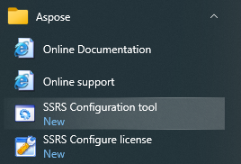
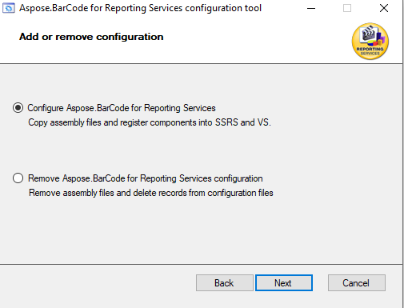
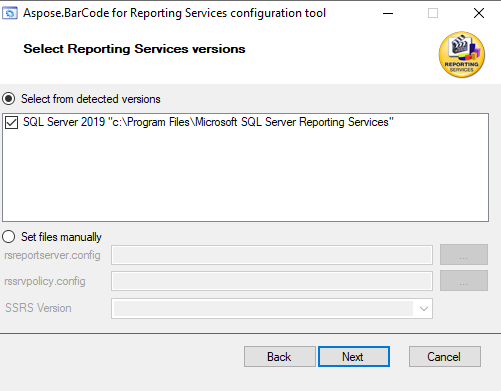
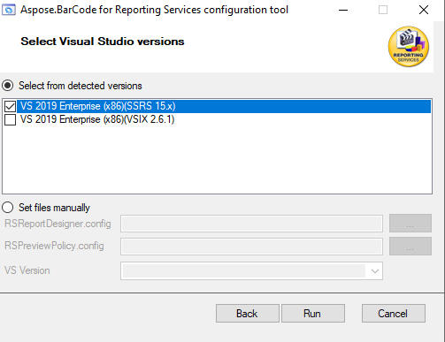
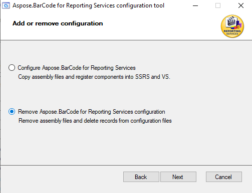
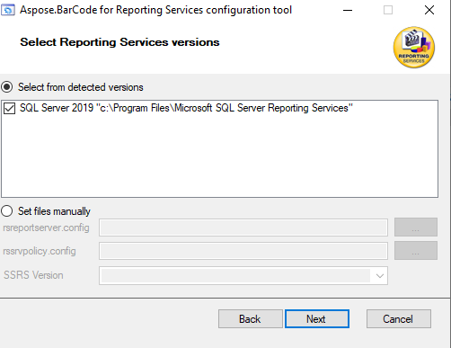
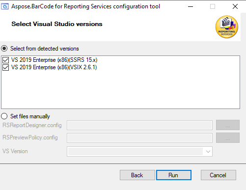

## **Overview**
***ConfigTool*** utility is created to install proper version of ***Aspose.BarCode.ReportingServices.dll*** with configuration files setup. In main case, you need just run ***ConfigTool*** utility and select products where Aspose.BarCode for Reporting Services should be installed.

***ConfigTool*** installs Aspose.BarCode for Reporting Services package for SQL Server Reporting Services as well as for Visual Studio with SQL Server Data Tools installed.

## **Aspose.BarCode for Reporting Services package installation with ConfigTool utility**
1. ***Run ConfigTool utility.***
You need to run ***ConfigTool*** utility from ***{Package folder}\Tools\*** folder. Full path is ***{Package folder}\Tools\ConfigTool.exe***. Other way utility running from start menu ***Aspose\SSRS Configuration Tool***.

2. ***Install Aspose.BarCode for Reporting Services package.***
As you can see, you need to select “Configure Aspose Barcode for Reporting Services”.

On next screen you can select SQL Server Reporting Services version where Aspose.BarCode for Reporting Services library will be installed.

And on this screen, you can select Visual Studio versions with SQL Server Data Tools installed.  The same version of Visual Studio can contain different versions of SSRS engine. As an example, Visual Studio 2017 can contain SSRS 14.x and 15.x version. Utility analyzes SSRS libraries and, in main case, selects right version of Aspose.BarCode for Reporting Services library.

## **Aspose.BarCode for Reporting Services package uninstalling with ConfigTool utility**
1. ***Run ConfigTool utility.***
You need to run ***ConfigTool*** utility from ***{Package folder}\Tools\ConfigTool.exe*** or from Start menu ***Aspose\SSRS Configuration Tool***.

2. ***Uninstall Aspose.BarCode for Reporting Services library.***
For this operation you have to select “Remove Aspose Barcode for Reporting Services configuration”.

On next screen you can select SQL Server Reporting Services versions where Aspose.BarCode for Reporting Services library will be removed.

And on this screen, you can select Visual Studio versions with SQL Server Data Tools installed, where Aspose.BarCode for Reporting Services library will be removed. 

