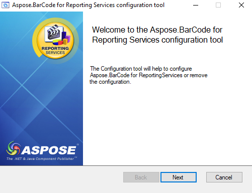
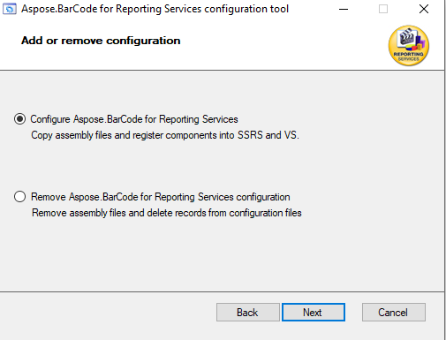
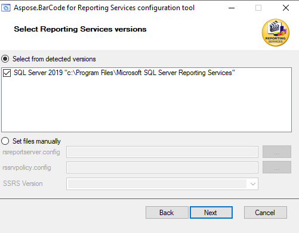
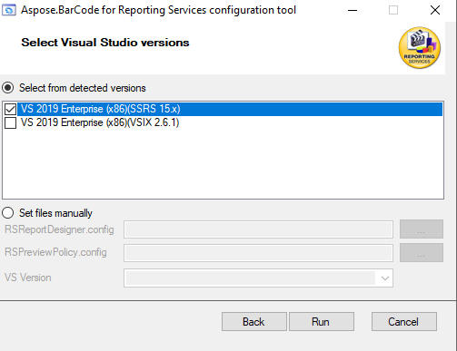
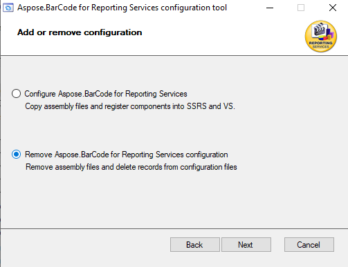
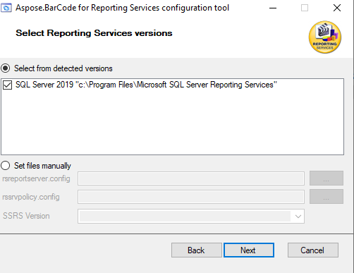
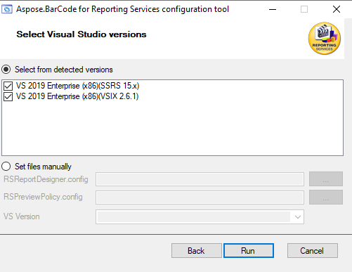

## **Overview**

The easiest way to install ***Aspose.BarCode for Reporting Services*** is using MSI installer. The installer proceeds the following steps:
- Installing library binary files and utilities;
- Coping proper versions of the library to Report Servers and Visual Studio Report Extensions;
- Add changes to configuration files of Report Servers and Visual Studio Report Extensions.

After this you need to do two additional steps:
- Install license by ***ConfigLicense*** utility;
- Add ***Aspose.BarCode for Reporting Services*** visual component to Visual Studio Toolbox.

## **Installation with MSI installer**
- Run installer and wait of library binary files installing and running ***ConfigTool*** utility.

- Choose “Configure Aspose Barcode for Reporting Services”.

- On next screen you can select SQL Server Reporting Services version where ***Aspose.BarCode for Reporting Services*** library will be installed.

- And on this screen, you can select Visual Studio versions with SQL Server Data Tools installed.  The same version of Visual Studio can contain different versions of SSRS engine. As an example, Visual Studio 2017 can contain SSRS 14.x and 15.x version. Utility analyzes SSRS libraries and, in main case, selects right version of ***Aspose.BarCode for Reporting Services*** library.

## **Package uninstallation**
At any time, you can uninstall the package the same way as any other program. The binary files of the package are removed as any other with exception of  applied library files and configurations settings which should are removed from Report Servers and Visual Studio Report Extensions by ***ConfigTool*** utility which is run as final step of deinstallation. To remove installed configuration and binary files you need to do the following steps:
- Select “Remove Aspose Barcode for Reporting Services configuration”.

- On next screen you can select SQL Server Reporting Services versions where ***Aspose.BarCode for Reporting Services library*** will be removed.

- And on this screen, you can select Visual Studio versions with SQL Server Data Tools installed, where ***Aspose.BarCode for Reporting Services*** library will be removed. 

