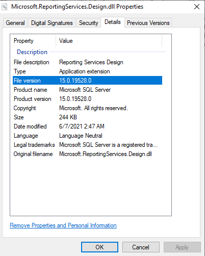

## **Overview**
The easiest way to install ***Aspose.BarCode for Reporting Services*** library for Visual Studio is using ***ConfigTool*** utility. However, you can install the library manually. To do this you need to:
- Select required version of ***Aspose.BarCode.ReportingServices.dll*** from ***Bin*** folder.
- Copy it to Visual Studio Reporting Services Extension folder. You need to locate it, at first.
- Add proper options to ***RSPreviewPolicy.config*** and ***RSReportDesigner.config*** configuration files.

After this you can add ***Aspose.BarCode for Reporting Services*** visual component to Visual Studio ***Toolbox***.

## **Locate dll directory**
You need proper ***Aspose.BarCode for Reporting Services*** library version which is matched with current Reporting Services Extension installed to current Visual Studio version. Visual Studio can have multiple Reporting Services Extensions which have different SSRS versions. As an example, **Visual Studio 2017** supports **SSRS 14.X** and **SSRS 15.X** versions. Current version of SSRS you can locate from the version of the ***Microsoft.ReportingServices.Design.dll*** library. In this location of required ***dll*** is provided in two steps: you need to find installed Visual studio version and installed Reporting Services Extension version.

Following package folders contain Visual Studio SSRS versions:
- The **Visual Studio 2010** with **SSRS11.X** version is located in the ***Bin\VS2010SSRS11*** directory.
- The **Visual Studio 2012** with **SSRS11.X** version is located in the ***Bin\VS2012SSRS11*** directory.
- The **Visual Studio 2013** with **SSRS12.X** version is located in the ***Bin\VS2013SSRS12*** directory.
- The **Visual Studio 2015** with **SSRS13.X** version is located in the ***Bin\VS2015SSRS13*** directory.
- The **Visual Studio 2015** with **SSRS13.X** version is located in the ***Bin\VS2015SSRS14*** directory.
- The **Visual Studio 2017** with **SSRS14.X** version is located in the ***Bin\VS2017SSRS14*** directory.
- The **Visual Studio 2017** with **SSRS15.X** version is located in the ***Bin\VS2017SSRS15*** directory.
- The **Visual Studio 2019** with **SSRS15.X** version is located in the ***Bin\VS2019SSRS15*** directory.

## **Locate and copy dll to Reporting Services Extension directory**
You need to copy proper ***Aspose.BarCode for Reporting Services*** library to Visual Studio Reporting Services Extension directory. Some version of Visual Studios require library copping into two folders because visual component, built by Custom Report Item technology and Custom Code can be run from different folders. You can locate Visual Studio Reporting Services Extension directories by following paths:
- The ***VS 2010 SSRS Extension and Custom Code*** folder is located in the ***C:\Program Files (x86)\Microsoft Visual Studio 10.0\Common7\IDE\PrivateAssemblies*** directory.
- The*** VS 2012 SSRS Extension and Custom Code*** folder is located in the ***C:\Program Files (x86)\Microsoft Visual Studio 11.0\Common7\IDE\PrivateAssemblies*** directory.
- The ***VS 2013 SSRS Extension and Custom Code*** folder is located in the ***C:\Program Files (x86)\Microsoft Visual Studio 12.0\Common7\IDE\PrivateAssemblies*** directory.
- The ***VS 2015 SSRS Extension and Custom Code*** folder is located in the ***C:\Program Files (x86)\Microsoft Visual Studio 14.0\Common7\IDE\PrivateAssemblies*** directory.
- The ***VS 2017 SSRS Extension*** folder is located in the ***C:\Program Files (x86)\Microsoft Visual Studio\2017\\{Edition}\Common7\IDE\CommonExtensions\Microsoft\SSRS*** directory.
- The ***VS 2017 SSRS Custom Code*** folder is located in the ***C:\Program Files (x86)\Microsoft Visual Studio\2017\\{Edition}\Common7\IDE\PrivateAssemblies*** directory.
- The ***VS 2019 SSRS Extension*** folder is located in the ***C:\Program Files (x86)\Microsoft Visual Studio\2019\\{Edition}\Common7\IDE\CommonExtensions\Microsoft\SSRS*** directory.
- The ***VS 2019 SSRS Custom Code*** folder is located in the ***C:\Program Files (x86)\Microsoft Visual Studio\2019\\{Edition}\Common7\IDE\PrivateAssemblies*** directory.

## **Register Visual Component**
To use visual component, you need to register it in configuration file ***RSReportDesigner.config*** which is located in Visual Studio Reporting Services Extension directory. You need to add the following rows:

<Configuration>
	<Extensions>
		<!-- Start config of Aspose.BarCode for Reporting Services-->
		<ReportItemDesigner>
			<ReportItem Name="BarcodeGenerator" Type="Aspose.BarCode.ReportingServices.BarCodeReportItemDesigner, Aspose.BarCode.ReportingServices"/>
		</ReportItemDesigner>
		<ReportItems>
			<ReportItem Name="BarcodeGenerator" Type="Aspose.BarCode.ReportingServices.BarCodeReportItem, Aspose.BarCode.ReportingServices"/>
		</ReportItems>
		<!-- End of config -->		
	</Extensions>
</Configuration>


## **Add Permission to Execute**
To use visual component, you need to add execution permission. You can do this by editing ***RSPreviewPolicy.config*** file in Visual Studio Reporting Services Extension directory. You need to add ***FullTrust*** permission to Visual component and change ***Execution*** permission to ***FullTrust*** in Custom Code section, because without this license in Visual Studio preview mode of Custom Code expressions sometimes can be applied incorrectly. You need to add the following rows:
{} 
Add ***FullTrust*** to ***Report_Expressions_Default_Permissions*** to allow Aspose.BarCode for Reporting Services reading license in Visual Studio ***Custom Code***.
{} 

<configuration>
	<mscorlib>
		<security>
			<policy>
				<PolicyLevel version="1">
					<CodeGroup class="FirstMatchCodeGroup" version="1" PermissionSetName="Nothing">
						<!-- Set Custom Code permission from Execution to FullTrust. License Fix-->
						<CodeGroup class="UnionCodeGroup" version="1" PermissionSetName="FullTrust" Name="Report_Expressions_Default_Permissions" Description="This code group grants default permissions for code in report expressions and Code element. ">
							<IMembershipCondition class="StrongNameMembershipCondition" version="1" PublicKeyBlob="0024000004800000940000000602000000240000525341310004000001000100512C8E872E28569E733BCB123794DAB55111A0570B3B3D4DE3794153DEA5EFB7C3FEA9F2D8236CFF320C4FD0EAD5F677880BF6C181F296C751C5F6E65B04D3834C02F792FEE0FE452915D44AFE74A0C27E0D8E4B8D04EC52A8E281E01FF47E7D694E6C7275A09AFCBFD8CC82705A06B20FD6EF61EBBA6873E29C8C0F2CAEDDA2"/>
						</CodeGroup>
						<CodeGroup class="FirstMatchCodeGroup" version="1" PermissionSetName="Execution" Description="This code group grants MyComputer code Execution permission. ">
							<!-- Start config of Aspose.BarCode for Reporting Services-->
							<CodeGroup class="UnionCodeGroup" version="1" PermissionSetName="FullTrust" Name="BarcodeGenerator" Description="Aspose.BarCode for Reporting Services">
								<IMembershipCondition class="StrongNameMembershipCondition" version="1" PublicKeyBlob="0x00240000048000009400000006020000002400005253413100040000010001005542E99CECD28842DAD186257B2C7B6AE9B5947E51E0B17B4AC6D8CECD3E01C4D20658C5E4EA1B9A6C8F854B2D796C4FDE740DAC65E834167758CFF283EED1BE5C9A812022B015A902E0B97D4E95569EB8C0971834744E633D9CB4C4A6D8EDA03C12F486E13A1A0CB1AA101AD94943236384CBBF5C679944B994DE9546E493BF"/>
							</CodeGroup>
							<!-- End of config -->
						</CodeGroup>
					</CodeGroup>
				</PolicyLevel>
			</policy>
		</security>
	</mscorlib>
</configuration>
