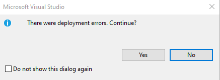
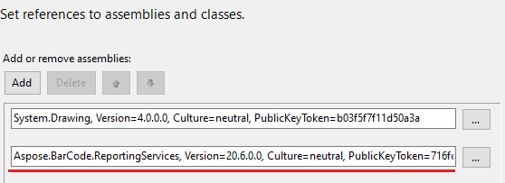
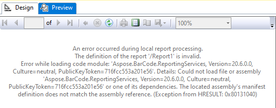
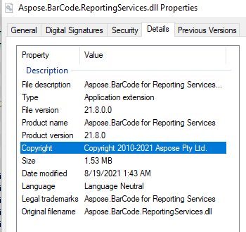
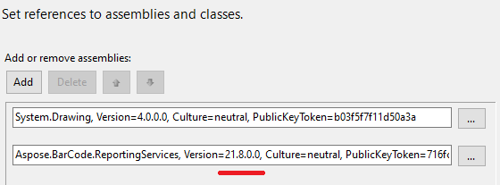
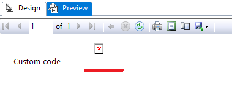
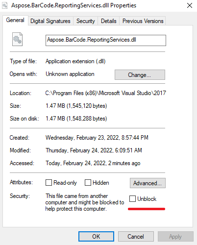

## Overview
This section describes different issues and their solutions which can be raised during Custom Code usage in your reports. 

## Report with Custom Code cannot be Deployed
You can obtain error during deploying process:


Deploying to http://localhost/reportserver
Error pvInvalidDefinition : The definition of the report '\xxxx.rdl' is invalid.


VS2017 and VS2019 requires ***dlls***, referenced in Custom Code, placed to ***PrivateAssemblies*** folder. Moreover the ***dlls*** versions **must be the same** as described in assembly references.

In this way, ***Aspose.BarCode.ReportingServices.dll*** must be placed to both ***SSRS*** and ***PrivateAssemblies*** folders:

C:\Program Files (x86)\Microsoft Visual Studio\2017\{Edition}\Common7\IDE\CommonExtensions\Microsoft\SSRS 
C:\Program Files (x86)\Microsoft Visual Studio\2017\{Edition}\Common7\IDE\PrivateAssemblies
C:\Program Files (x86)\Microsoft Visual Studio\2019\{Edition}\Common7\IDE\CommonExtensions\Microsoft\SSRS 
C:\Program Files (x86)\Microsoft Visual Studio\2019\{Edition}\Common7\IDE\PrivateAssemblies


## Preview Error with Incorrect Version of the Library

If you use library with version different from set in Custom Code assembly references you will see this error instead of the report during preview in Visual Studio.


An error occurred during local report processing.
The definition of the report '/xxxx' is invalid.
Error while loading code module: 'Aspose.BarCode.ReportingServices, Version:20.6.0.0, Culture: neutral, PublicKeyToken=716fcc5533201e56'. Details: Could not load file or assembly 'Aspose.BarCode.ReportingServices, Version:20.6.0.0, Culturezneutral, PublicKeyTokenz716fcc5533201e56' or one of its dependencies. The located assembly's manifest definition does not match the assembly reference. (Exception from HRESULT: 0x80131040)


To fix it, you need to add correct version of the library (***SSRS*** and ***PrivateAssemblies*** folders) to references. 

## Custom Code with the Library Versions Previous to 21.5

When you use Custom Code with ***Aspose.BarCode for Reporting Services*** with versions previous to 21.5 you can see absent barcode image in Visual Studio Preview Mode or on SSRS server.

By the default Custom Code has ***Execution*** rights which requires rights to be called from [partially trusted code]( https://docs.microsoft.com/dotnet/api/system.security.allowpartiallytrustedcallersattribute ). ***Aspose.BarCode for Reporting Services*** with versions previous to **21.5** does not allow to call itself from partially trusted code. To fix this you need to set ***FullTrust*** instead of ***Execution*** to ***Report_Expressions_Default_Permissions*** section.

Visual Studio fix can be added with ***RSPreviewPolicy.config*** changes:

<configuration>
	<mscorlib>
		<security>
			<policy>
				<PolicyLevel version="1">
					<CodeGroup class="FirstMatchCodeGroup" version="1" PermissionSetName="Nothing">
						<!-- Set Custom Code permission from Execution to FullTrust. -->
						<CodeGroup class="UnionCodeGroup" version="1" PermissionSetName="FullTrust" Name="Report_Expressions_Default_Permissions" Description="This code group grants default permissions for code in report expressions and Code element. ">
							<IMembershipCondition class="StrongNameMembershipCondition" version="1" PublicKeyBlob="0024000004800000940000000602000000240000525341310004000001000100512C8E872E28569E733BCB123794DAB55111A0570B3B3D4DE3794153DEA5EFB7C3FEA9F2D8236CFF320C4FD0EAD5F677880BF6C181F296C751C5F6E65B04D3834C02F792FEE0FE452915D44AFE74A0C27E0D8E4B8D04EC52A8E281E01FF47E7D694E6C7275A09AFCBFD8CC82705A06B20FD6EF61EBBA6873E29C8C0F2CAEDDA2"/>
						</CodeGroup>
					</CodeGroup>
				</PolicyLevel>
			</policy>
		</security>
	</mscorlib>
</configuration>


Report Server fix can be added with ***rssrvpolicy.config*** changes:

<configuration>
	<mscorlib>
		<security>
			<policy>
				<PolicyLevel version="1">
					<CodeGroup class="FirstMatchCodeGroup" version="1" PermissionSetName="Nothing">
						<!-- Set Custom Code permission from Execution to FullTrust. -->
						<CodeGroup class="UnionCodeGroup" version="1" PermissionSetName="FullTrust" Name="Report_Expressions_Default_Permissions" Description="This code group grants default permissions for code in report expressions and Code element. ">
							<IMembershipCondition class="StrongNameMembershipCondition" version="1" PublicKeyBlob="0024000004800000940000000602000000240000525341310004000001000100512C8E872E28569E733BCB123794DAB55111A0570B3B3D4DE3794153DEA5EFB7C3FEA9F2D8236CFF320C4FD0EAD5F677880BF6C181F296C751C5F6E65B04D3834C02F792FEE0FE452915D44AFE74A0C27E0D8E4B8D04EC52A8E281E01FF47E7D694E6C7275A09AFCBFD8CC82705A06B20FD6EF61EBBA6873E29C8C0F2CAEDDA2"/>
						</CodeGroup>
					</CodeGroup>
				</PolicyLevel>
			</policy>
		</security>
	</mscorlib>
</configuration>


## Blocked Library Downloaded from Internet

When the library is download from Internet the file can be blocked by embedded antimalware software. In this way if you put this library to ***SSRS*** and ***PrivateAssemblies*** folders and try to preview the report you can see current error message:

An error occurred during local report processing.
Failed to load expression host assembly. Details: Could not load file or assembly 'Aspose.BarCode.ReportingServices, Version:20.6.0.0, Culture: neutral, PublicKeyTokenz716fcc553a201e56' or one of its dependencies. Failed to grant permission to execute. (Exception from HRESULT: 0x80131418)


If you put the blocked file to SSRS bin folder and try to deploy the file, you will see this error message:

Error		Error while loading code module: ‘Aspose.BarCode.ReportingServices, Version=20.6.0.0, Culture=neutral, PublicKeyToken=716fcc553a201e56’. Details: Could not load file or assembly 'Aspose.BarCode.ReportingServices, Version=20.6.0.0, Culture=neutral, PublicKeyToken=716fcc553a201e56' or one of its dependencies. Failed to grant permission to execute. (Exception from HRESULT: 0x80131418)



Failed to load expression host assembly. Details: Could not load file or assembly 'Aspose.BarCode.ReportingServices, Version=20.6.0.0, Culture=neutral, PublicKeyToken=716fcc553a201e56' or one of its dependencies. Failed to grant permission to execute. (Exception from HRESULT: 0x80131418) (rsErrorLoadingExprHostAssembly)


To fix this issue you must select the dll’s properties, set ***Unblock*** and press ***Apply*** button

## Report Redeploying

The reports on SSRS server are cashed (rdl files, configurations and custom libraries) and changes to report could be not implemented if no changes are added. To avoid this and redeploy with any configuration or libraries changes you can add any component from “Toolbox” to report and then remove. After this new version of the report could rewrite cached version. 