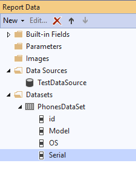
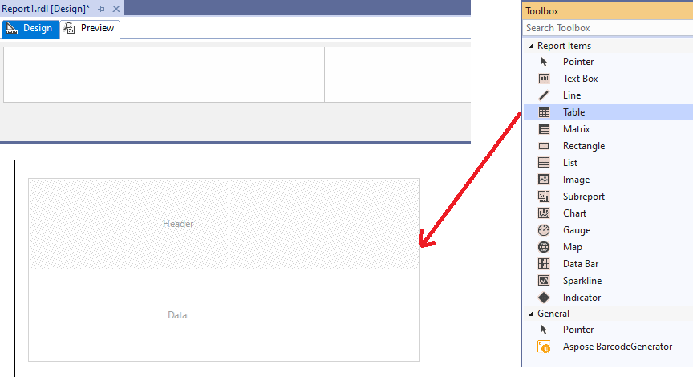
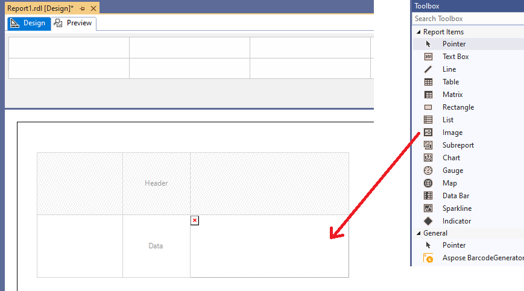
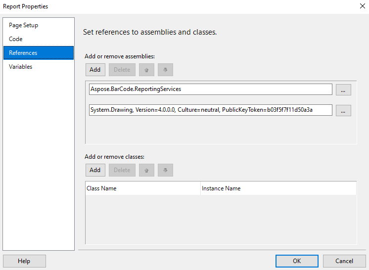
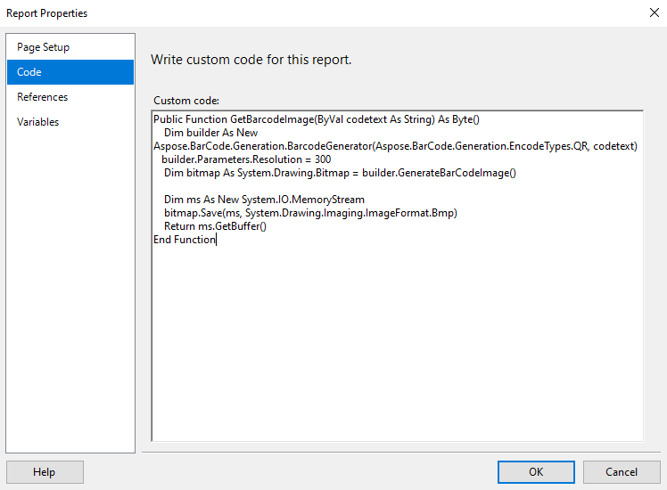
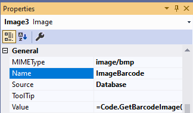
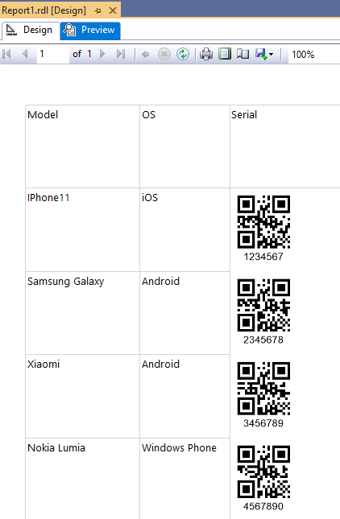

## **Overview**
***Aspose.BarCode for Reporting Services*** allows render barcode labels not only with BarcodeGenerator visual component but with [Custom Code](https://docs.microsoft.com/sql/reporting-services/report-design/custom-code-and-assembly-references-in-expressions-in-report-designer-ssrs) technology. In this way, barcode label is generated as image binary data for ***Image*** Report Item. 

The image data for barcode label is generated by ***BarcodeGenerator class*** in the embedded code. The generation code can be written only on ***VB.Net*** but it supports all features of [BarcodeGenerator class](https://apireference.aspose.com/barcode/net/aspose.barcode.generation/barcodegenerator) from ***Aspose.BarCode for .Net***.

{} 
More examples you can see on [Generate Barcodes](https://docs.aspose.com/barcode/net/generate-barcodes/) from examples for ***Aspose.BarCode for .Net***.
{} 

## **Tips and Tricks**
You don’t need apply license in the code manually. ***BarcodeGenerator class*** from ***Aspose.BarCode for Reporting Services*** automatically tries to read license from the registry as ***BarcodeGenerator visual component*** does. However, you need to apply license manually in code if you want to use ***BarcodeGenerator class*** from ***Aspose.BarCode for .Net***.

In Visual Studio 2017 and 2019 Custom Code assemblies are located in ***C:\Program Files (x86)\Microsoft Visual Studio\201X\{Edition}\Common7\IDE\PrivateAssemblies*** folders.

If you see watermark message in Visual Studio Preview mode with ***Custom Code*** barcode label generation, but you applied license with ***ConfigLicense*** utility, you need to change permissions.

Add ***FullTrust*** to ***Report_Expressions_Default_Permissions*** in ***RSPreviewPolicy.config*** file in Visual Studio Reporting Services Extension directory to allow ***Aspose.BarCode for Reporting Services*** reading license in Visual Studio ***Custom Code***.

<configuration>
	<mscorlib>
		<security>
			<policy>
				<PolicyLevel version="1">
					<CodeGroup class="FirstMatchCodeGroup" version="1" PermissionSetName="Nothing">
						<!-- Set Custom Code permission from Execution to FullTrust. License Fix-->
						<CodeGroup class="UnionCodeGroup" version="1" PermissionSetName="FullTrust" Name="Report_Expressions_Default_Permissions" Description="This code group grants default permissions for code in report expressions and Code element. ">
							<IMembershipCondition class="StrongNameMembershipCondition" version="1" PublicKeyBlob="0024000004800000940000000602000000240000525341310004000001000100512C8E872E28569E733BCB123794DAB55111A0570B3B3D4DE3794153DEA5EFB7C3FEA9F2D8236CFF320C4FD0EAD5F677880BF6C181F296C751C5F6E65B04D3834C02F792FEE0FE452915D44AFE74A0C27E0D8E4B8D04EC52A8E281E01FF47E7D694E6C7275A09AFCBFD8CC82705A06B20FD6EF61EBBA6873E29C8C0F2CAEDDA2"/>
						</CodeGroup>
					</CodeGroup>
				</PolicyLevel>
			</policy>
		</security>
	</mscorlib>
</configuration>


## **How to Generate Barcode Label with Custom Code**
1. Create blank report project and attach DataSource and DataSet to the project. You can see from these examples how to add [DataSource](https://docs.microsoft.com/sql/reporting-services/lesson-2-specifying-connection-information-reporting-services) and [DataSet](https://docs.microsoft.com/sql/reporting-services/lesson-3-defining-a-dataset-for-the-table-report-reporting-services) to the report.

As an example, for the article, we use test Microsoft Access database with the table ***Phones*** with the following fields.

**Table Name: Phones**

|**Column Name**|**Description**|
| :- | :- |
|**id**|Auto number. Used as primary key |
|**Model**| Model description, text field.|
|**OS**| Operational System description, text field.|
|**Serial**| Serial number, text field.|

After attaching DataSet to the project, you should see on the ***Report Data*** toolbox something like this:

2. Drag-and-drop ***Table*** report item on report surface.

3. Add ***Image*** Report Item to the table column.

4. Open ***Report Properties*** section ***References*** and add references to the ***Aspose.BarCode for Reporting Services*** and ***System.Drawing***.

Aspose.BarCode.ReportingServices
System.Drawing, Version=4.0.0.0, Culture=neutral, PublicKeyToken=b03f5f7f11d50a3a


5. Add current code to the ***Report Properties*** section ***Code***.

Public Function GetBarcodeImage(ByVal codetext As String) As Byte()
    Dim builder As New Aspose.BarCode.Generation.BarcodeGenerator(Aspose.BarCode.Generation.EncodeTypes.QR, codetext)
    builder.Parameters.Resolution = 300
    Dim bitmap As System.Drawing.Bitmap = builder.GenerateBarCodeImage()
    Dim ms As New System.IO.MemoryStream
    bitmap.Save(ms, System.Drawing.Imaging.ImageFormat.Bmp)
    Return ms.GetBuffer()
End Function


6. Return to the ***Image*** Report Item, and set properties with these values:
- ***Source*** to ***Database***;
- ***MIMEType*** to ***image/bmp***;
- ***Value*** to ***=Code.GetBarcodeImage(Fields!Serial.Value)***

7. Drag-and-drop other DataSet fields to the table.

8. Now you can see the full dataset, rendered as report. You can deploy the report to SSRS server or just pass to ***Preview*** section.

