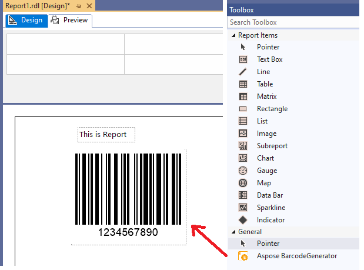
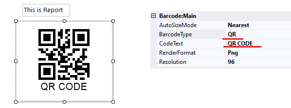
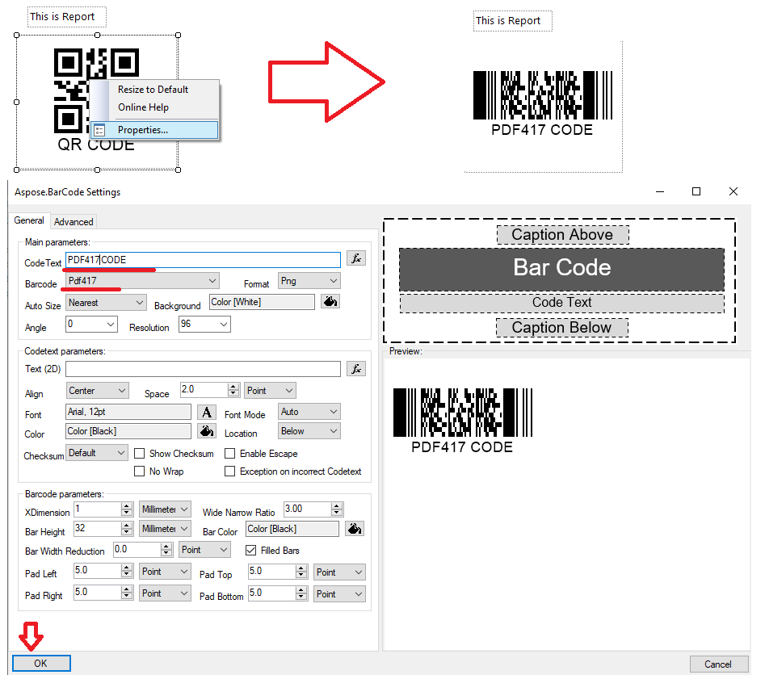
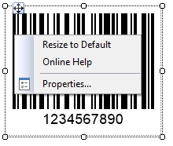
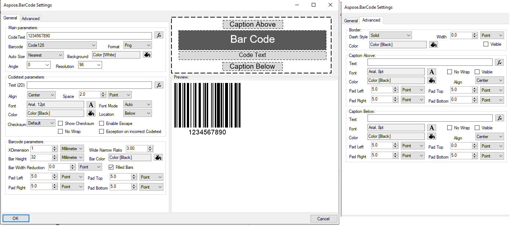
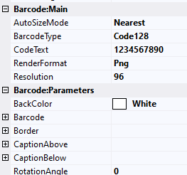

## **Overview**
***BarcodeGenerator visual component*** is a main part of Aspose.BarCode for Reporting Services and can be used any other visual Report Item. Visual component is built by [Custom Report Items](https://docs.microsoft.com/sql/reporting-services/custom-report-items/custom-report-items) technology and allows visually editing all of properties with permanent generated result preview.

Before reading this section, you should have ***BarcodeGenerator visual component*** get installed. Other way, read and proceed ***Installation*** section.

Editing of visual component parameters is possible in two ways:
- editing parameters by properties edition;
- editing parameters by visual editor embedded to component.

BarcodeGenerator visual component allows to accept report expressions like Dataset fields or report functions.

## **How to Add BarcodeGenerator Visual Component to Report**
1. Create Report project in Visual Studio and drag-and-drop BarcodeGenerator on report surface.

2. You can edit barcode label parameters in properties toolbox. Change ***BarcodeType*** to *QR* and ***CodeText*** to *QR CODE*. You can see result on the image.

3. You can edit barcode label parameters with embedded editor. For this you need, right click on the component, select ***Properties***, on opened window, ***Main Parameters*** section, change ***BarcodeType*** to ***Pdf417*** and ***CodeText*** to ***PDF417 CODE***.

## **Visual Component Menu**
Right clicking on the component opens menu, which has the following options:
- ***Resize to Default*** – resizes barcode label to minimal size which is set in ***XDimension*** and other barcode parameters. You can resize it manually to required size after this.
- ***Online Help*** – opens online help web page.
- ***Properties*** opens embedded editor.

## **Visual Embedded Editor**
At any time you can edit barcode label parameters with visual embedded editor which is raised with right clicking on the component and selecting ***Properties*** menu item. Visual editor allows you to select required properties with preview and apply them to component by ***OK*** button or discard by ***Cancel*** button

## **Visual Component Properties**
BarcodeGenerator visual component parameters can be edited in ***Properties*** toolbox. The properties are split on ***Barcode:Appearance***, ***Barcode:Main*** and ***Barcode:Parameters***. 

***Barcode:Appearance*** group contains parameters which affect component appearance and visibility and it includes the following parameters:
- ***Visible*** - the barcode paraments affect barcode label visibility in ***Preview*** mode. Can contains report expressions.
- ***DrawErrors*** - the barcode paraments disables or enables error drawing during barcode label generation. If it is disabled, component draws nothing in case error occurring.

***Barcode:Main*** group contains main generation parameters which is required in most cases and it includes the following parameters:
- ***AutoSizeMode*** - specifies the different types of automatic sizing modes. The mode defines barcode image resizing to the component size. ***None*** resizes component size to barcode image size which is defined by other parameters. ***Nearest*** resizes barcode image size to nearest value which is fit to the component size. ***Interpolation*** precisely resizes barcode image size to component size value, but barcode can be damaged in low resolution mode. If you use ***Interpolation*** mode, set at least 300 dpi at ***Resolution*** property.
- ***BarcodeType*** - BarCode symbology type. It includes 60+ symbologies.
- ***CodeText*** - text or data to be encoded as BarCode label.
- ***RenderFormat*** - image format which barcode label is rendered(jpeg, bmp, gif, png, tiff).
- ***Resolution*** - resolution of the generated BarCode image. Contains resolutions set and can be entered manually. The best resolution for printing is **300 dpi**.

***Barcode:Parameters*** group contains all other barcode generation parameters, most of them are not important or used in special cases, you can read about them in **Visual Component Properties** article. But the following parameters are more important and can be used more often:
- ***Border*** - set of border parameters that contains all configuration properties for BarCode border.
- ***CaptionAbove*** - set of Caption Above parameters of the BarCode image (text, and appearance).
- ***CaptionBelow*** - set of Caption Below parameters of the BarCode image (text, and appearance).
- ***RotationAngle*** - BarCode image rotation angle, measured in degree, e.g. RotationAngle = 0 or RotationAngle = 360 means no rotation. If ***RotationAngle*** NOT equal to 90, 180, 270 or 0, it may increase the difficulty for the scanner to read the image.
- ***XDimension*** from “Barcode” section - is the smallest width of the unit of BarCode bars or spaces. Is ignored when ***AutoSizeMode*** set to ***Nearest*** or ***Interpolation***. Works only with ***AutoSizeMode*** set to ***None***.
- ***CodeTextParameters*** from ***Barcode*** section - parameters which affects barcode text appearance on the barcode label.
- ***Location*** from ***CodeTextParameters*** section from ***Barcode*** section - specifies barcode text location. **Setting location to None hides CodeText**.
- ***IsChecksumEnabled*** from ***Barcode*** section - flag affects enabling checksum during generation 1D barcodes.
- ***WideNarrowRatio*** from ***Barcode*** section - wide bars to Narrow bars ratio.
- ***BarHeight*** from ***Barcode*** section - height of 1D barcodes' bars. Is ignored when ***AutoSizeMode*** set to ***Nearest*** or ***Interpolation***. Works only with ***AutoSizeMode*** set to ***None***.
- ***Padding*** from ***Barcode*** section - barcode paddings between other barcode elements like barcode border, captions or barcode text.