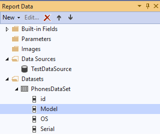
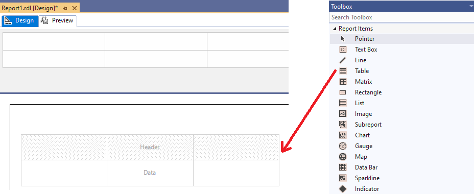
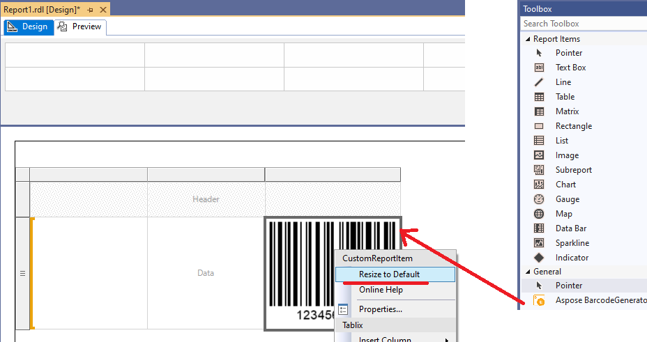
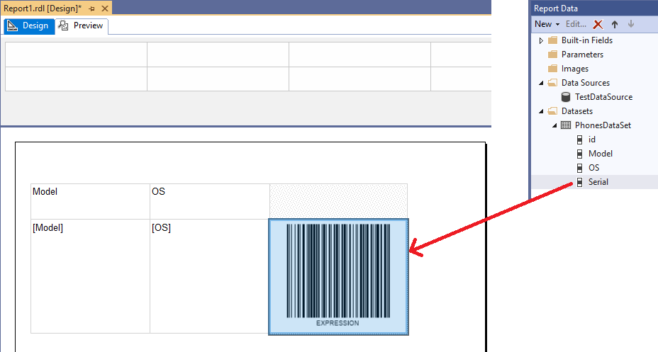
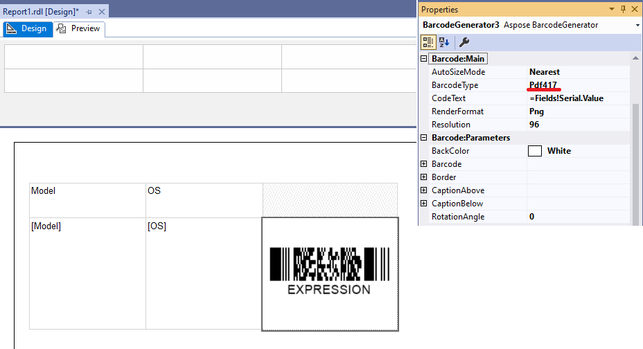
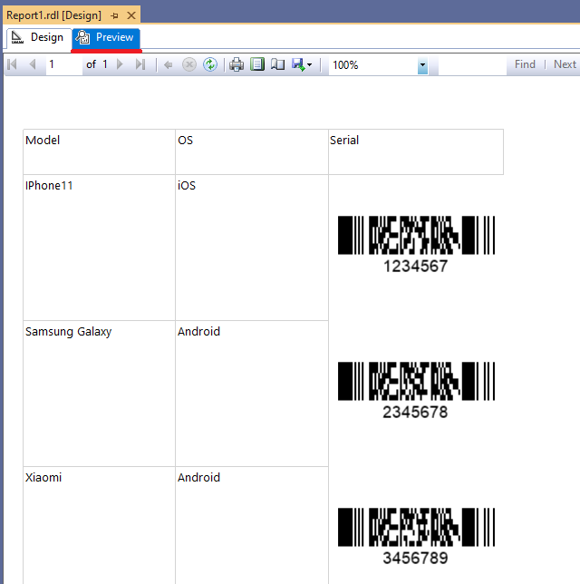

## **Overview**
The most common reporting services usage is generating reports from table data from datasets. ***BarcodeGenerator visual component*** can generate barcodes from dataset or any expression data as well as any other Report Item. In this article we provide information how to generate reports with barcodes support from any DataSet.

## **How to Generate Report with Barcodes Support from Dataset**
1. Create blank report project and attach DataSource and DataSet to the project. You can see from these examples how to add [DataSource](https://docs.microsoft.com/sql/reporting-services/lesson-2-specifying-connection-information-reporting-services) and [DataSet](https://docs.microsoft.com/sql/reporting-services/lesson-3-defining-a-dataset-for-the-table-report-reporting-services) to the report.

As an example, for the article, we use test Microsoft Access database with the table ***Phones*** with the following fields.

**Table Name: Phones**

|**Column Name**|**Description**|
| :- | :- |
|**id**|Auto number. Used as primary key |
|**Model**|Model description, text field.|
|**OS**|Operational System description, text field.|
|**Serial**|Serial number, text field.|

After attaching DataSet to the project, you should see on the ***Report Data*** toolbox something like this:

2. Drag-and-drop ***Table*** report item on report surface.

3. Drag-and-drop ***BarcodeGenerator visual component*** to any of ***Table*** column. The next, right click on BarcodeGenerator component and select ***Resize to Default***. This resizes component to default size with current parameters.

4. Drag-and-drop data fields from ***Report Data*** toolbox to the table columns. Put fields ***Serial*** to ***BarcodeGenerator*** component.

5. Now as example you can change barcode properties. Set ***BarcodeType*** to ***Pdf417***. As you can see ***CodeText*** value is set to expression value ***=Fields!Serial.Value*** which is represent field identifier. All values, detected as ***Expression*** in design mode, the component renders as word ***EXPRESSION***.

6. Now you can see the full dataset, rendered as report. You can deploy the report to SSRS server or just pass to ***Preview*** section.

## **Tips and Tricks**
1. BarcodeGenerator visual component renders all values, detected as [Expression](https://docs.microsoft.com/sql/reporting-services/report-design/expressions-report-builder-and-ssrs) in design mode, as word “EXPRESSION” instead of real expression value. The real value can be seen on ***Properties*** toolbox.

2. The DataSet fields can be just drag-and-dropped on the component. The behavior is similar to other Report Items.

3. Some BarcodeGenerator component properties like ***CodeText***, ***Caption*** text values or ***TwoDDisplayText*** can accept ***Expression*** values which are resolved in runtime.

4. Right click on BarcodeGenerator component and select ***Resize to Default*** is a simplest way to obtain most correct barcode size.