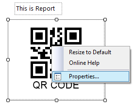
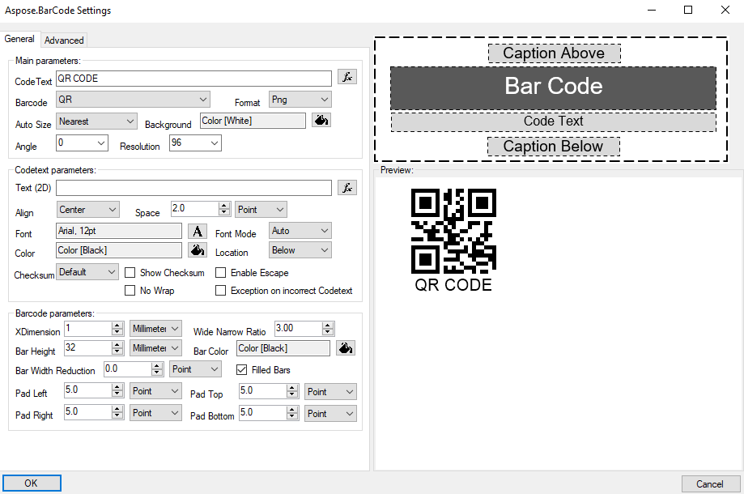
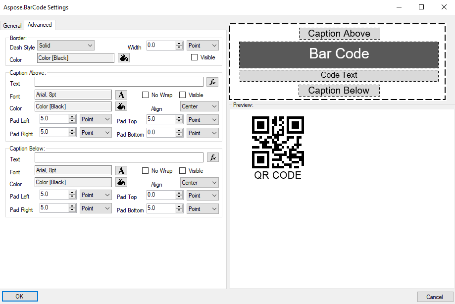

## **Overview**
Barcode label parameters can be edit visually with embedded visual editor which is raised with right clicking on the component and selecting ***Properties*** menu item. Visual editor allows you to select required properties with preview and apply them to component by ***OK*** button or discard by ***Cancel*** button. Visual editor allows to edit most common component properties except special barcode properties.

## **General Section**
This section contains most common used properties set which allows to set barcode appearance or data.

### **Main Parameters**
This subsection contains main barcode parameters which will be set in any barcode label usage.

The section contains the following parameters:
- ***CodeText*** - text or data to be encoded as BarCode label.
- ***Barcod*** - BarCode symbology type. It includes 60+ symbologies.
- ***Format*** - image format which barcode label is rendered(jpeg, bmp, gif, png, tiff).
- ***Auto Size*** - specifies the different types of automatic sizing modes. The mode defines barcode image resizing to the component size. ***None*** resizes component size to barcode image size which is defined by other parameters. ***Nearest*** resizes barcode image size to nearest value which is fit to the component size. ***Interpolation*** precisely resizes barcode image size to component size value, but barcode can be damaged in low resolution mode. If you use ***Interpolation*** mode, set at least 300 dpi at ***Resolution*** property.
- ***Background*** - background color of the BarCode image.
- ***Angle*** - BarCode image rotation angle, measured in degree, e.g. RotationAngle = 0 or RotationAngle = 360 means no rotation. If RotationAngle NOT equal to 90, 180, 270 or 0, it may increase the difficulty for the scanner to read the image.
- ***Resolution*** - resolution of the generated BarCode image. Contains resolutions set and can be entered manually. The best resolution for printing is **300 dpi**.

### **Codetext Parameters**
This subsection contains parameters which affects barcode visual text appearance. 

The subsection contains the following parameters:
- ***Text (2D)*** - is a text that will be displayed instead of codetext in 2D barcodes.
- ***Align*** - horizontal alignment of barcode text.
- ***Space*** - is a space between the CodeText and the BarCode.
- ***Font*** - specifies the displaying CodeText font.
- ***Font Mode*** - switch mode between manual font size set in ***Font*** property and automatic font size calculation.
- ***Color*** - barcode text color.
- ***Location*** - specifies barcode text location. **Setting location to None hides CodeText**.
- ***Checksum*** - flag affects enabling checksum during generation 1D barcodes.
- ***Show Checksum*** - flag affects displaying checksum digit in the human readable text for Code128 and GS1Code128 barcodes.
- ***Enable Escape*** - indicates whether explains the character "\\" as an escape character in CodeText property.
- ***No Wrap*** - flag that affects text line wrapping.
- ***Exception on incorrect Codetext*** - if codetext is incorrect and value set to true - exception will be thrown. Otherwise codetext will be corrected to match barcode's specification. Only for 1D barcodes.

### **Barcode Parameters**
This subsection contains parameters which affects graphic representation of barcode element.

The subsection contains the following parameters:
- ***XDimension*** - is the smallest width of the unit of BarCode bars or spaces. Is ignored when ***AutoSizeMode*** set to ***Nearest*** or ***Interpolation***. Works only with ***AutoSizeMode*** set to ***None***.
- ***Wide Narrow Ratio*** - wide bars to Narrow bars ratio.
- ***Bar Height*** - height of 1D barcodes' bars. Is ignored when ***AutoSizeMode*** set to ***Nearest*** or ***Interpolation***. Works only with ***AutoSizeMode*** set to ***None***.
- ***Bar Color*** - color of barcode bars or cells.
- ***Bar Width Reduction*** - reduction value that is used to compensate ink spread while printing.
- ***Filled Bars*** - flag affects whether bars filled. Only for 1D barcodes.
- ***Pad Left***, ***Pad Top***, ***Pad Right***, ***Pad Bottom*** - barcode paddings between other barcode elements like barcode border, captions or barcode text.

## **Advanced Section**
This section contains special barcode properties set which can be used in special cases. These properties extend barcode appearance functionality but are not required in common use. Advanced section doews not includes special barcode parameters which can be set with on ***Properties*** Visual Studio toolbox.

### **Border Parameters**
This subsection contains visual style of border around barcode parameters.

The subsection contains the following parameters:
- ***Dash Style*** - visual style of the border.
- ***Width*** - border width.
- ***Color*** - border color.
- ***Visible*** - flag that affects border visibility.

### **Caption Above and Caption Below Parameters**
These subsections contain parameters about ***Caption*** and their visual representations on barcode label image. The parameters of both subsections are identical but changes above and below ***Caption*** elements.

The subsections contain the following parameters:
- ***Text*** - caption text.
- ***Font*** - caption font.
- ***No Wrap*** - flag that affects text line wrapping.
- ***Visible*** - flag that affects caption visibility.
- ***Color*** - caption text color.
- ***Align*** - horizontal alignment of caption text.
- ***Pad Left***, ***Pad Top***, ***Pad Right***, ***Pad Bottom*** - captions paddings between other barcode elements like barcode border, barcode or barcode text.