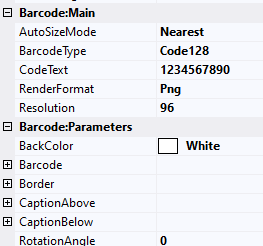
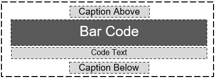

## **Overview**
***BarcodeGenerator visual component*** properties is a similar to [BarcodeGenerator Parameters]( https://apireference.aspose.com/barcode/net/aspose.barcode.generation/barcodegenerator) and more detail information about their usage can be obtained from that section. Visual component split on ***Barcode:Appearance***, ***Barcode:Main*** and ***Barcode:Parameters*** sections. ***Barcode:Appearance*** group contains parameters which affect component appearance and visibility, ***Barcode:Main*** group contains main generation parameters which is required in most cases, ***Barcode:Parameters*** includes all other barcode generation parameters.

The property groups influence can be seen on this image.

## **Barcode:Appearance Properties Group**
***Barcode:Appearance*** group contains parameters which affect component appearance and visibility

It contains the following parameters:
- ***Visible*** - the barcode paraments affect barcode label visibility in ***Preview*** mode. Can contains report expressions.
- ***DrawErrors*** - the barcode paraments disables or enables error drawing during barcode label generation. If it is disabled, component draws nothing in case error occurring.

## **Barcode:Main Properties Group**
***Barcode:Main*** properties group includes main generation parameters which is required in most cases. 

It contains the following parameters:
- ***AutoSizeMode*** - specifies the different types of automatic sizing modes. The mode defines barcode image resizing to the component size. ***None*** resizes component size to barcode image size which is defined by other parameters. ***Nearest*** resizes barcode image size to nearest value which is fit to the component size. ***Interpolation*** precisely resizes barcode image size to component size value, but barcode can be damaged in low resolution mode. If you use ***Interpolation*** mode, set at least 300 dpi at ***Resolution*** property.
- ***BarcodeType*** - BarCode symbology type. It includes 60+ symbologies.
- ***CodeText*** - text or data to be encoded as BarCode label.
- ***RenderFormat*** - image format which barcode label is rendered(jpeg, bmp, gif, png, tiff).
- ***Resolution*** - resolution of the generated BarCode image. Contains resolutions set and can be entered manually. The best resolution for printing is **300 dpi**.

## **Barcode:Parameters Properties Group**
***Barcode:Parameters*** properties group contains all other barcode generation parameters, most of them are not important or used in special cases. 

It contains the following parameters:
- ***BackColor*** - background color of the BarCode image.
- ***Barcode*** - set of BarCode parameters that contains barcode generation properties
- ***Border*** - set of border parameters that contains all configuration properties for BarCode border.
- ***CaptionAbove*** - set of Caption Above parameters of the BarCode image (text, and appearance).
- ***CaptionBelow*** - set of Caption Below parameters of the BarCode image (text, and appearance).
- ***RotationAngle*** - BarCode image rotation angle, measured in degree, e.g. RotationAngle = 0 or RotationAngle = 360 means no rotation. If RotationAngle NOT equal to 90, 180, 270 or 0, it may increase the difficulty for the scanner to read the image.

### **CaptionAbove and CaptionBelow Properties Groups**
***Caption*** properties groups contain caption parameters. The parameters of both subsections are identical but changes above and below ***Caption*** elements.

They contain the following parameters:
- ***Text*** - caption text.
- ***Font*** - caption font.
- ***Visible*** - flag that affects caption visibility.
- ***TextColor*** - caption text color.
- ***Padding*** - captions paddings between other barcode elements like barcode border, barcode or barcode text.
- ***Alignment*** - horizontal alignment of caption text.
- ***NoWrap*** - flag that affects text line wrapping.

### **Border Properties Group**
***Border*** properties group contains parameters that affects barcode border appearance. 

It contains the following parameters:
- ***Visible*** - flag that affects border visibility.
- ***Width*** - border width.
- ***BorderDashStyle*** - visual style of the border.
- ***Color*** - border color.

### **Barcode Properties Group**

***Barcode*** properties group contains parameters which have influence on barcode visual style, barcode text style and on special barcode parameters. 

It contains the following parameters:
- ***XDimension*** - is the smallest width of the unit of BarCode bars or spaces. Is ignored when ***AutoSizeMode*** set to ***Nearest*** or ***Interpolation***. Works only with ***AutoSizeMode*** set to ***None***.
- ***BarHeight*** - height of 1D barcodes' bars. Is ignored when ***AutoSizeMode*** set to ***Nearest*** or ***Interpolation***. Works only with ***AutoSizeMode*** set to ***None***.
- ***BarColor*** - color of barcode bars or cells.
- ***Padding*** - barcode paddings between other barcode elements like barcode border, captions or barcode text.
- ***ChecksumAlwaysShow*** - flag affects displaying checksum digit in the human readable text for Code128 and GS1Code128 barcodes.
- ***IsChecksumEnabled*** - flag affects enabling checksum during generation 1D barcodes.
- ***EnableEscape*** - indicates whether explains the character "\\" as an escape character in CodeText property.
- ***ThrowExceptionWhenCodeTextIncorrect*** - if codetext is incorrect and value set to true - exception will be thrown. Otherwise codetext will be corrected to match barcode's specification. Only for 1D barcodes.
- ***WideNarrowRatio*** - wide bars to Narrow bars ratio.
- ***FilledBars*** - flag affects whether bars filled. Only for 1D barcodes.
- ***BarWidthReduction*** - reduction value that is used to compensate ink spread while printing.
- ***CodeTextParameters*** - parameters which affects barcode text appearance on the barcode label.
- ***Postal*** - postal barcode parameters. Used for Postnet, Planet.
- ***PatchCode*** - PatchCode barcode type parameters.
- ***AustralianPost*** - AustralianPost barcode parameters.
- ***DataBar*** - parameters which are used for Databar barcode types set.
- ***Codablock*** - CodablockF barcode parameters.
- ***DataMatrix*** - parameters which are used for DataMatrix barcode types set.
- ***Code16K*** - Code16K barcode parameters.
- ***DotCode*** - DotCode barcode parameters.
- ***ITF*** – ITF14 barcode parameters.
- ***Pdf417*** - contains PDF417, MacroPDF417 and MicroPDF417 parameters.
- ***QR*** – contains QR and MicroQR barcode parameters.
- ***Supplement*** – Supplement (EAN5 and EAN2) parameters. Used for Interleaved2of5, Standard2of5, EAN13, EAN8, UPCA, UPCE, ISBN, ISSN, ISMN.
- ***MaxiCode*** - MaxiCode barcode parameters.
- ***Aztec*** - Aztec barcode parameters.
- ***Codabar*** - Codabar barcode parameters.
- ***Coupon*** - contains parameters for UpcaGs1DatabarCoupon, UpcaGs1Code128Coupon.

#### **CodeTextParameters Properties Group**

***CodeTextParameters*** contains parameters which affects barcode text appearance on the barcode label. 

It contains the following parameters:
- ***TwoDDisplayText*** - is a text that will be displayed instead of codetext in 2D barcodes.
- ***FontMode*** - switch mode between manual font size set in ***Font*** property and automatic font size calculation.
- ***Font*** - specifies the displaying CodeText font.
- ***Space*** - is a space between the CodeText and the BarCode.
- ***Alignment*** - horizontal alignment of barcode text.
- ***Color*** - barcode text color.
- ***Location*** - specifies barcode text location. **Setting location to None hides CodeText**.
- ***NoWrap*** - flag that affects text line wrapping.