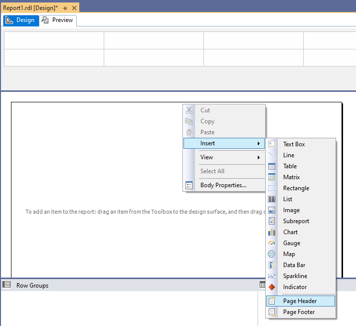
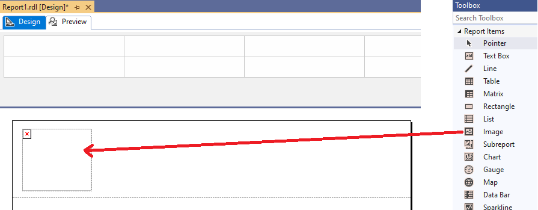
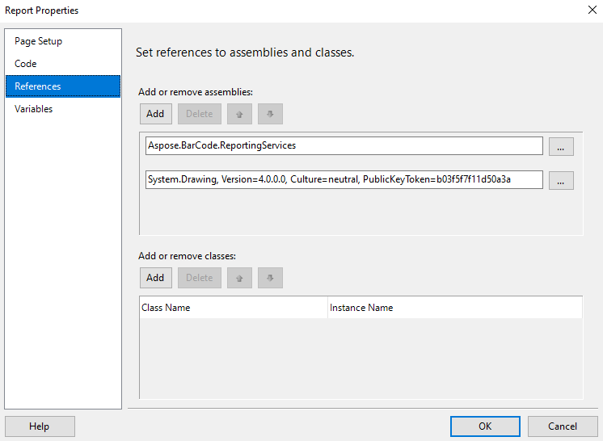
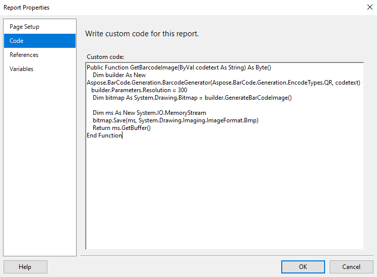
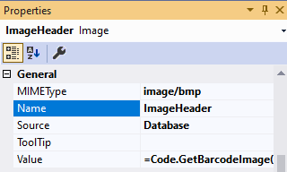
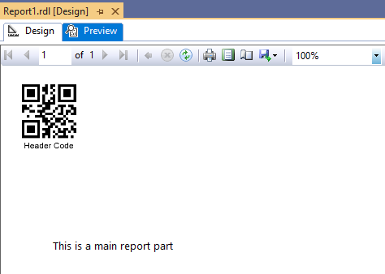

## **Overview**
In Visual Studio, you cannot use a [Custom Report Items](https://docs.microsoft.com/sql/reporting-services/custom-report-items/custom-report-items) in headers or footers. Therefore, ***BarcodeGenerator visual component*** cannot be used to render barcode labels in report headers or footers.

The solution is using [Custom Code](https://docs.microsoft.com/sql/reporting-services/report-design/custom-code-and-assembly-references-in-expressions-in-report-designer-ssrs) technology and render barcode label as image stream to standard ***Image*** Report Item control which can be placed to headers and footers. You can use ***BarcodeGenerator class*** instead of ***BarcodeGenerator visual component***. 
{} 
For more detailed information you can see [BarcodeGenerator Class]( /barcode/reportingservices/barcodegenerator-class/) tutorial.
{} 
The tutorial covers how to display barcode labels in a report header/footer with ***Aspose.Barcode for Reporting Services***.

## **How to Display Barcodes in a Report Header/Footer**
1. Create blank report project, right click on report page and select ***Insert*** then ***Page Header***.

2. Place ***Image*** Report item to report page header.

3. Open ***Report Properties*** section ***References*** and add references to the ***Aspose.BarCode for Reporting Services*** and ***System.Drawing***.

Aspose.BarCode.ReportingServices
System.Drawing, Version=4.0.0.0, Culture=neutral, PublicKeyToken=b03f5f7f11d50a3a


4. Add current code to the ***Report Properties*** section ***Code***.

Public Function GetBarcodeImage(ByVal codetext As String) As Byte()
    Dim builder As New Aspose.BarCode.Generation.BarcodeGenerator(Aspose.BarCode.Generation.EncodeTypes.QR, codetext)
    builder.Parameters.Resolution = 300
    Dim bitmap As System.Drawing.Bitmap = builder.GenerateBarCodeImage()
    Dim ms As New System.IO.MemoryStream
    bitmap.Save(ms, System.Drawing.Imaging.ImageFormat.Bmp)
    Return ms.GetBuffer()
End Function


5. Return to the ***Image*** Report Item, and set properties with these values:
- ***Source*** to ***Database***;
- ***MIMEType*** to ***image/bmp***;
- ***Value*** to ***=Code.GetBarcodeImage("Header Code")***

6. As a result, on ***Preview*** panel you should see something like this:

