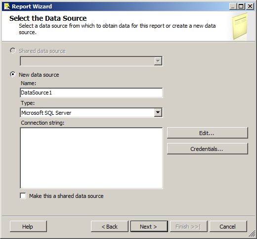
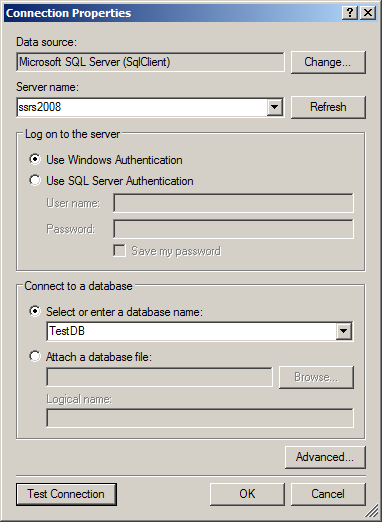
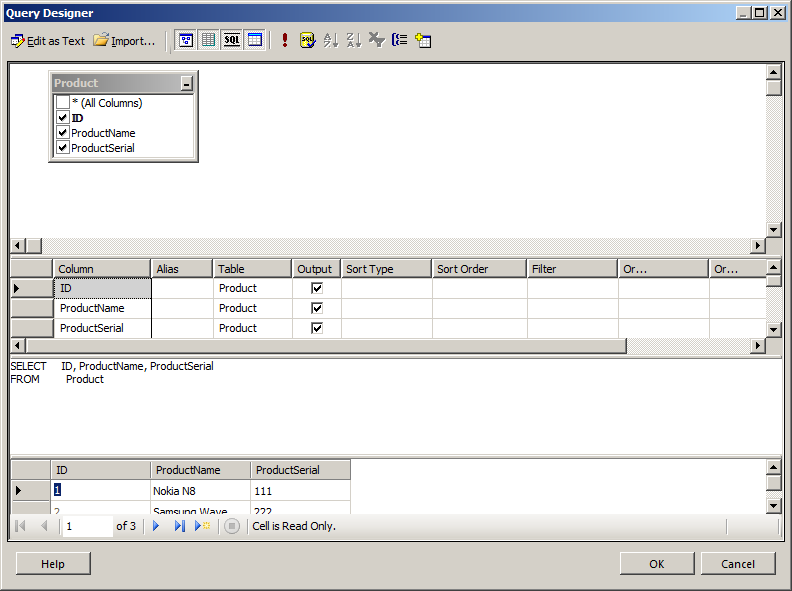
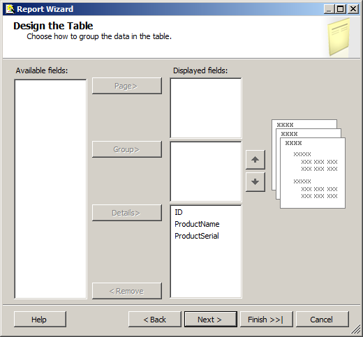
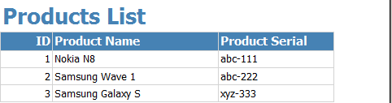
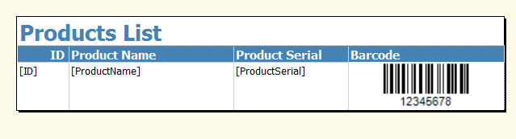
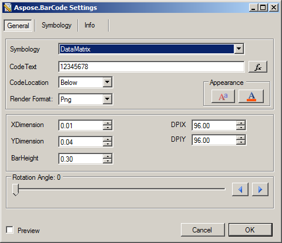
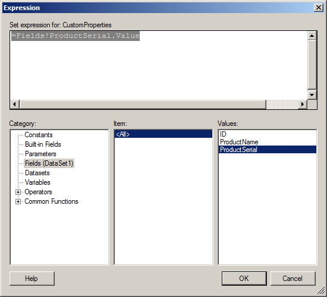
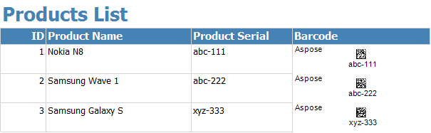
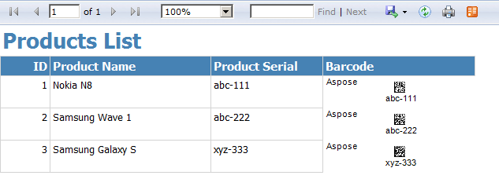

{} 

This article shows how easy it is to display barcodes in dataset-based reports with the help of Aspose.BarCode.

The article covers how to:

- [Create a new report](/barcode/reportingservices/display-barcodes-on-dataset-based-reports-html/).
- Add and configure a dataset.
- [Add the barcode control to the report](/barcode/reportingservices/display-barcodes-on-dataset-based-reports-html/).
- [Use a field of the dataset as codetext](/barcode/reportingservices/display-barcodes-on-dataset-based-reports-html/), for generating a barcode.
- [Set the barcode symbology](/barcode/reportingservices/display-barcodes-on-dataset-based-reports-html/).
- [View the final report after deploying to the SQL Server Reporting Services](/barcode/reportingservices/display-barcodes-on-dataset-based-reports-html/).

{} 
### **Background**
Using datasets in reports is very common when programming with SQL Server Reporting Services. We provide a SQL query to populate the records in a dataset and use it as the data source for the report. Columns are bound to the fields in the dataset to automatically display the correct value of the record.

In this article, we use a simple table with three columns for the report. Below are the details of the table:

**Table Name: Product**

|**Column Name** |**Purpose** |
| :- | :- |
|ID |Auto number. Used as primary key |
|ProductName |Store the product name. |
|ProductSerial |Store the serial number. Display barcode for this value |
The report will contain 4 columns. 3 columns displays the values from the table. The 4th column contains the barcode control. The barcode control uses the value of the “ProductSerial” column as codetext, for each of the rows.
### **Building the Report**
#### **Create a New Report**
1. Open Visual Studio.
1. Create a new **Report Server** project.
1. Add a new report.
1. Choose the **Report Wizard** for creating the report.
1. Choose the data source as shown in the figure below.

   **Selecting the data source** 

1. Click on **Edit** to create the connection string.
1. Choose the database server and database as shown below.

   **Selecting the databasde server and database** 

1. Make sure that the connection string is valid by clicking **Test Connection**.
   If the connection works, you'll see the message “test connection succeeded”.
1. Click **OK**.

   **The query designer** 

1. Select all the columns from the Product table.
   Make sure that the query is valid by executing it in the query designer window; it should show some records from the table.
1. Choose the **Tabular** option in the report type screen.
1. Click **Next**.
1. Add all the fields in the **Detail** category.

   **Designing the table** 

1. Click **Next** and call the report “Products List”.
1. Click **Finish** to create the report.

The report should now be created. It show all the 3 columns from the “Product” table. Below is a preview of the report, as shown in the **preview** tab in Visual Studio.

**A report preview** 

#### **Add Barcode column**
To display the barcode, add a new column. 

1. Open the report in **design** view.
1. Right-click the **Product Serial** column and select **Insert column** and then **Right**.
   A new column is added. 
1. Name the column **Barcode**.
1. Open the toolbox in Visual Studio and drag the Aspose.BarCode for Reporting Services control to the newly created column.

The report now looks like the one below.

**Barcode column added to the report** 

#### **Setting Symbology Type and Codetext**
Now set the codetext and symbology type in the barcode control.
##### **Set Symbology**
1. Right-click the barcode control and choose **properties**.
   The barcode designer window opens. 
1. Choose the desired barcode symbology from the list.
   In this example, we've selected **Datamatrix**.

   **Setting the barcode symbology** 

##### **Set Codetext**
As you can see the code text has a default value of “12345678”. We need to change it to set the product serial number to be used as codetext. 

1. Click the **fx** (Expression) button next to the **code text**.
   The Expression window opens.
1. Select **Fields** from the **Category** and select **ProductSerial** from the **Values** list.
   The **Expression** field should read =Fields!ProductSerial.Value.

   **Defining the codetext** 

1. Click **OK**.
   This sets the value of the **ProductSerial** column as the barcode codetext. 

A preview of the report should now look like the one below.

**The report preview, showing a barcode with the correct codetext** 

The barcode control picks the corresponding serial number for each product for the codetext.
#### **Deploy the Report**
You can also test the report by deploying it to SQL Server Reporting Services. 

Below is a screenshot of the report when opened in Internet Explorer after deployment.

**The final report** 

### **Summary**
The barcode control for Reporting Services provides a custom properties window for designing the barcode. It also provides a way to give any expression (fx) for the codetext value. It can be a constant string or value of a dataset column. This article was about specifying the serial number column of a table as the codetext, which was very easily done using the barcode control. 
### **Reference URLs**
{} 

- [Install Aspose.BarCode for Reporting Services](http://www.aspose.com/documentation/ssrs-rendering-extensions/aspose.barcode-for-reporting-services/install-aspose-barcode-for-reporting-services.html)
- [Design time barcode report designer](http://www.aspose.com/documentation/ssrs-rendering-extensions/aspose.barcode-for-reporting-services/designtime-barcode-report-designer.html)

{}
