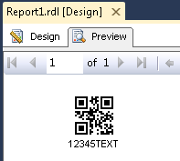

{} 

ECI (Extended Channel Interpretation) enables QR Code encode multiple character sets (e.g. Arabic, Cyrillic, Greek, Hebrew) and other data interpretations or industry specific requirements to be represented, into one QR Code symbol.

{} 

The ECIEncoding property of BarCodeBuilder class is used to tell the barcode reader details about the used references for encoding the data in the symbol by the Extended Channel Interpretation Identifiers. Current implementation consists all well-known charset encodings. Currently, it is used only for QR 2D barcode.

Enum ECIEncodings:

1. **ISO_8859_1** - ISO/IEC 8859-1 Latin alphabet No. 1 encoding. ECI Id:"\000003".
1. **ISO_8859_2** - ISO/IEC 8859-2 Latin alphabet No. 2 encoding. ECI Id:"\000004".
1. **ISO_8859_3** - ISO/IEC 8859-3 Latin alphabet No. 3 encoding. ECI Id:"\000005".
1. **ISO_8859_4** - ISO/IEC 8859-4 Latin alphabet No. 4 encoding. ECI Id:"\000006".
1. **ISO_8859_5** - ISO/IEC 8859-5 Latin/Cyrillic alphabet encoding. ECI Id:"\000007".
1. **ISO_8859_6** - ISO/IEC 8859-6 Latin/Arabic alphabet encoding. ECI Id:"\000008".
1. **ISO_8859_7** - ISO/IEC 8859-7 Latin/Greek alphabet encoding. ECI Id:"\000009".
1. **ISO_8859_8** - ISO/IEC 8859-8 Latin/Hebrew alphabet encoding. ECI Id:"\000010".
1. **ISO_8859_9** - ISO/IEC 8859-9 Latin alphabet No. 5 encoding. ECI Id:"\000011".
1. **ISO_8859_10** - ISO/IEC 8859-10 Latin alphabet No. 6 encoding. ECI Id:"\000012".
1. **ISO_8859_11** - ISO/IEC 8859-11 Latin/Thai alphabet encoding. ECI Id:"\000013".
1. **ISO_8859_13** - ISO/IEC 8859-13 Latin alphabet No. 7 (Baltic Rim) encoding. ECI Id:"\000015".
1. **ISO_8859_14** - ISO/IEC 8859-14 Latin alphabet No. 8 (Celtic) encoding. ECI Id:"\000016".
1. **ISO_8859_15** - ISO/IEC 8859-15 Latin alphabet No. 9 encoding. ECI Id:"\000017".
1. **ISO_8859_16** - ISO/IEC 8859-16 Latin alphabet No. 10 encoding. ECI Id:"\000018".
1. **Shift_JIS** - Shift JIS (JIS X 0208 Annex 1 + JIS X 0201) encoding. ECI Id:"\000020".
1. **Win1250** - Windows 1250 Latin 2 (Central Europe) encoding. ECI Id:"\000021".
1. **Win1251** - Windows 1251 Cyrillic encoding. ECI Id:"\000022".
1. **Win1252** - Windows 1252 Latin 1 encoding. ECI Id:"\000023".
1. **Win1256** - Windows 1256 Arabic encoding. ECI Id:"\000024".
1. **UTF16BE** - ISO/IEC 10646 UCS-2 (High order byte first) encoding. ECI Id:"\000025".
1. **UTF8** - ISO/IEC 10646 UTF-8 encoding. ECI Id:"\000026".
1. **US_ASCII** - ISO/IEC 646:1991 International Reference Version of ISO 7-bit coded character set encoding. ECI Id:"\000027".
1. **Big5** - Big 5 (Taiwan) Chinese Character Set encoding. ECI Id:"\000028".
1. **GB18030** - GB (PRC) Chinese Character Set encoding. ECI Id:"\000029".
1. **EUC_KR** - Korean Character Set encoding. ECI Id:"\000030".
##### **Encode QR Code in the ECI Mode**
### **Add a reference of the Aspose.BarCode.ReportingServices.dll**
1. Select report in solution explorer.
1. In Visual Studio main menu, Select **Report** and then **Report Properties**.
1. Click the **References** tab.
1. Browse to the Aspose.BarCode.ReportingServices.dll and add it to the references.
1. A reference to System.Drawing dll is also required, which can be found in the .NET tab.
1. In **Add or remove classes** part, add the description for the class as follows:
   Class Name:Aspose.BarCode.ReportingServices.BarCodeBuilder Instance Name: objBarCode
1. Click on the **OK** button.
### **Add the source code to encode QR code in ECI mode**
1. Select report in solution explorer.
1. In Visual Studio main menu, Select **Report** and then **Report Properties**.
1. Click the **Code** tab.
1. Add the following source code to encode QR code
   Set properties of BarCodeBuilder class object, QREncodeMode to ECIEncoding, QREncodeType to ForceQR, ECIEncoding to UTF8 and set error correction level for the data you want to encode. Below is an example to generate a QR barcode: 

Error rendering macro 'code' : Invalid value specified for parameter lang

1. Click on the **OK** button.
   So far, we have added the code and Aspose library reference to generate the barcodes.
#### **Drag an image control on the report:**
1. Drag an image control on the report.
1. Set its properties as narrated in below steps 3,4,5 and 6.
1. Select **Database** as the **Image Source**.
1. In **MIME type**, select an appropriate format.
1. Select **Size** tab.
1. Change the display size to "Original Size*.
1. Click on the **OK** button.
#### **Setting the image control value**
1. Right-click the Micro QR Code image control and select **Properties**.
1. Set the **Value** property to =Code.GetBarCodeImageOfMicroQRCode()
   Save all the files and click on “Preview” tab. You should see the similar output as below: 
   **The final report** 

