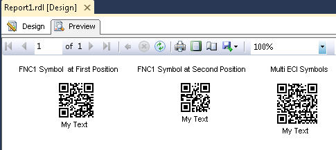

{} 

The ExtendedCodetext mode allows developers to encode multi-ECI and FNC1 symbols in the QR code. Extended Channel mode supports FNC1 first position, FNC1 second position and multi ECI modes.

{} 
##### **Encode QR Code in the Extended Code Text Mode**
Use Display2DText property of the BarCodeBuilder class to set visible text and removing managing characters display.

Encoding Principles:

- All symbols "\" must be doubled in the codetext.
- FNC1 in first position is set in codetext as as "<FNC1>".
- FNC1 in second position is set in codetext as as "<FNC1(value)>". The value must be single symbols (a-z, A-Z) or digits from 0 to 99.
- Group Separator for FNC1 modes is set as 0x1D character '\u001D'.
- If you need to insert "<FNC1>" string into barcode write it as "<\FNC1>".
- ECI identifiers are set as single slash and six digits identifier "\000026" - UTF8 ECI identifier.
- TO disable current ECI mode and convert to default JIS8 mode zero mode ECI indetifier is set "\000000".
- All unicode characters after ECI identifier are automatically encoded into correct character codeset.

QrExtCodetextBuilder class description:

- **Clear()** method - clears extended codetext items.
- **AddPlainCodetext(System.String)** method - adds plain codetext to the extended codetext items.
- **AddECICodetext(Aspose.BarCode.ECIEncodings,System.String)** method - Adds codetext with Extended Channel Identifier.
- **AddFNC1FirstPosition()** method - adds FNC1 in first position to the extended codetext items.
- **AddFNC1SecondPosition(System.String)** method - adds FNC1 in second position to the extended codetext items.
- **AddFNC1GroupSeparator()** method - Adds Group Separator (GS - '\u001D') to the extended codetext items.
- **GetExtendedCodetext()** method - generates extended codetext from generation items list.
### **Add a reference of the Aspose.BarCode.ReportingServices.dll**
1. Select report in solution explorer.
1. In Visual Studio main menu, Select **Report** and then **Report Properties**.
1. Click the **References** tab.
1. Browse to the Aspose.BarCode.ReportingServices.dll and add it to the references.
1. A reference to System.Drawing dll is also required, which can be found in the .NET tab.
1. In **Add or remove classes** part, add the description for the class as follows:
   Class Name:Aspose.BarCode.ReportingServices.BarCodeBuilder Instance Name: objBarCode
1. Click on the **OK** button.
### **Add the source code to encode QR code**
1. Select report in solution explorer.
1. In Visual Studio main menu, Select **Report** and then **Report Properties**.
1. Click the **Code** tab. 
#### **Use FNC1 First Position in Extended Mode**
Call AddFNC1FirstPosition method of the BarCodeBuilder class object to set FNC1 in first position of the extended code text items, call AddPlainCodetext method to add plain code text to the extended code text items, call AddFNC1GroupSeparator method to add group separator in the extended code text items and then call AddPlainCodetext method to add plain code text to the extended code text items. 

Error rendering macro 'code' : Invalid value specified for parameter lang
#### **Use FNC1 Second Position in Extended Mode**
Call AddFNC1SecondPosition method of the BarCodeBuilder class object to set FNC1 in second position of the extended code text items and then call AddPlainCodetext method to add plain code text to the extended code text items.

Error rendering macro 'code' : Invalid value specified for parameter lang
#### **Use multi ECI Mode in Extended Mode**
Call AddECICodetext method multiple times of the BarCodeBuilder class object to add code text with extended channel identifier and then call AddPlainCodetext method to add plain code text to the extended code text items.

Error rendering macro 'code' : Invalid value specified for parameter lang

1. Click on the **OK** button.
   So far, we have added the code and Aspose library reference to generate the barcodes.
#### **Drag an image control for each code on the report:**
1. Drag three image controls on the report.
1. Label controls as "**FNC1 Symbol at First Position**", "**FNC1 Symbol at Second Position**" and "**Multi ECI Symbols**".
1. Set their properties as narrated in below steps 4,5,6 and 7.
1. Select **Database** as the **Image Source**.
1. In **MIME type**, select an appropriate format.
1. Select **Size** tab.
1. Change the display size to "Original Size*.
1. Click on the **OK** button.
#### **Setting the image control value**
1. Right-click the first image control and select **Properties**.
1. Set the **Value** property to =Code.GetBarCodeImage1stFNC1Position()
1. Right-click the second image control and select **Properties**.
1. Set the **Value** property to =Code.GetBarCodeImage2stFNC1Position()
1. Right-click the third image control and select **Properties**.
1. Set the **Value** property to =Code.GetBarCodeImageMultiECI()
   Save all the files and click on “Preview” tab. You should see the similar output as below:
   **The final report** 

MicroQR cannot support ECI and FNC1 modes. In this way if you want to generate MicroQR code you must use current modes of QREncodeMode: Auto, Bytes, Utf8BOM and Utf16BEBOM.
