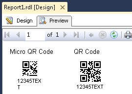

{} 

QR barcode is a two dimensional barcode symbology developed in Japan. QR barcode has the following features:

- High capacity encoding of data, upto 7000 numeric digits or 4000 alphanumeric data
- Dirt and damage resistant, a maximum 30% of code words can be restored
- Readable from all directions

{} 

The QREncodeType property in BarCodeBuilder Class works as QR / MicroQR selector. Select ForceQR (default) for standard QR symbols, Auto for MicroQR.

Enum QREncodeType:

1. **Auto** - mode starts barcode version negotiation from MicroQR V1
1. **ForceQR** – mode starts barcode version negotiation from QR V1
1. **ForceMicroQR** - mode starts barcode version negotiation from MicroQR V1 to V4. If data cannot be encoded into MicroQR, exception is thrown.

Added changes to Enum QREncodeMode:

1. **Auto** - encode codetext as is non-unicode charset. If there is any unicode character, the codetext will be encoded with value which is set in CodeTextEncoding.
1. **Bytes** - encode codetext as plain bytes. If it detects any unicode character, the character will be encoded as two bytes, lower byte first;
1. **Utf8BOM** - encode codetext with UTF8 encoding with first ByteOfMark character;
1. **Utf16BEBOM** - encode codetext with UTF8 encoding with first ByteOfMark character. It can be problems with some barcode scaners;
1. **ECIEncoding** - encode codetext with value set in the ECIEncoding property. It can be problems with some old (pre 2006) barcode scaners.
1. **ExtendedCodetext** - encode codetext in Extended Channel mode which supports FNC1 first position, FNC1 second position and multi ECI modes.
##### **Generate a QR or Micro QR Barcode**
Micro QR code is a smaller version of the QR code standard for applications where symbol size is limited. There are 4 different versions (sizes) of Micro QR codes: the smallest is 11×11 modules; the largest can hold 35 numeric characters.
### **Error correction**
QR barcode can withstand certain damage and can still be decoded normally. This is decided by QR barcode's error correction level during encode. There are four levels of error correction, from low to high:

- **LevelL**. Allows recovery of 7% of the code text
- **LevelM**. Allows recovery of 15% of the code text
- **LevelQ**. Allows recovery of 25% of the code text
- **LevelH**. Allows recovery of 30% of the code text
### **Add a reference of the Aspose.BarCode.ReportingServices.dll**
1. Select report in solution explorer.
1. In Visual Studio main menu, Select **Report** and then **Report Properties**.
1. Click the **References** tab.
1. Browse to the Aspose.BarCode.ReportingServices.dll and add it to the references.
1. A reference to System.Drawing dll is also required, which can be found in the .NET tab.
1. In **Add or remove classes** part, add the description for the class as follows:
   Class Name:Aspose.BarCode.ReportingServices.BarCodeBuilder Instance Name: objBarCode
1. Click on the **OK** button.
### **Add the source code to encode QR and MicroQR codes**
1. Select report in solution explorer.
1. In Visual Studio main menu, Select **Report** and then **Report Properties**.
1. Click the **Code** tab.
1. Add the following source code to encode QR code
   Set properties of BarCodeBuilder class object, QREncodeMode to auto, QREncodeType to ForceQR and set error correction level for the data you want to encode. Below is an example to generate a QR barcode: 

Error rendering macro 'code' : Invalid value specified for parameter lang

1. Add the following source code to encode Micro QR code
   Set properties of BarCodeBuilder class object, QREncodeMode to auto, QREncodeType to auto and set error correction level for the data you want to encode. Below is an example to generate a Micro QR barcode: 

Error rendering macro 'code' : Invalid value specified for parameter lang

1. Click on the **OK** button.
   So far, we have added the code and Aspose library reference to generate the barcodes.
#### **Drag an image control for each code on the report:**
1. Drag two image controls on the report.
1. Label one control as "**Micro QR Code**" and second as "**QR Code**".
1. Set their properties as narrated in below steps 3,4,5 and 6.
1. Select **Database** as the **Image Source**.
1. In **MIME type**, select an appropriate format.
1. Select **Size** tab.
1. Change the display size to "Original Size*.
1. Click on the **OK** button.
#### **Setting the image control value**
1. Right-click the Micro QR Code image control and select **Properties**.
1. Set the **Value** property to =Code.GetBarCodeImageOfMicroQRCode()
1. Right-click the QR Code image control and select **Properties**.
1. Set the **Value** property to =Code.GetBarCodeImageOfQRCode()
   Save all the files and click on “Preview” tab. You should see the similar output as below: 
   **The final report** 

