## **Overview**
Sometimes we need to show barcode label depending from obtained variables like field values. In most cases we can use ***Hidden*** property from ***Visibility*** group to dynamically hide component. Unfortunately, [Custom Report Items](https://docs.microsoft.com/sql/reporting-services/custom-report-items/custom-report-items) technology does not support dynamic settings in ***Visibility*** group, it can be set only to two defined values: ***True*** or ***False***. 

The problem can be solved with ***Image*** component and Custom Code with barcode image data generation by ***BarcodeGenerator class***. Additionally, you can use ***Visible*** property of ***BarcodeGenerator visual component***. This article provides information about both ways of dynamic barcode label displaying.
## **Project Preparations**
This section described preparation steps to create project structure which can be used for both methods.

1. Create blank report project and attach DataSource and DataSet to the project. You can see from these examples how to add [DataSource](https://docs.microsoft.com/sql/reporting-services/lesson-2-specifying-connection-information-reporting-services) and [DataSet](https://docs.microsoft.com/sql/reporting-services/lesson-3-defining-a-dataset-for-the-table-report-reporting-services) to the report.

**Table Name: Phones**

|**Column Name**|**Description**|
| :- | :- |
|**id**|Auto number. Used as primary key |
|**Model**| Model description, text field.|
|**OS**| Operational System description, text field.|
|**Serial**| Serial number, text field.|

After attaching DataSet to the project, you should see on the ***Report Data*** toolbox something like this:

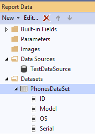

2. Drag-and-drop ***Table*** report item on report surface.

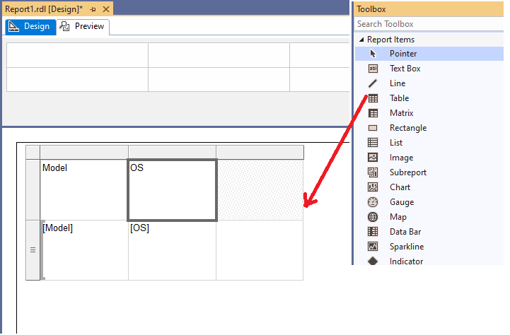
## **How to Dynamically Show Barcode Label with Custom Code**

Any embedded ***Report Item*** control allows to dynamically hide or show component from evaluated expression. In this way we can use ***Image*** report control and render barcode label as image data. To show barcode label this way we need to implement the following steps.

1. Add ***Image*** Report Item to the table column.

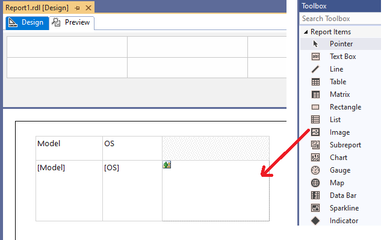
[dynamic_customcode_01.png]

2. Open ***Report Properties*** section ***References*** and add references to the ***Aspose.BarCode for Reporting Services*** and ***System.Drawing***.


Aspose.BarCode.ReportingServices
System.Drawing, Version=4.0.0.0, Culture=neutral, PublicKeyToken=b03f5f7f11d50a3a


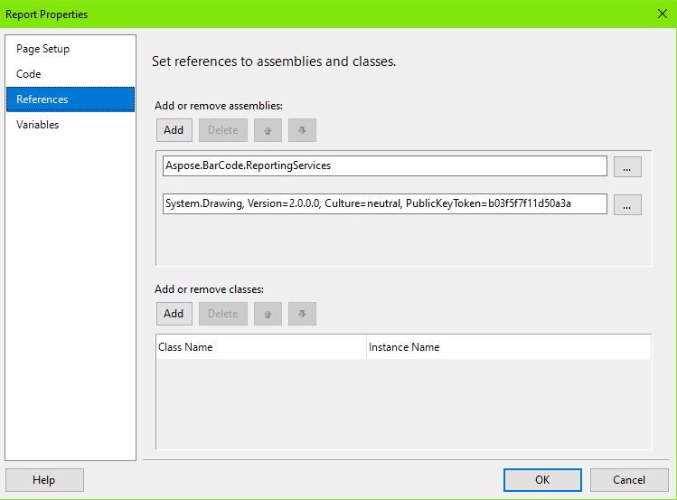

3. Add current code to the ***Report Properties*** section ***Code***.

Public Function GetBarcodeImage(ByVal codetext As String) As Byte()
    Dim builder As New Aspose.BarCode.Generation.BarcodeGenerator(Aspose.BarCode.Generation.EncodeTypes.QR, codetext)
    builder.Parameters.Resolution = 300
    Dim bitmap As System.Drawing.Bitmap = builder.GenerateBarCodeImage()
    Dim ms As New System.IO.MemoryStream
    bitmap.Save(ms, System.Drawing.Imaging.ImageFormat.Bmp)
    Return ms.GetBuffer()
End Function


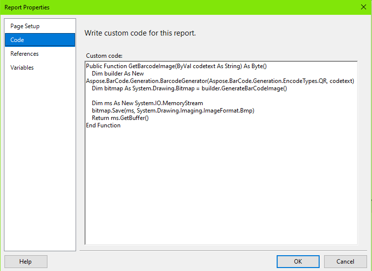

4. Return to the ***Image*** Report Item, and set properties with these values:
- ***Source*** to ***Database***;
- ***MIMEType*** to ***image/bmp***;
- ***Value*** to ***=Code.GetBarcodeImage(Fields!Serial.Value)***;
- ***Hidden*** to ***=IIf(Fields!Serial.Value = "", True, False)***.

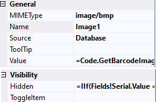

5. Drag-and-drop other DataSet fields to the table.

6. Now you can see the full dataset, rendered as report. You can deploy the report to SSRS server or just pass to ***Preview*** section.

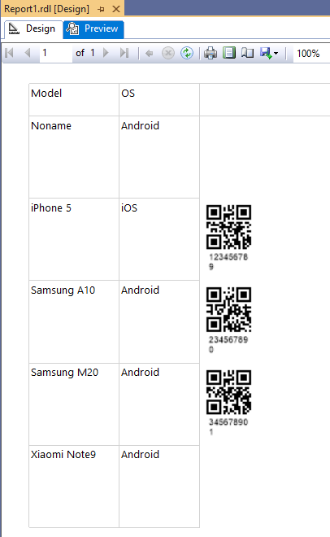

## **How to Dynamically Show Barcode Label with BarcodeGenerator Visual Component**

***BarcodeGenerator visual component*** allows dynamically showing and hiding barcode label with ***Visible*** property. This property emulates component hiding which is visible the same as using ***Hidden*** property. To show barcode label this way we need to implement the following steps.

1. Drag-and-drop ***BarcodeGenerator visual component*** to any of ***Table*** column.

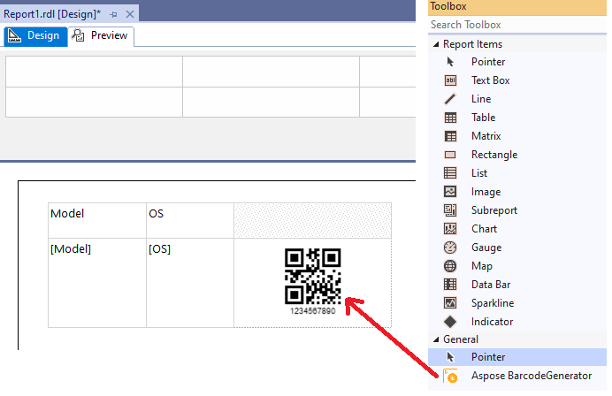

2. Drag-and-drop data fields from ***Report Data*** toolbox to the table columns. Put fields ***Serial*** to ***BarcodeGenerator*** component.

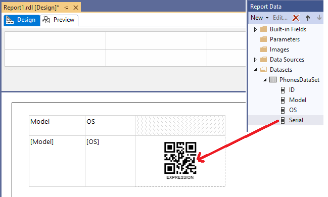

3. Set properties of ***BarcodeGenerator*** component to ***BarcodeGenerator*** component
- ***BarcodeType*** to ***QR***;
- ***CodeText*** to ***=Fields!Serial.Value***;
- ***Visible*** to ***=IIf(Fields!Serial.Value = "", False, True)***.

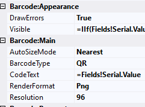

4. Now you can see the full dataset, rendered as report. You can deploy the report to SSRS server or just pass to ***Preview*** section.

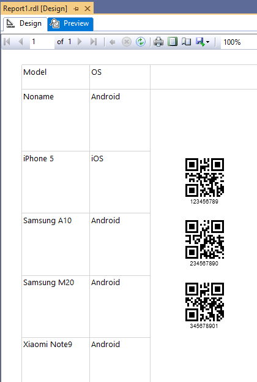
